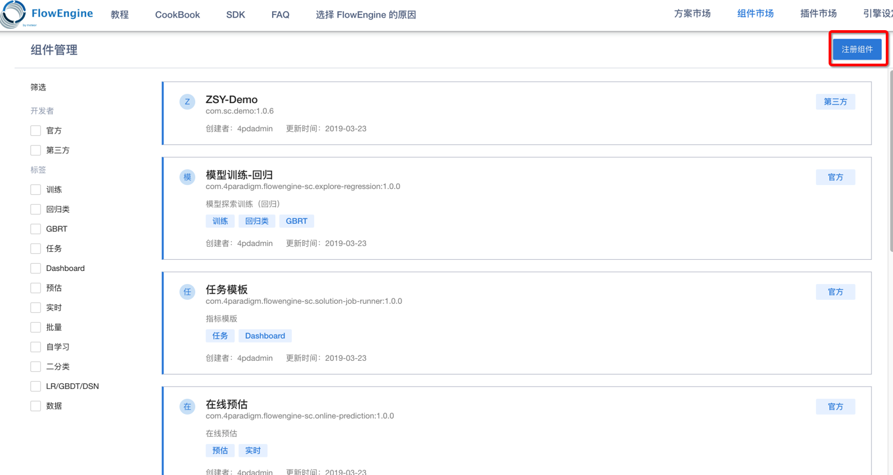
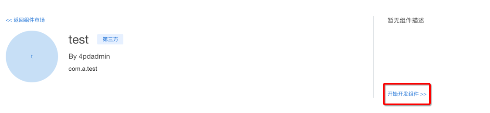
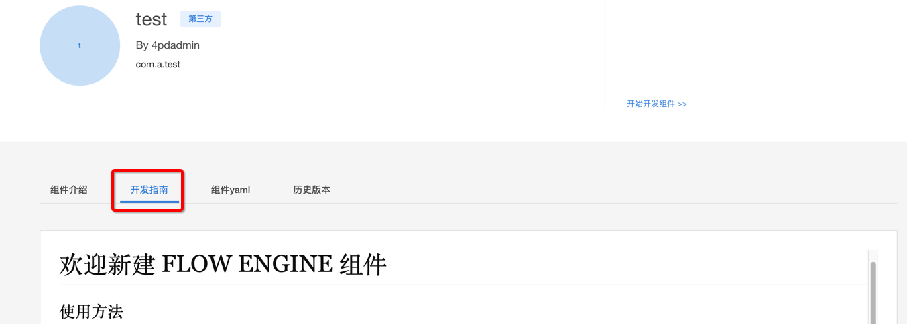
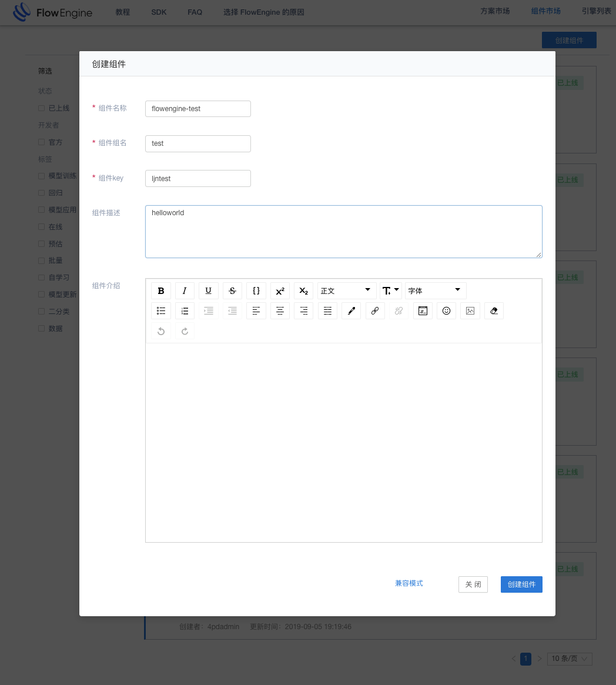
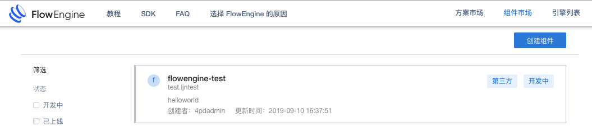
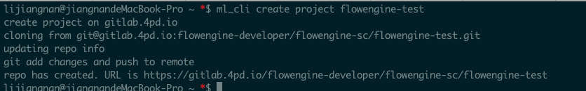
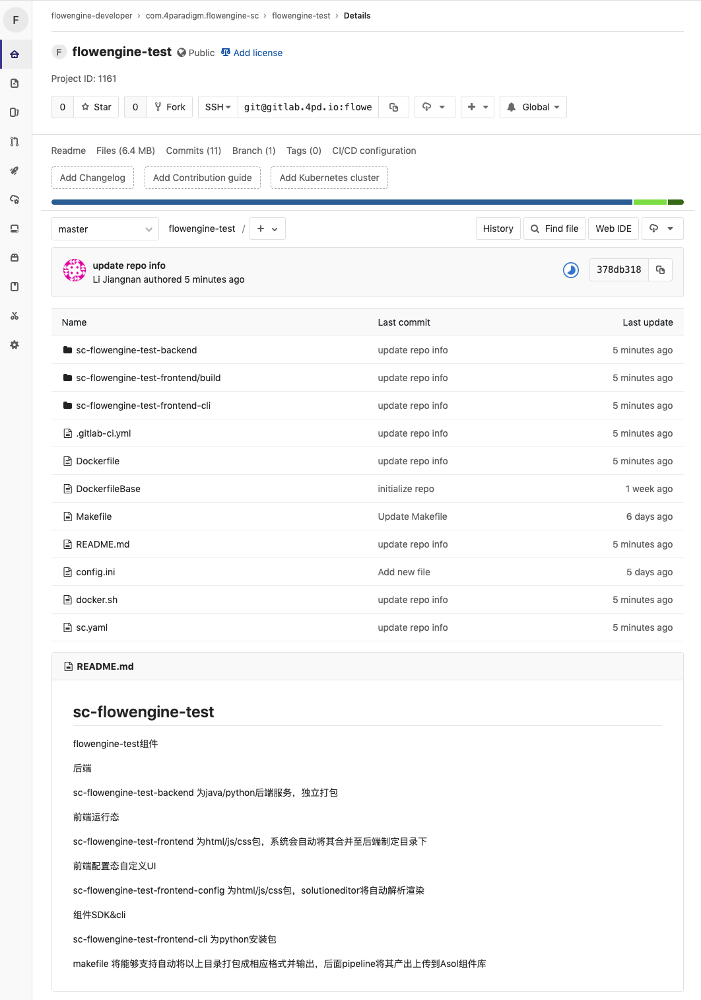
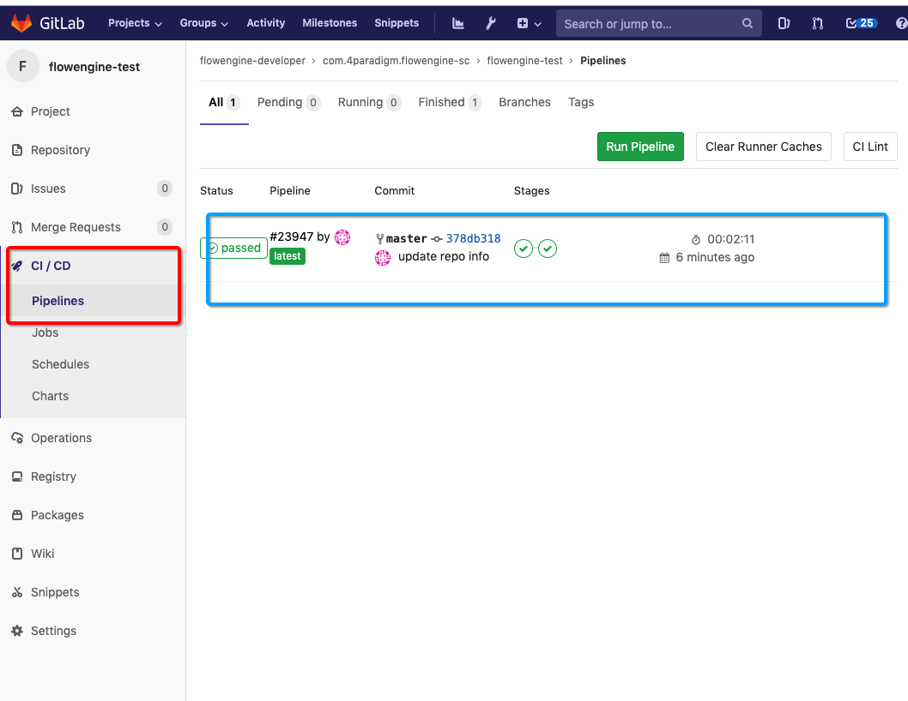
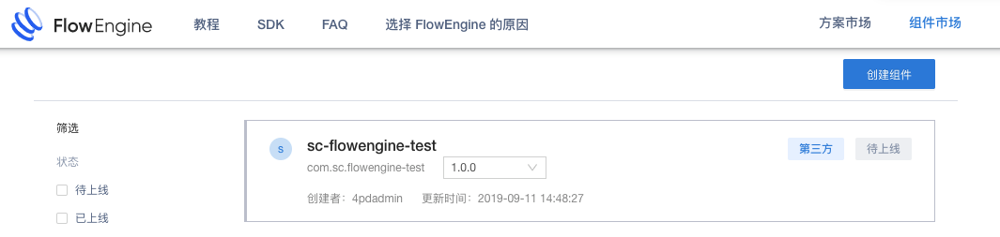

#组件注册到上线 cli
##目标
用户第一次创建组件时，可通过 create sc 的命令自动上传产出的镜像，并且可以自动在组件库中上线该组件。

##完整步骤
1. 在界面中点击注册组件，并且填写组件相关信息，生成对应的yaml文件，点击注册组件。  
  
2. 在组件列表中点击对应的具体组件，进入详细页后，点击右上角开发组件，查看对应的 README ，并且仔细按照 README 步骤进行开发。      
 
3. 点击开发指南可以看到组件开发需要的步骤，按照README中展示的步骤进行操作。
    
4. 若有需要修改的配置，则在用户 home 目录下建立 ~/.flowEngine/config.ini 文件，用于存放一些必须修改的配置（图中为样例配置，请尽可能少的添加自己的配置）:   

```
[REMOTE]
workspace_name = <workspace_name>
access_key = 1fcd83fd-c134-4b49-bfe5-31301820e981
cluster_url = http://172.27.128.236:40121
error_log_file=error.log
info_log_file=info.log
FLOW_ENGINE_URL=http://172.27.128.236:40121
docker_url=172.27.128.236:35000
```

## 使用命令行及gitlab创建组件效果演示
1. 在界面上新建一个组件叫 flowengine-test ，在页面上填写信息，并且点击创建组建，便可以在组建列表中看到该组件。  
 

2. 在命令行中，执行 ml_cli 创建项目命令，在gitlab上创建出该项目。  


3. 查看项目 pipeline 看是否已经跑完流程。   

4. 可以看到组件市场中该组件已经被创建。   
