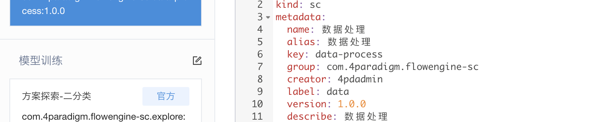
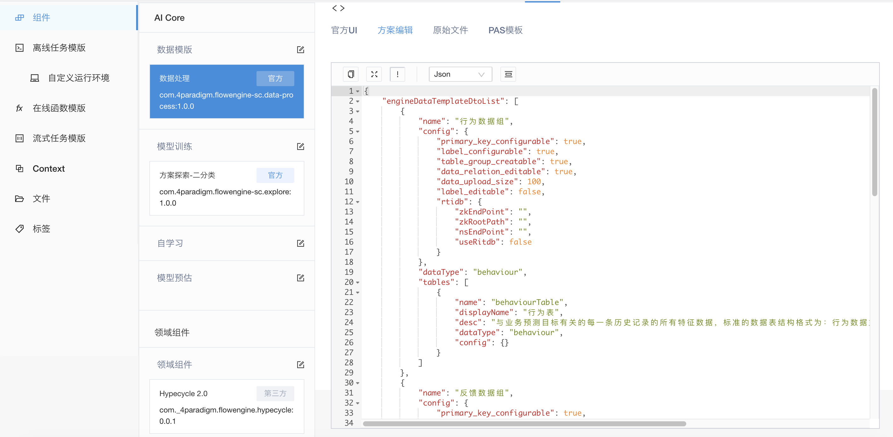
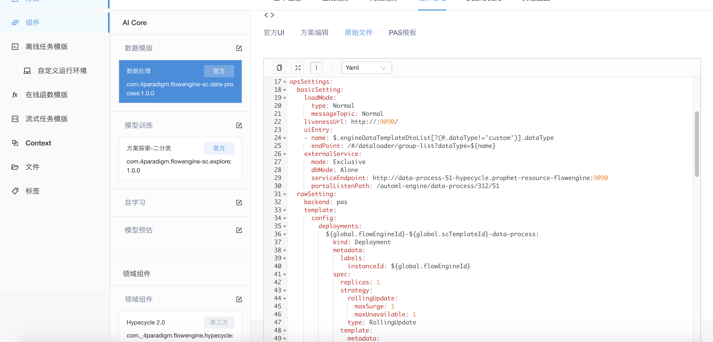

#基本功能介绍
&emsp; &emsp;组件主要由三大部分构成
##基本信息
&emsp; &emsp;基本信息包括组件的名称，组件的描述以及用来定位标示唯一资源的group、key、version，组件开发者根据组件的定位合理填写这些信息

##方案信息
&emsp; &emsp;方案属于组件的业务配置，比如对于数据组件，其方案配置包括数据表信息，如表明，字段名，字段类型等，还包括表与表之间的关系定义，业务基于这种声明式的方式定义，屏蔽了底层技术实现细节，降低了业务和技术之间的耦合度，配置了方案的组件，需要暴露一组方案接收端口(POST /v1/solution/loadSolution;POST /v1/solution/reloadSolution),一旦配置信息有变化，flowengine会及时通过这一组接口通知给组件

##运维信息
&emsp; &emsp;运维信息是描述组件部署的信息，包括组件运行需要的cpu资源，内存资源，端口资源，还可以指定组件的环境变量
