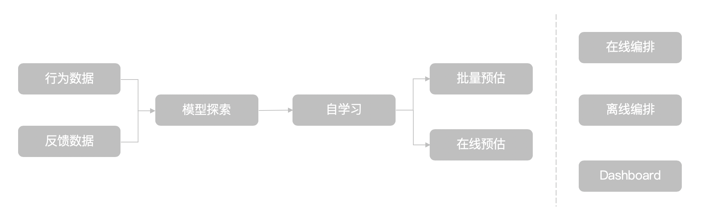
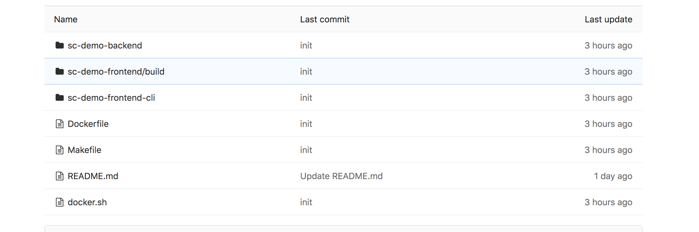
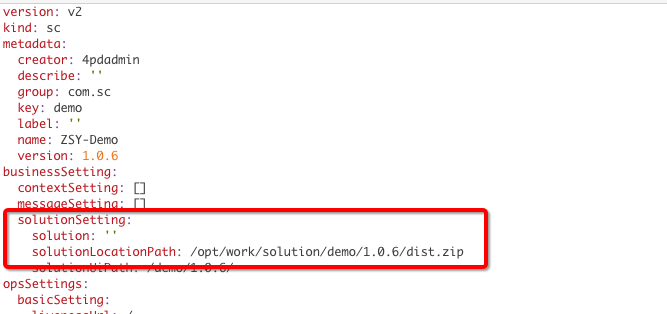
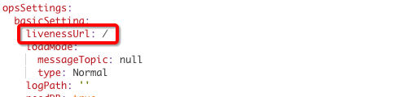
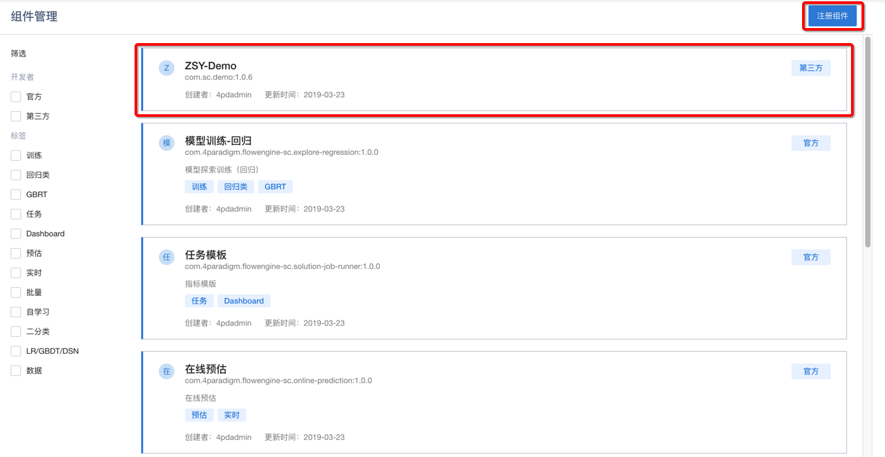
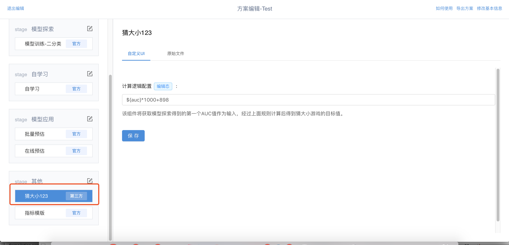
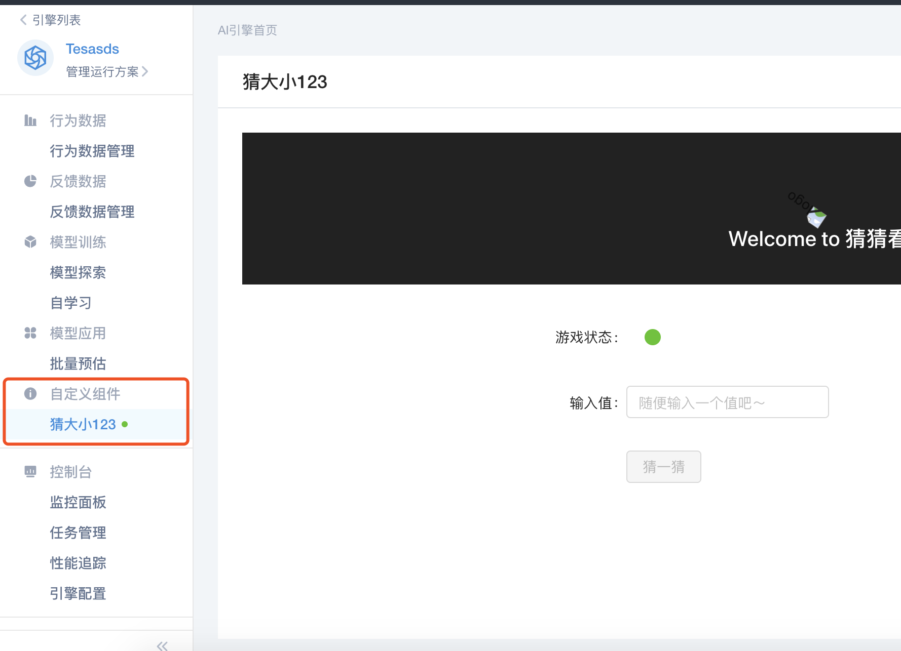

# 如何开发一个新组件
## 一、写在前面-为什么需要开发新组件
&emsp; &emsp; Flowengine 基于范式多年 AI 落地的 knowhow 沉淀，同时汲取了库伯学习圈的先进理念，将一个 AI 应用的开发落地提炼由一系列组件构成的标准化流程，如下图所示：



&emsp; &emsp; 但是不同企业不同业务场景可能会有在 AI 应用开发标准化流程之外的一些小流程，这些小流程虽然不通用，但是对于业务来说却是必需的。在以往的模式中，这时就需要交付来根据实际业务场景来做定制化开发。而 Flowengine 则对开发者开放了自定义组件的能力，在这种情况下，开发者需要定制化开发的是一个新组件，而不再是一整套定制化开发的小套件。

&emsp; &emsp; 这其中，开发新组件相比开发新套件的**优势在于：**

* 开发者只需要关心如何将业务问题（需要）转换为一个组件的功能实现，而不需要关心组件与其他组件是如何交互的，这些都是交给 flowengine 来完成的；
* 通过将组件配置在流程（stage）中，功能可以完美内嵌到标准流程之中，而不需要将其外挂于标准流程之外。组件甚至还可以有自己的 UI 。

## 二、Demo 实现的目标
&emsp; &emsp; 为了既体现 Flowengine 的特性，又兼顾趣味性，我们设计了一个简单的猜猜乐 demo 小组件，来示范如何开发一个自定义组件。

&emsp; &emsp; 这个小组件所要达到的核心效果是：根据模型探索任务产出的 AUC 值，对其先进行一个自定义运算得到一个目标值，然后实现一个以这个目标值为正确答案玩猜大小的游戏。


**目标拆解（我们这个组件具体要实现哪些任务）：**

* 定义一个组件配置的 UI ，支持定义对 AUC 值的计算逻辑；
* 定义一个组件在AI引擎页面的 UI ，来承载玩“猜大小”游戏的用户界面；
* 利用消息通知的能力，来让新组件知晓“模型探索任务已完成”这个消息；
* 新组件获取到消息后，通过 flowengine 取到 AUC 值，并根据组件配置中的计算逻辑进行运算，得到目标值
* 前端用户界面，可以根据这个目标值来完成“猜大小”游戏
* Cli 需要能够与新组件互动。

## 三、具体步骤
### 3.1 组件开发
&emsp; &emsp; 在开发组件前，首先需要定义清楚该组件是在什么样的场景下解决什么样的问题，也就是说需要先做好组件的设计，设计既包括镜像的设计，也包括 SC yaml 文件的设计。  
开发组件时：首先需要 make 出组件镜像，如果有自定义 UI 的需求，则还需要开发相应的 U 镜像。

#### 工程创建

&emsp; &emsp; 首先创建一个工程，用来 build 镜像，为开发组件做准备。我们以本 demo 为例创建了一个工程，工程目录如下：工程连接参考 https://gitlab.4pd.io/flowengine-developer/flowengine-sc/sc-demo

目录结构说明：

* sc-demo-backend：后端代码目录
* sc-demo-frontend：前端静态文件目录
* sc-demo-frontend-cli：cli 文件目录
* Dockerfile: 构建镜像的描述文件
* Makefile: cicd 描述文件

#### 后端构建
&emsp; &emsp; demo 的后端服务是用 springboot 开发，主要提供接口服务和数据库操作功能。除了用户的服务业务的接口之外，必要的接口功能主要包括：

* 接收组件的 solution 接口。当组件启动或者 solution 修改以后，flowengine 会将用户填写好的 solution 通过接口调用的方式传给组件。接口的路径定义在 sc.yaml 里，flowengine 会根据 sc.yaml 里配置的路径，灵活地调用接口。solution在模版中的定义，是为了沉淀组件开发者的解决方案，使其能很好的复用到不同的模版中。

* 接收消息的接口。组件开发者需要定义一个消息接口，用来接收从 flowengine 产生的消息，flowengine会通过该接口传送消息。  
* 健康检查接口。用户需要定义一个健康检查的接口，flowengine 会根据该接口实时同步组件状态


&emsp; &emsp; 需要通过编译指令，编译出一个可执行的服务文件，该事例会编译出一个 springboot 的 jar 包出来，编译命令详见 makefile ，并将该 jar 包放到镜像的某个目录下，需要用户编写服务包运行的脚本，详见项目的 start.sh 。

&emsp; &emsp; 最后需要用户将编译好的镜像上传至 flowengine 所在的镜像库中，并将镜像地址回填到组件中，注意这里的镜像地址不要填写镜像库的完整地址，写相对地址即可，这样在迁移的时候就不需要重新修改镜像地址了!
[镜像配置](../assets/component/镜像配置.png)

#### 镜像构建

&emsp; &emsp; 你需要一个 makefile 来编写你的整个构建过程，以该 demo 为例，makefile 的内容如下：

```
.PHONY: all build-docker image build-local test clean

all: build-local image

dir = ${shell pwd}

image:
	./docker.sh
	rm -f ./sc-demo-backend/release/engine-manager.jar

build-local:
	rm -rf ./sc-demo-backend/release

	cd sc-demo-backend && mvn -U -Dmaven.test.skip=true clean install && mkdir -p release && cp target/sc-demo-1.0-SNAPSHOT.jar release/sc-demo.jar
```

&emsp; &emsp; 内容如下，整个 make all 的过程包含两部分：

* build-local 表示我们 springboot 服务包的构建过程，编译工具为 maven ，最后我们会在release 目录下生成一个 sc-demo.jar 。
* image 过程表示我们 build 镜像的过程，他是间接的调用了 docker.sh 脚本，docker.sh 脚本如下，其中 imageName 表示我们的镜像地址，以改 demo为 例镜像地址为 172.27.128.146:35000/sc-demo:1.0

```
#!/usr/bin/env sh

tag=`LC_CTYPE=C && LANG=C cat /dev/urandom | tr -cd 'a-f0-9' | head -c 32`
imagename=sc:1.0
docker build -t ${imagename} --network=host -f ./Dockerfile .
```

* 下面我们看一下我们的 Dockerfile 内容，它描述了整个镜像 build 的过程，内容如下,我们提供一个 base 镜像 docker.4pd.io/prophet/flowengine/sc/base:1.0.0 ,内部集成了 jdk8 和 python3 环境，并且集成了我们最新的 python-sdk ，在 Dockerfile 中，从第二步开始，我们把所有的文件放到镜像对应的位置中，其中包括我们的 cli ，刚才编译的服务 jar 包，前端的静态文件，启动脚本，我们将 8080 端口暴露出来，写好 Dockerfile 并执行 docker.sh ，整个过程久好了，然后登陆到 172.27.128.146 ，把刚才的镜像 push 上去，如果你没有登陆 146 服务器的权限，可以将镜像产出存放在本地，我们负责将你的镜像push上去

```
FROM docker.4pd.io/prophet/flowengine/sc/base:1.0.0

ADD ./sc-demo-backend/release/sc-demo.jar /opt/work/
ADD ./sc-demo-backend/bin/ /opt/work/bin/
ADD ./sc-demo-frontend/build/ /opt/work/portal/
ADD ./sc-demo-frontend-cli/py_cli/ /opt/work/py_cli/
ADD ./sc-demo-frontend-cli/py_sdk/ /opt/work/py_sdk/
ENTRYPOINT ["bash", "/opt/work/bin/start.sh"]
EXPOSE 8080
```

#### 前端构建

&emsp; &emsp; 我们推荐使用 React 来进行对应的页面开发。我们会提供脚手架，统一样式，组件库及通用方法库。

1. 脚手架支持简单应用及复杂多路由应用两种模式。可根据场景不同自由选择。
2. 使用脚手架开发的优点有：
    - 可使组件视觉风格与FlowEngine系统保持一致
    - 各种程度上减少开发成本
    - 规范构建流程

&emsp; &emsp; 你也可以使用其他方式来构建你的前端，但需遵从一定规范。

如何使用：

```
npm install -g yo
npm install -g generator-4pd-flowengine-component-ui
 
yo 4pd-flowengine-component-ui
```

简单项目结构：

&emsp; &emsp; 简单项目结构使用 React + antd + less, 基于[create-react-app](https://github.com/facebook/create-react-app ) 构建，增加了 antd 及本地请求 Proxy。

如何使用：
```
npm start # 本地调试
npm run build # 打包构建
```

```
default-app
├── README.md
├── node_modules
├── package.json
├── config-overrides.js # 覆盖 antd 原有样式
├── .gitignore
├── public
│   ├── index.html
└── src
    ├── App.less
    ├── App.js
    ├── App.test.js
    ├── index.css
    ├── index.js
    ├── logo.svg
    ├── setupProxy.js # 本地调试设置Proxy
    ├── serviceWorker.js
```


### 3.2 使用组件
&emsp; &emsp; 流程阶段的选择由业务逻辑决定，您需要将组件安置在一个合适的阶段。猜猜乐demo组件由于不侵入核心流程，这里我们只需要将其放置在“其它”流程中即可。

&emsp; &emsp; sc.yaml 主要是描述组件的行为，flowengine 负责解析 sc.yaml。 详细信息请参考 [关于组件](about_component.md)  
&emsp; &emsp; 创建好的组件如下：


### 3.3 配置组件的solution
组件被配置到流程中去之后，就可以进行组件 solution.json 信息的配置了（ solution.json 信息来源于 SC 的 yaml 文件，决定了在应用一个组件时需要配置怎样的 key-value 对）。对于 solution.json 的配置，支持两种编辑方式，如果在 SC yaml 文件中没有配置 solution UI的镜像，那么默认需要编辑的就是一段 json 代码；如果在 yaml 文件中配置了solution UI，那么在编辑时会默认渲染出所配置的 UI ，但是可以在 UI 和 json 代码两种编辑方式中进行切换。

在本 demo 中，猜猜乐所需要配置的 solution.json 非常简单，只需要定义一个对原始 AUC 值进行计算的运算逻辑，即设置一个计算公式即可，对应的 sc.yaml 的字段为 metadata.container.image.module.solution

组件应用画面：



### 3.4 AI应用中的自定义组件
一个内置了自定义组件的方案编辑完成后，我们就可以新建一个AI引擎应用这个方案。

对于自定义组件的展示模式，也有两种。如果在组件的SC yaml文件中定义了组件在 AI 应用中的展示 UI 镜像，则渲染出自定义的 UI ，否则展示自定义组件的状态和所配置的 solution.json 。

在猜猜乐 demo 中，我们自定义了展示的UI界面。UI 界面的功能分为两层，一层是游戏状态的展示，另一层是游戏操作区域。



游戏状态包括尚未就绪和已就绪。回顾组件的目标，猜猜乐游戏是通过 AI 引擎首次探索产出的最佳 AUC 为原始输入的，也就是说需要探索产出结果了，游戏才能 ready 。探索完成的这个信息自定义组件是如何获悉的呢，是通过 Flowengine 的内部消息管理系统获取的，详细请参考[message](message.md) 

游戏操作区域当游戏就绪后才能展示。游戏就绪后，组件首先通过 Flowengine 获取到探索产生的最高 AUC 值，然后根据 solution.json 中的配置对原始 AUC 值先进行计算得到一个新值，也即猜猜乐游戏的目标值。

后台完成上述操作后，就可以进行游戏了。参与者可以在输入框中输入自己猜想的数字，点击猜一猜进行游戏。点击后系统会给反馈，“太大了”、“太小了”或者“回答正确”。回答正确时还会打印出目标值背后的 AUC 值及其计算逻辑，以供验证。

当然，如果猜了几次不中，也可以选择“弃疗”，点击后也会展示正确答案及其背后的计算逻辑。

### 3.5 自定义组件与 Cli 如何交互
#### Cli 相关的小目标

* Cli 需要能够获取组件状态及其基本信息配置
* 针对本 demo ，cli 需要能够实现和前端 UI 一样的猜猜乐效果的能力

#### 如何开发
步骤如下：

* 需要开发自定义组件的 service 接口以及和 service 接口能力相关 Cli 。     
* 将相应的 py 文件存放到相应的项目目录中，并打包编译进镜像中。 
* 在 cli 的实现中，可以通过 from flowengine import 自定义组件 service 。   

以 Demo 为例，自定义的 service 存放在 sc-demo-frontend-cli/py\_sdk 中，对应的 cli 存放在 sc-demo-frontend-cli/py\_cli 中。同时在 Dockerfile 中将相关代码文件 add 到镜像中。

##### service 接口开发
自定义 service 组件需要继承基础 Service 类以此获取当前组件示例的信息（访问路径、组件实例ID等）。    
代码参考：   

~~~py
from flowengine import ScInstanceService
from flowengine import ManagerService

class CustomerSciService(ScInstanceService):
	""" Demo Service for Demo."""
    def __init__(self):
        super().__init__()

    def get_info(self):
        info = []
        info.append('sci_id:' + self.sci_id)
        info.append('sci_ip/port:' + self.url)
        headers = '\n'.join([key + ':' + self.headers[key] for key in self.headers])
        info.append('headers:' + headers)
        return '\n'.join(info)
        
    def guess(self, value):
        url = '{}/v1/game/'.format(self.url)
        data = self.client('get', url)
        data = data.json()['data']
        status = data.get('gameStatus', '')
        if status != 'ready':
            return 'not ready...'
        statment = data['config']['rules'].replace('${auc}', str(data['auc']))
        real_value = eval(statment)
        msg_list = []
        msg_list.append('your guess:')
        msg_list.append(value)
        msg_list.append('real value:')
        msg_list.append(real_value)
        if real_value <  value:
            msg_list.append('too big..')
        elif real_value > value:
            msg_list.append('too little...')
        else:
            msg_list.append('cong!!!, rules:' +  data['config']['rules'])
        return '\n'.join(list(map(lambda x: str(x), msg_list)))
~~~
##### cli 开发
自定义 Cli 需要：    

*  函数：cli\_a\_b 会自动生成命令：ml_cli a b  
*  函数名不能和 flowengin 自带命令重名
*  help 函数必须为：cli\_组件实例名\_help 函数
*  使用 args 装饰器

~~~py
import sys
from flowengine_cli.utils import args
from flowengine import CustomerSciService

def cli_demo_info(args):
    """show the info of the current sci"""

    cs = CustomerSciService()
    msg = cs.get_info()
    print(msg)

def cli_demo_help(args):
    """show the help of yourself defined cli for the current sci"""
    
    current_module = sys.modules[__name__]
    data = []
    for subcmd in (a for a in dir(current_module) if a.startswith('cli_')):
        cmd_name = subcmd[4:].replace('_', ' ')
        callback = getattr(current_module, subcmd)
        desc = callback.__doc__ or ''
        msg = '{} \t{}'.format(cmd_name, desc)
        data.append(msg)
    ret = '\n'.join(data)
    print(ret)

@args('value', metavar='<VALUE>', type=int, help='value to guess')
def cli_guess(args):
    """Demo: have a guess(try)"""

    scis = CustomerSciService()
    data = scis.guess(args.value)
    print(data)
~~~

####效果演示
##### 下载安装 Cli

~~~shell
pip3 install FlowEngineSDK --index-url=http://pypi.4paradigm.com/4paradigm/dev --trusted-host pypi.4paradigm.com
~~~

##### 配置 config
在 ~/.flowEngine/config.ini 下配置：    
**确保 log 文件地址目录存在**

~~~py
[HTTP]
X-Prophet-Workspace-Id = 1
access_key = fd8b5c89-7244-4be8-85c6-c58eb11100e1
cluster_url = http://172.27.128.146:40121
error_log_file=error.log
info_log_file=info.log
~~~

##### 执行
~~~shell
>>> ml_cli demo demo help 1
demo help 	show the help of yourself defined cli for the current sci
demo info 	show the info of the current sci
guess 	Demo: have a guess(try)

>>> ml_cli demo guess 2  1
your guess:
2
real value:
1698.0
too little...
~~~


更多信息参考：[SDK/Cli QuickStart](./sdk/component-cli.md)