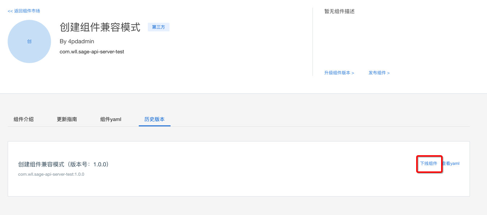
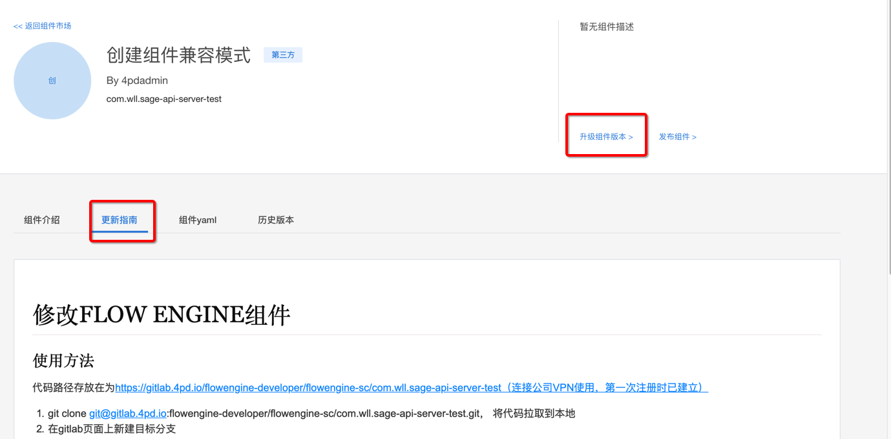

# 组件更新再发布 cli
## 目标
用户后期修改组件时，可同样通过 create sc 的命令自动上传产出的镜像，并可以重新在组件库中重新上线该组件。

## 完整步骤
1. 在组建列表中点击已有的组件，进入详情页后，若组件还处于上线状态，则点击历史版本查看需要下线的组件版本，再点击下线版本，使组件下线。  

2. 点击右上角升级组件版本按钮，在开发指南中查看对应的 README，并且仔细按照README步骤进行开发。       

3. 建议使用 gitlab 仓库进行开发，这样提交代码后将自动更新组件市场，若需要使用 ml_cli 命令行工具，则执行

```
 ml_cli create sc <sc.yaml存放的绝对路径> --stage <组件所处在的阶段> --solution-ui <solution.ui zip包路径> --local-image-url <本地镜像地址> 
```

（其中除了yaml-path，均为为选填字段。stage在注册阶段无特殊情况默认为None， 若用户填写，则以用户填写的为准。 solution-ui在有solution-ui-zip需要上传的情况下填写zip包地址，若不需要上传，则不用填写该参数。local-image-url在需要cli帮助上传镜像到远端仓库时需要填写，若已有远端镜像，且不需要再次从本地上传镜像则不需要填写。 ）
即可将组件上传至组件库中。若使用界面操作，则点击界面上的发布组件按钮即可上传发布。  
