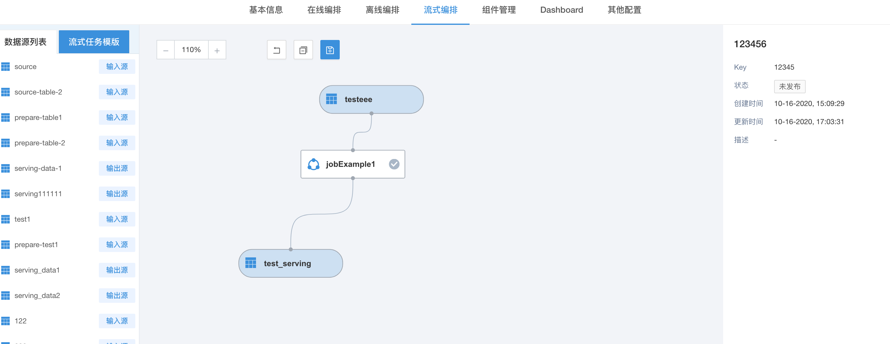

# 流式任务

流式任务是Flowengine为对Flowengine Data(sds)提供的流式编排方式，供sds在数据转换规则上绑定。

## 流式编排

基于流式任务之上构建的编排规则，称为流式编排。

### 目的

针对sds提供的数据源部分，构建数据源之间的流式转换规则。这条规则可以定义多个流式任务，亦可以定义多种类型的流式任务，来完成相应的数据源之间的数据转换需求

### 构建步骤

1. 建立流式任务模板

2. 同步数据源

3. 建立流式pipeline

4. 发布流式pipeline并运行

5. 绑定流式pipeline至Flowengine Data中

