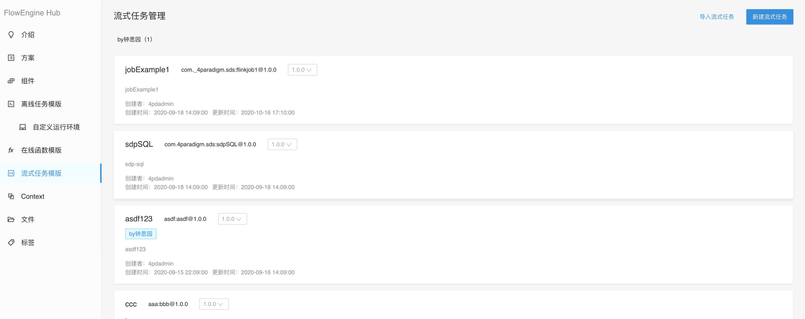
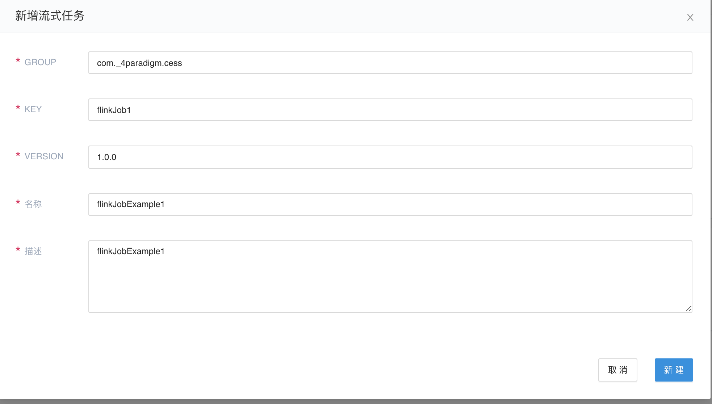
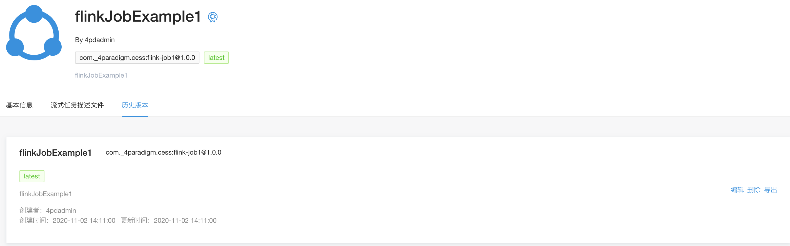
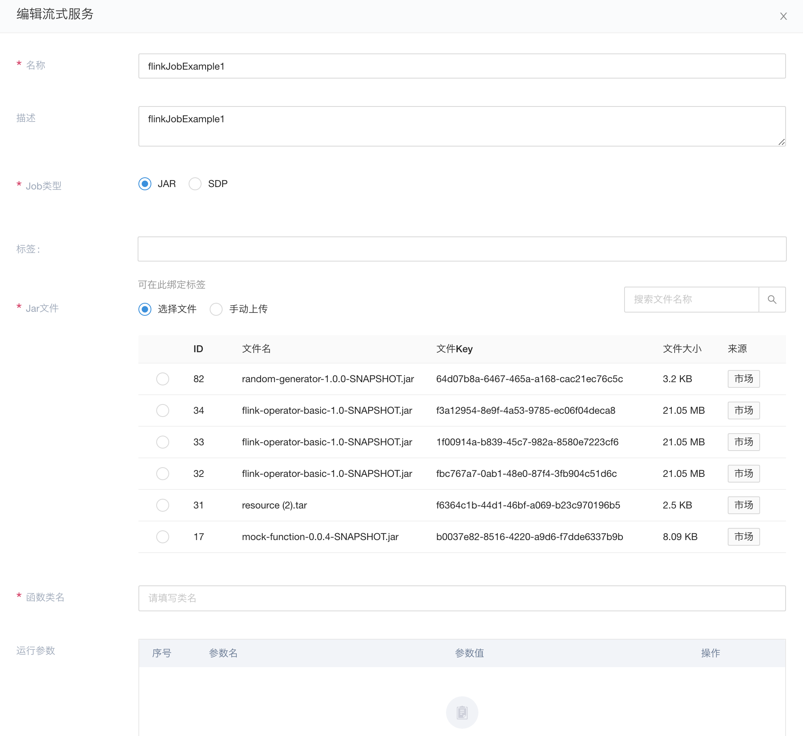

# 流式任务模板简介

Flowengine Hub负责流式任务模板的管理。

## 操作步骤

### 新建

同离线任务模板类似，支持新建/导入的方式来完成流式任务的新建操作。这里，我们以新建流式任务来示意

## 编辑

在完成基本的信息编写后，就可以在历史版本中，找到相应的版本，并进行编辑。

流式编排现有支持的流式任务模板类型：

* [Flink Jar任务](component/stream/flink-job.md)

* [Sdp Flink任务](component/stream/sdp-job.md)

根据不同的任务类型，选择相应的Jar文件，并填写相关的参数，即可
