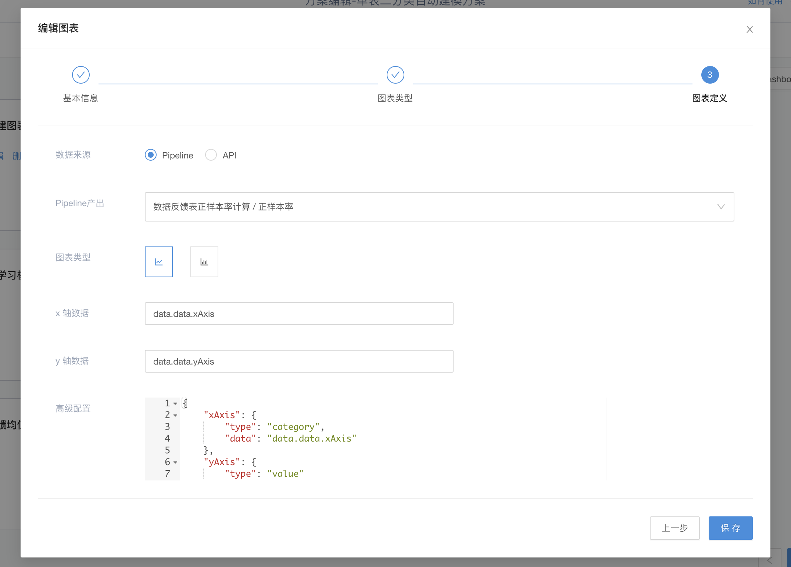

# 图表模式

## 图(Graph) - Pipeline 产出（Python、Java、Shell）

素材准备：

1. 配置运行文件，Job 需输出

    ``` Python
    {
        "xseries":  ["Mon", "Tue", "Wed", "Thu", "Fri", "Sat", "Sun"],
        "yseries": [820, 932, 901, 934, 1290, 1330, 1320]
    }
    ```

2. 图表配置页面如图
    
3. dashboard 配置，填写基本信息，图表选择 图(Graph)，进入图配置页, 选择离线编排产出，选择对应 Pipeline 并选择 Pipeline 内对应 Job, 如图: 

    
4. 图表配置完成，会默认展示。如需隐藏，点击右上角 编辑 Dashboard，选择展示/隐藏的 Dashboard。
5. 进入引擎离线编排管理页面，运行图表关联 Pipeline，待 Pipeline 运行成功后，即可在 Dashboard 表盘上看到配置的图表。

    

## 图(Graph) - Pipeline 产出（DAG）

暂不支持

## 图(Graph) - API

步骤一已详细描述具体流程。后面仅说明关键配置信息。

1. 图表数据来源选择 API，符合图表规范的 API 格式如下：

    ``` json
    [
        {
        "result": {
            "xseries":  ["Mon", "Tue", "Wed", "Thu", "Fri", "Sat", "Sun"],
            "yseries": [120, 132, 101, 134, 90, 230, 210]
        }
        }
    ]
    ```

2. 需确保 API 格式正确且可正确访问。
3. 后续配置如上，无需运行 Pipeline ，如 API 可正确访问，引擎内 Dashboard 界面图表将正常展示。

## 图(Graph) - 高级配置

某些情况下需扩展图表配置。现以多纵坐标系图表配置为例。

1. 请求返回/脚本产出格式

    ``` json
    [
        {
        "result": {
            "xseries":  ["Mon", "Tue", "Wed", "Thu", "Fri", "Sat", "Sun"],
            "yseries": [120, 132, 101, 134, 90, 230, 210],
            "y2series": [820, 932, 901, 934, 1290, 1330, 1320],
            "y3series": [150, 232, 201, 154, 190, 330, 410]
        }
        }
    ]
    ```

2. 图表配置如下：

    ``` json
    {
        "xAxis": {
            "type": "category",
            "data": "data.data.xeries"
        },
        "yAxis": {
            "type": "value"
        },
        "series": [
            {
                "data": "data.data.yseries",
                "type": "line"
            },
            {
                "data": "data.data.y2series",
                "type": "line"
            },
            {
                "data": "data.data.y3series",
                "type": "line"
            }
        ]
    }
    ```

3. 图表展示如下：

    
