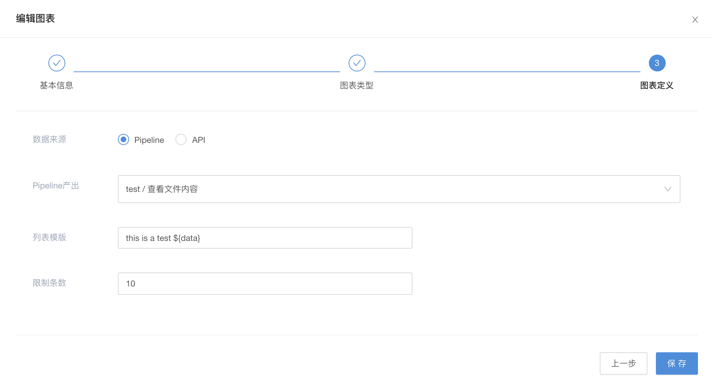
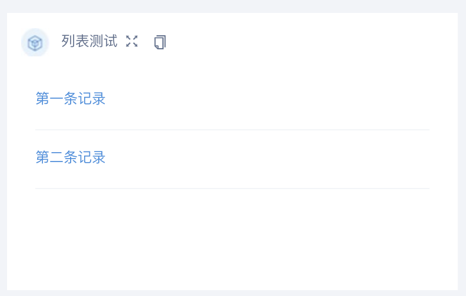

# 列表模式

## 列表(List) - Pipeline 产出（Python、Java、Shell）

任务素材准备：

1. 配置运行文件，Job 需输出

    ``` json
    [
        {
            "result": "第一条记录",
            "prn": "记录对应的prn（可选）",
            "link": "记录对应的链接（可选）"
        },
        {
            "result": "第二条记录",
            "prn": "记录对应的prn（可选）",
            "link": "记录对应的链接（可选）"
        }
    ]
    ```

2. 任务配置页面如图表模式
3. dashboard 配置，填写基本信息，图表选择列表(List)，进入列表配置页, 选择离线编排产出，选择对应 Pipeline 并选择 Pipeline 内对应 Job, 如图:

    
4. 列表配置完成，会默认展示。如需隐藏，点击右上角 编辑Dashboard，选择展示/隐藏的任务。
5. 进入引擎任务管理页面，运行图表关联任务，待任务运行成功后，即可在 Dashboard 表盘上看到配置的列表结果。

## 列表(List) - Pipeline 产出（DAG）

配置如上，会默认展示选择节点的 prn 产出。

## 列表(List) - API

步骤一已详细描述具体流程。后面仅说明关键配置信息。

1. 如上准备 API，API 格式如下：

    ``` json
    [
        {
            "result": "第一条记录",
            "prn": "记录对应的prn（可选）",
            "link": "记录对应的链接（可选）"
        },
        {
            "result": "第二条记录",
            "prn": "记录对应的prn（可选）",
            "link": "记录对应的链接（可选）"
        }
    ]
    ```

2. 需确保 API 格式正确且可正确访问。
3. 后续配置如上，无需运行任务，如 API 可正确访问，引擎内 Dashboard 界面列表将正常展示。

    
