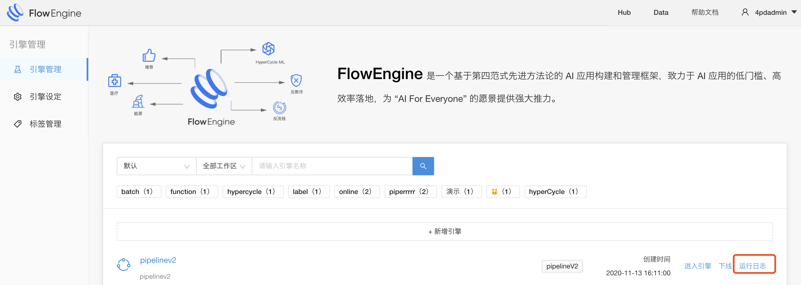
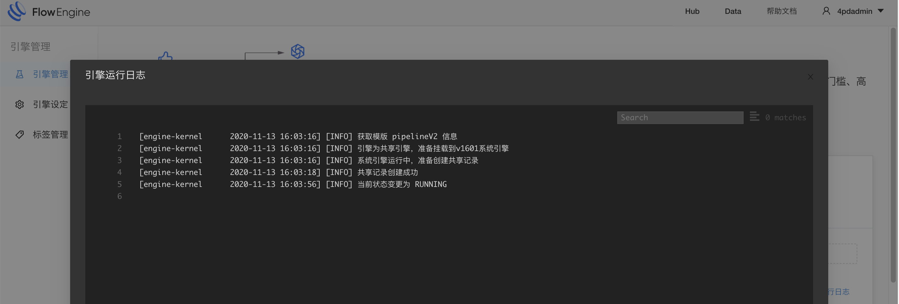
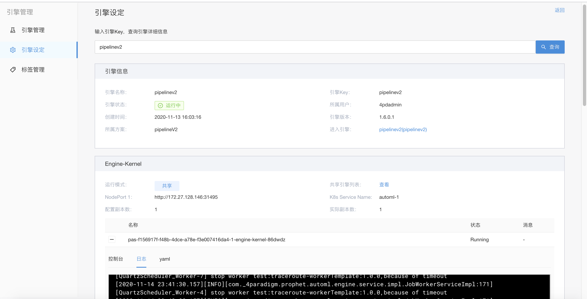

# 引擎异常及修复

&emsp; &emsp;这一节主要讲述的是在引擎启动异常的时候如何通过一些方式来排查问题

# 查看运行日志
&emsp; &emsp;通过运行日志可以排除一些简单问题，比如因为资源不足导致引擎或者组件无法启动，即使没有异常也可以通过运行日志来查看启动进度

# 引擎设定修改模版
&emsp; &emsp;如果引擎日志无法判断异常信息那么可以直接通过引擎设定来查看pod的启动状态和pod的日志，并通过修改模版来修复异常状态，引擎设定查看信息，需要输入正确的engineKey

