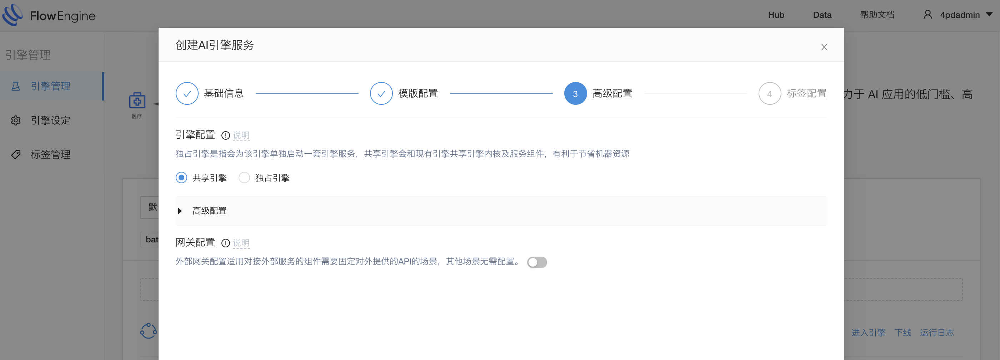

# 引擎类型

&emsp; &emsp; 引擎类型主要分为两个类别，一个是共享引擎，一个是独占引擎

##如何指定引擎类型
&emsp; &emsp; 引擎类型是需要在引擎创建的时候指定，用户需要在高级配置里选择使用那种类型的引擎

##不同的引擎类型有什么不同
&emsp; &emsp; 独占引擎：每启动一个独占引擎都会在k8s集群里启动一个pod，也就是每个独占引擎都有自己的资源，独占引擎之间不会相互影响，就算是其中一个引擎因为一些异常挂掉，也不会影响另外的独占引擎
&emsp; &emsp; 共享引擎：了解共享引擎之前，首先要解释一下什么是系统引擎，系统引擎管理多个共享引擎，每个工作区只能有一个系统引擎，但不是所有的工作区都一定会有系统引擎，只有用户在该工作区下创建第一个共享引擎的时候，才会创建系统引擎，一个工作区的所有共享引擎都会使用同一个系统引擎，这就意味着他们的资源是共享的，一旦系统引擎因为某一个引擎而产生异常，那么所有的引擎都会无法使用。共享引擎的优势就是可以节省资源，并且启动快速，不好的地方就是会导致引擎之间相互影响，这个需要用户根据自己的实际情况来衡量到底使用哪个类型