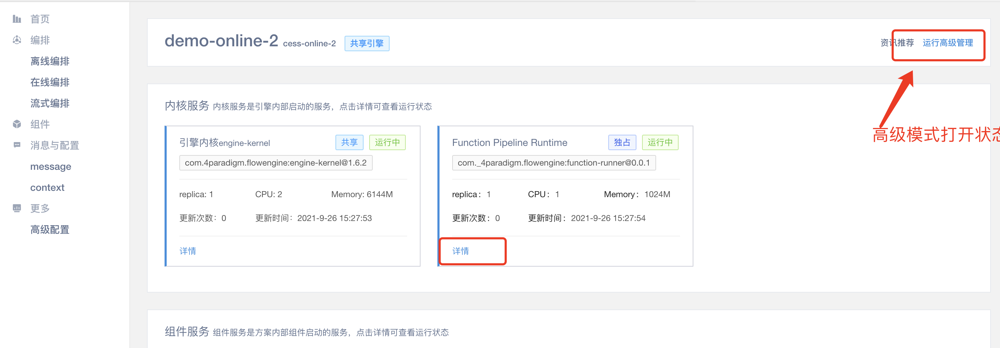
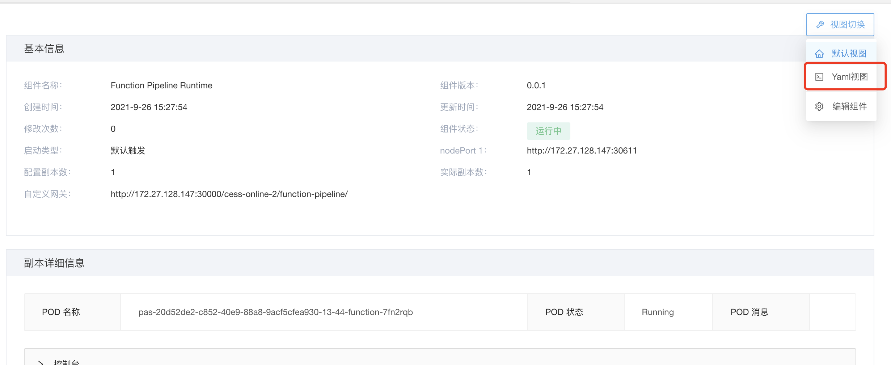
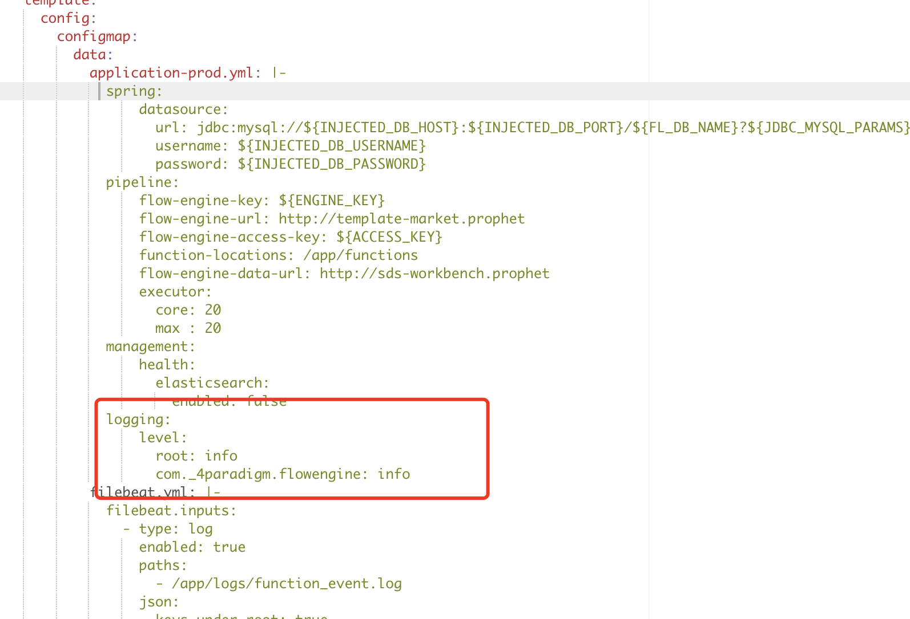
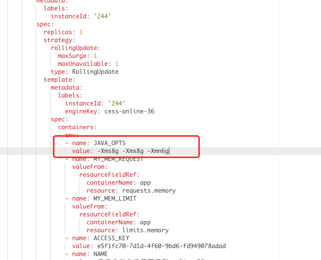
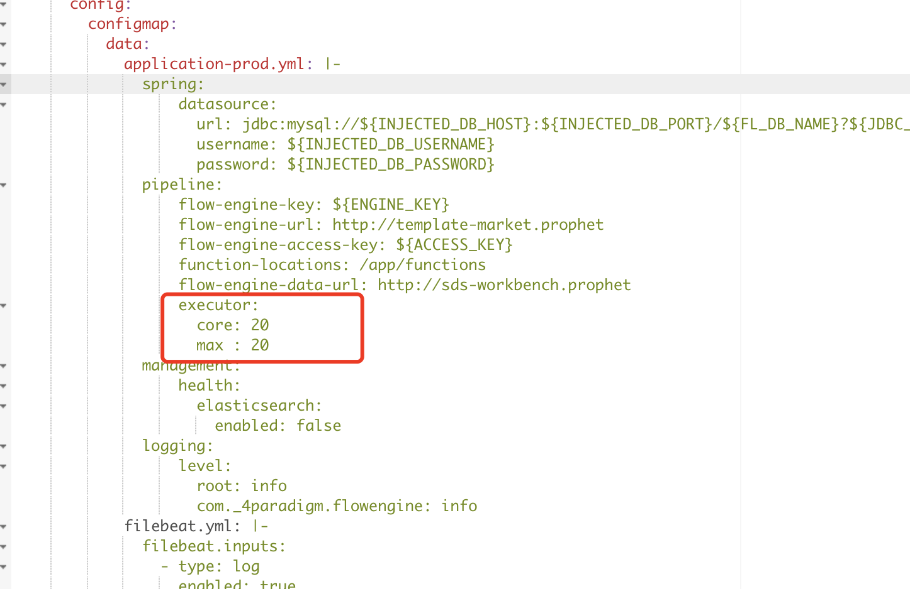

## 背景

在使用过程中，为了排查问题或者优化性能我们开放了一些参数供用户调节。

### 准备：如何进入配置界面

{:width="50%" }
{:width="50%" }

### 1.日志开关(为了提升性能，默认设置为error)

{:width="50%" }

### 2.JVM参数(推荐设置为容器可用内存的2/3左右)

{:width="50%" }

### 3.并发处理线程数(10-200之间)（能够提升服务的并发数减少服务拒绝情况，可根据cpu核心和延迟综合考虑。）

{:width="50%" }

修改后点击右上角"预览差异并提交"。
对于configmap修改服务不生效的情况，可以改动无关deploy的参数，使之强制生效。
另外，可以将该配置[flfunctionpipelinev1.json](./assets/fl-function-pipeline-v1.json)
导入到grafana中，查看pipeline相关监控信息。
