# 02-如何在离线pipeline运行环境中安装未预装的python依赖？

## 什么时候需要制作一个自定义的运行环境？

一般来讲，默认的runtime即enginekernel已经能够完成大部分工作，但以下几种情况，可以考虑自定义一个runtime：

* enginekernel中没有所需要的依赖，动态安装成本较高（运行时即时安装）
* 需要运行大任务，但并不想长期占用资源，希望指定资源占用，动态回收（enginekernel是常驻的）
* 需要指定特殊的节点运行该任务（如GPU节点）

## 目标

构建一个可以执行traceroute命令的运行环境

## 构建镜像

****构建镜像使用的的基础镜像必须要使用官方提供，镜像中自带jdk1.8环境以及worker代码

vim Dockerfile

```
FROM docker.4pd.io/flowengine/worker-base-jdk8:1.6.1

#以下为自定义部分
RUN yum install -y traceroute
```

docker build -f Dockerfile -t docker.4pd.io/worker-test:v1.1 ./(构建镜像后存储的地址)  ####这一步操作前应该先新建一个文件夹，然后把dockerfile放到这个文件夹里，然后再build镜像

base镜像见百度云盘（链接: [https://pan.baidu.com/s/1SdzWCIO37UKfqOHhcfP4yQ](https://pan.baidu.com/s/1SdzWCIO37UKfqOHhcfP4yQ) 提取码: v6ee）。

## 构建Runtime(worker)模版

填写基本信息，保存退出

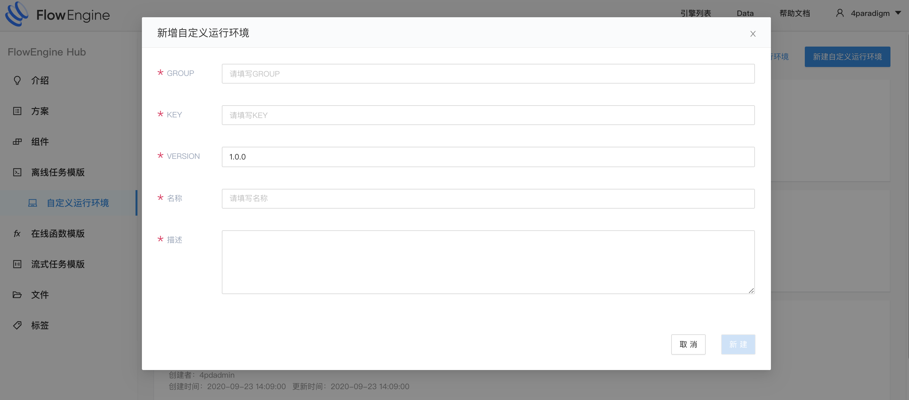{:width="50%" }

打开描述文件，查看信息是否准确

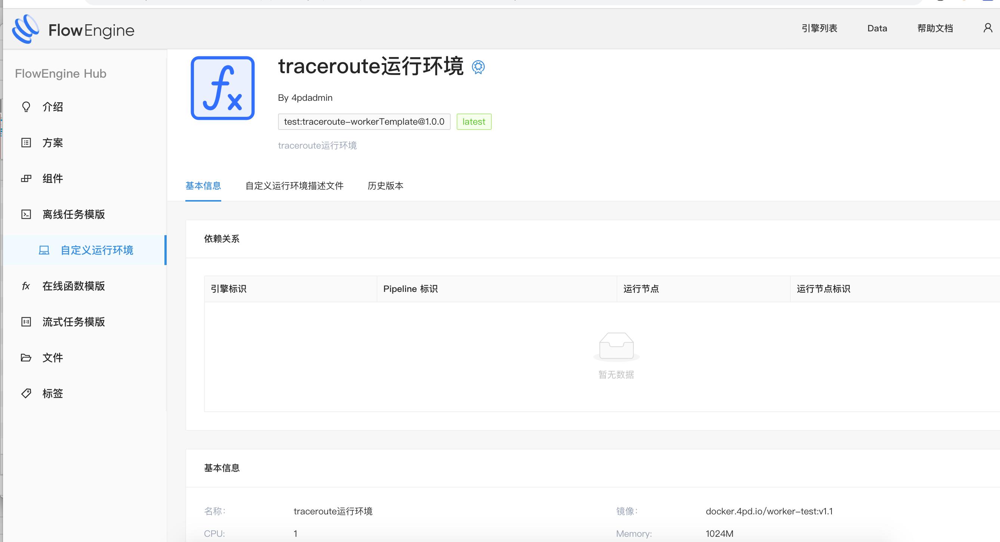{:width="50%" }

主要信息描述

```
{
    "resourceType": "workerT",
    "group": "test",
    "key": "traceroute-workerTemplate",
    "version": "1.0.0",
    "creator": "4pdadmin",
    "createTime": 1601020881060,
    "modifyTime": 1601187816223,
    "desc": "traceroute运行环境",
    "name": "traceroute运行环境",
    "spec": {
        "pasDeployment": {
            "spec": {
                "replicas": 1, // worker运行实例数
                "template": {
                    "spec": {
                        "containers": [
                            {
                                "image": "docker.4pd.io/worker-test:v1.1", // worker镜像地址
                                "resources": {
                                    "limits": {
                                        "memory": "1024M", // worker运行内存
                                        "cpu": "1"// worker运行cpu
                                    }
                                }
                            }
                        ],
                        "nodeSelector": {
                            "prophet.4paradigm.com/offline": true // nodeSelector标签
                        }
                    }
                }
            }
        },
        "idleTimeMillis": 100 // 最大空闲时间
    }
}
```

## 如何使用

1. 创建job并绑定运行环境

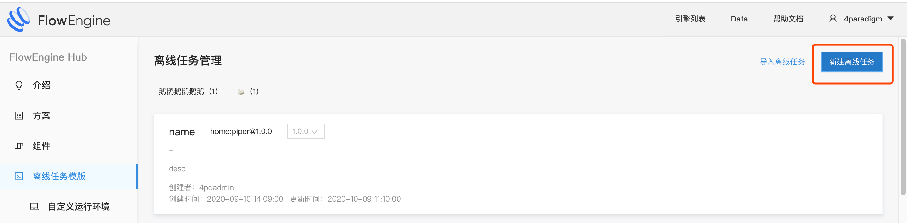{:width="50%" }

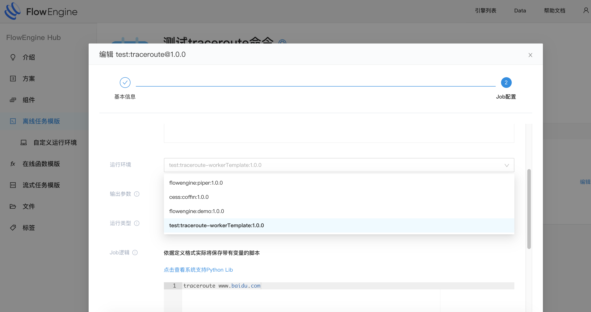{:width="50%" }

2. 在pipeline中使用job
   在一个asol的离线编排里创建一个pipeline，并将刚才创建好的job拖入到pipeline中

   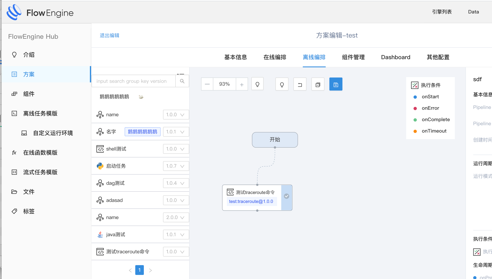{:width="50%" }

发布好这个asol后，我们就可以根据这个asol创建一个引擎了

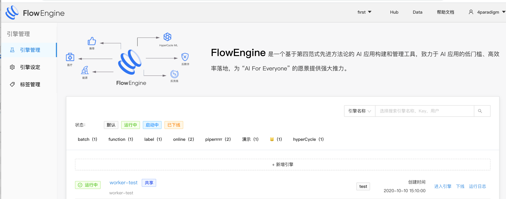{:width="50%" }

创建好引擎后，进入引擎，启动刚才创建的离线pipeline（这个是运行完成的画面）

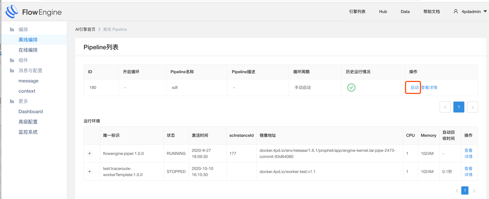{:width="50%" }

3.运行中查看：
可以通过该页面查看job运行的状态和运行环境等信息

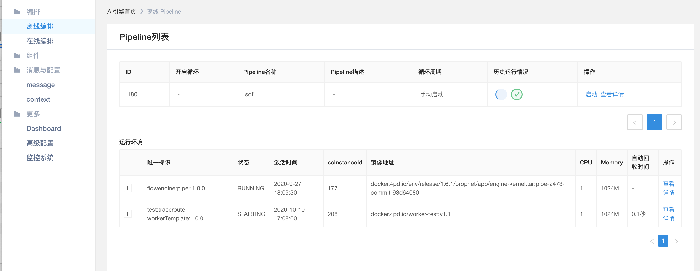{:width="50%" }

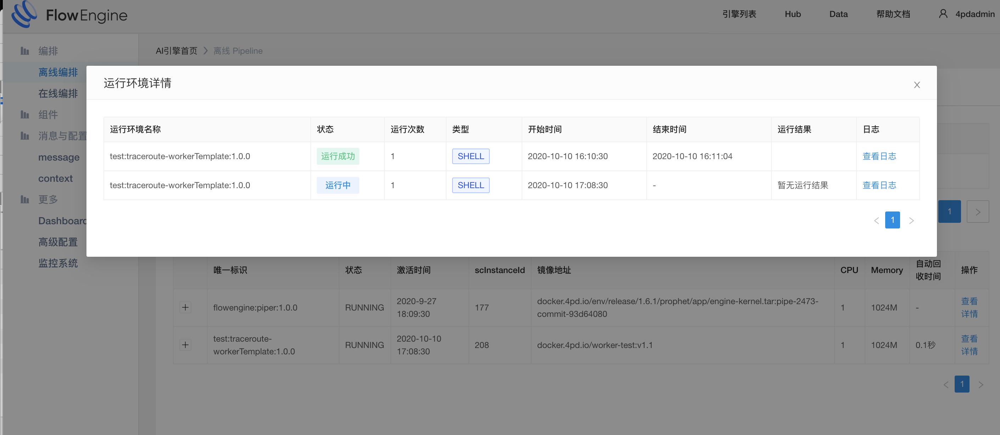{:width="50%" }

运行完成的状态：
由于最大空闲时间设置的为0.1秒，所以运行完成后，运行环境立即被回收了

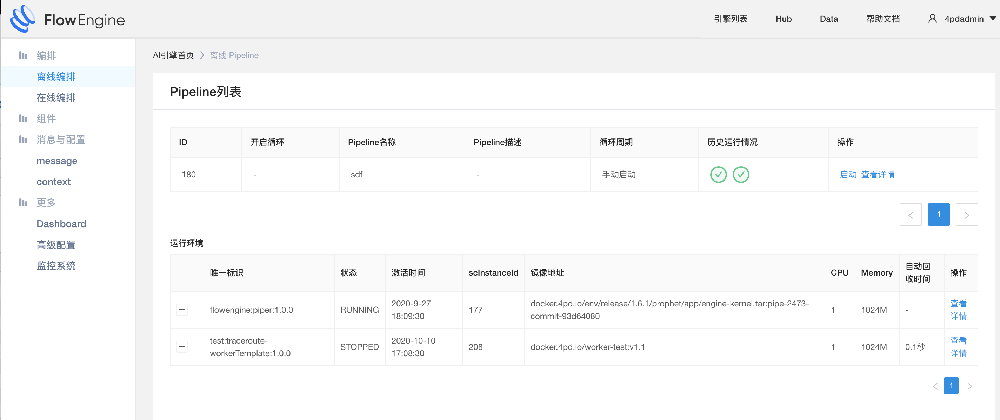{:width="50%" }

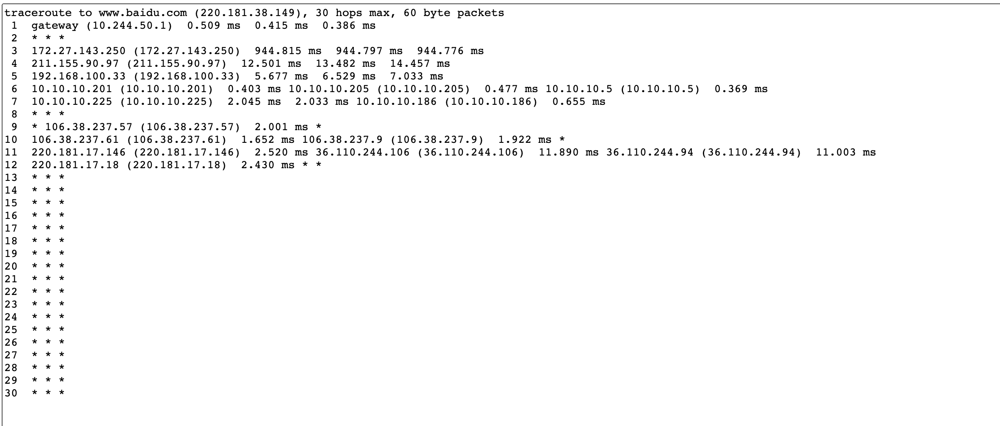{:width="50%" }
