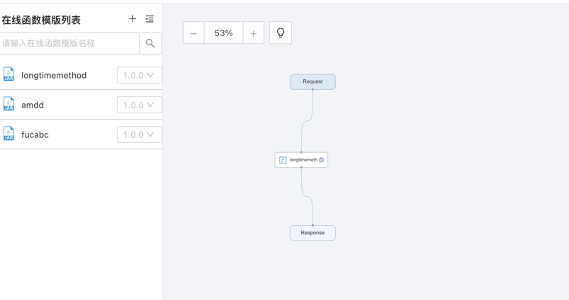
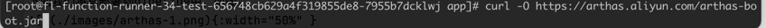
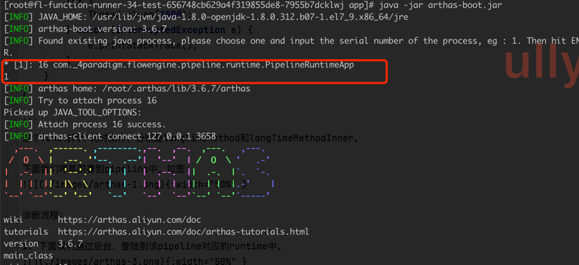
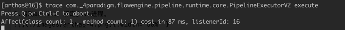
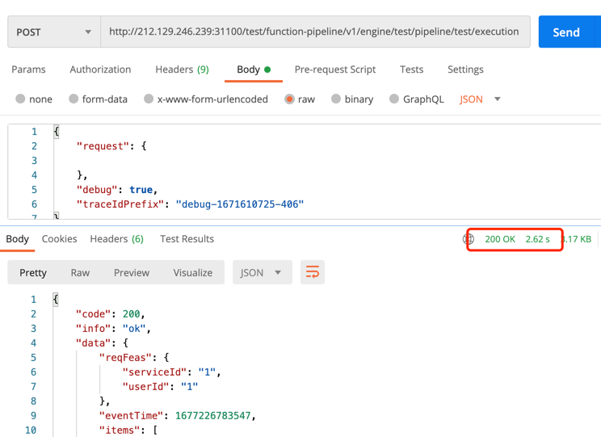
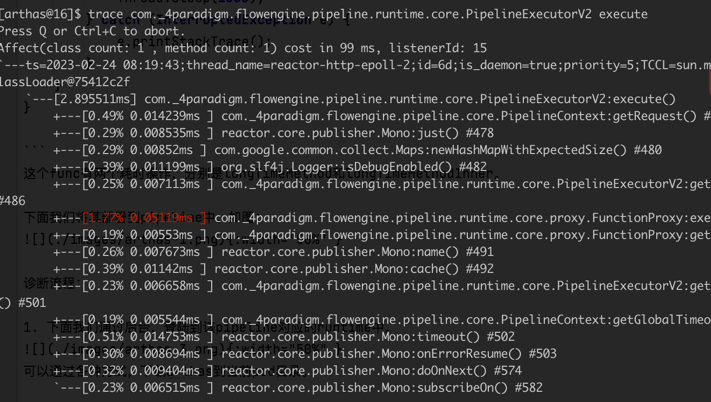
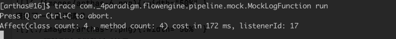
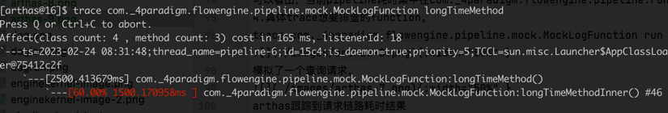

# 08-如何利用arthas排查在线pipeline性能问题

在生产环境中，经常会出现一些性能问题难以定位问题，这时候我们可以利用阿里开源的一个线上监控诊断产品Arthas（https://arthas.gitee.io/doc/）。
它提供了丰富的在线debug能力。

## 模拟问题

下面我们以排查耗时func为例，做一个介绍。

假设我们有一个这样的func：

```java
package com._4paradigm.flowengine.pipeline.mock;

import com._4paradigm.flowengine.pipeline.core.FLFunction;
import com._4paradigm.flowengine.pipeline.core.PipelineContext;
import java.time.Instant;
import java.util.HashMap;
import java.util.LinkedList;
import java.util.List;
import java.util.Map;
import java.util.concurrent.ThreadLocalRandom;

public class MockLogFunction extends FLFunction {

    @Override
    public Object run(PipelineContext context, Object... args) {
        Map<String, Object> body = new HashMap<>();
        body.put("reqId", "demo_request_id");
        body.put("eventTime", Instant.now().toEpochMilli());
        Map<String, Object> reqFeas = new HashMap<>();
        reqFeas.put("userId", "1");
        reqFeas.put("serviceId", "1");
        body.put("reqFeas", reqFeas);
        List<Map<String, Object>> items = new LinkedList<>();
        for (int i = 0; i <= 30; i++) {
            Map<String, Object> item = new HashMap<>();
            item.put("itemId", String.valueOf(i));
            Map<String, Object> itemFeas = new HashMap<>();
            itemFeas.put("weight", ThreadLocalRandom.current().nextDouble());
            itemFeas.put("page", 0);
            itemFeas.put("rank", i);
            item.put("itemFeas", itemFeas);
            items.add(item);
        }
        body.put("items", items);
        context.log(this.getKey(), "test-log", body);
        longTimeMethod();
        return body;
    }

    public void longTimeMethod(){
        try {
            Thread.sleep(1000);
        } catch (InterruptedException e) {
            e.printStackTrace();
        }
        longTimeMethodInner();
    }

    public void longTimeMethodInner(){
        try {
            Thread.sleep(1500);
        } catch (InterruptedException e) {
            e.printStackTrace();
        }
    }
}

```

这个func有两个耗时操作，分别是longTimeMethod和longTimeMethodInner。

下面我们将其部署到pipeline中。如图：

{:width="50%" }

## 诊断流程：

1.下面我们通过后台，登陆到该pipeline对应的runtime中。

{:width="50%" }

可以通过各种方式，下载arthas到当前pod目录。

2.启动arthas，绑定java进程。

{:width="50%" }

3.利用trace命令追踪想要排查的方法。首先全局检查一下pipeline耗时分布。
1）开启trace com._4paradigm.flowengine.pipeline.runtime.core.PipelineExecutorV2 execute

{:width="50%" }

2）模拟了一个查询请求。

{:width="50%" }

3）arthas跟踪到请求链路耗时结果。

{:width="50%" }

可以看出，当前pipeline耗时集中在com._4paradigm.flowengine.pipeline.runtime.core.proxy.FunctionProxy类上，即具体的func上。

4.具体trace想要排查的function。

1) 开启tracefunction
   trace com._4paradigm.flowengine.pipeline.mock.MockLogFunction run

   {:width="50%" }
2) 模拟了一个查询请求。

   {:width="50%" }
3) arthas跟踪到请求链路耗时结果

   {:width="50%" }
4) 从图上看出，最耗时的为： com._4paradigm.flowengine.pipeline.mock.MockLogFunction:longTimeMethod()
5) 进一步分析该method，开启trace检查该方法的耗时分布
   trace com._4paradigm.flowengine.pipeline.mock.MockLogFunction longTimeMethod

   {:width="50%" }

   这样，就可以完整找到代码耗时的全部问题了。

arthas提供了丰富的debug能力，可以结合问题，参考文档综合解决。
