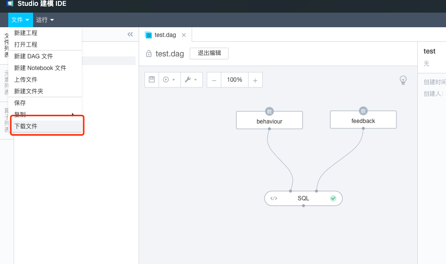
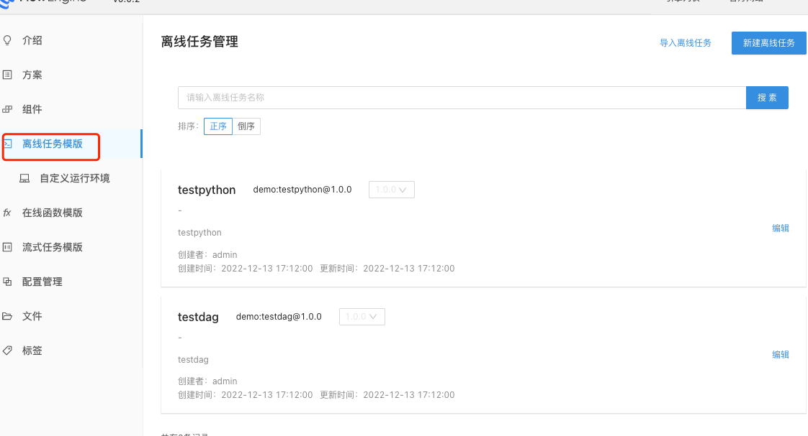
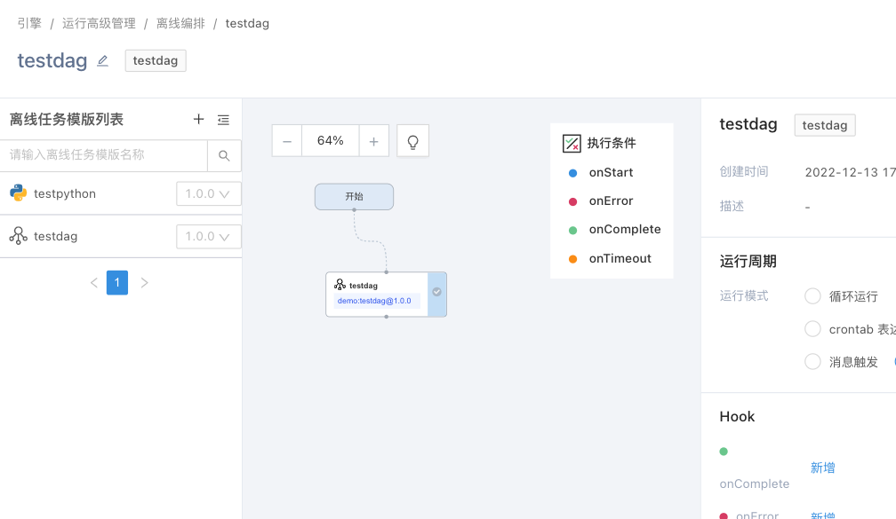

## 目标

开源版本对接第四范式Aios大数据&机器学习DAG任务。

## 步骤

1. 在开源版本的flowengine中，可以通过namespace上添加注解，绑定aios的工作区完成映射。

```
apiVersion: v1
kind: Namespace
metadata:
  annotations:
    fl-managed-ns-config: '{"onAios":true,"name":"fl-test","aiosWorkspaceId":"","aiosAccessKey":""}'
  labels:
    fl-managed-ns: "true"
  name: fl-test
```

其中：

* onAios为true时，表示该工作区映射到aios工作区
* aiosWorkspaceId为aios绑定的工作区ID
* aiosAccessKey为系统生成的accesskey。

也可以直接在aios对应的工作区上，添加flowengine管理的注解，将该工作区纳入flowengine管理。

2. 绑定完成后，可以通过aios进行数据导入，并利用建模ide进行建模，调试开发完成后，可以到处为dag文件。
   {:width="50%" }
   {:width="50%" }
3. 在flowengine hub中创建dag job，将dag文件导入，编排进pipeline中即可。
   {:width="50%" }
   {:width="50%" }
   {:width="50%" }
