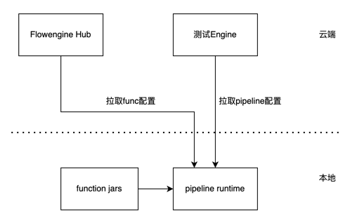
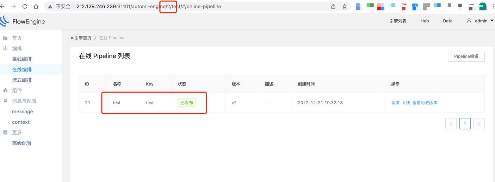
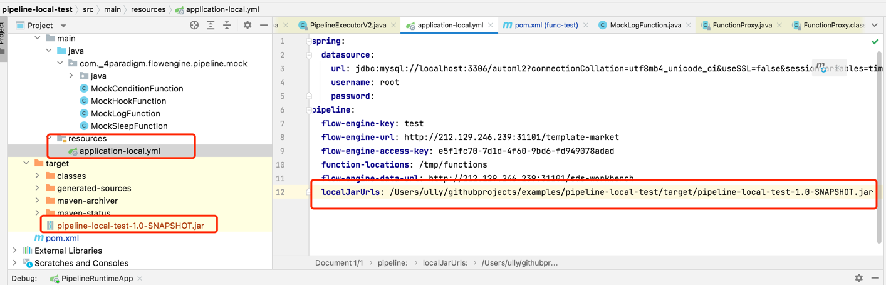
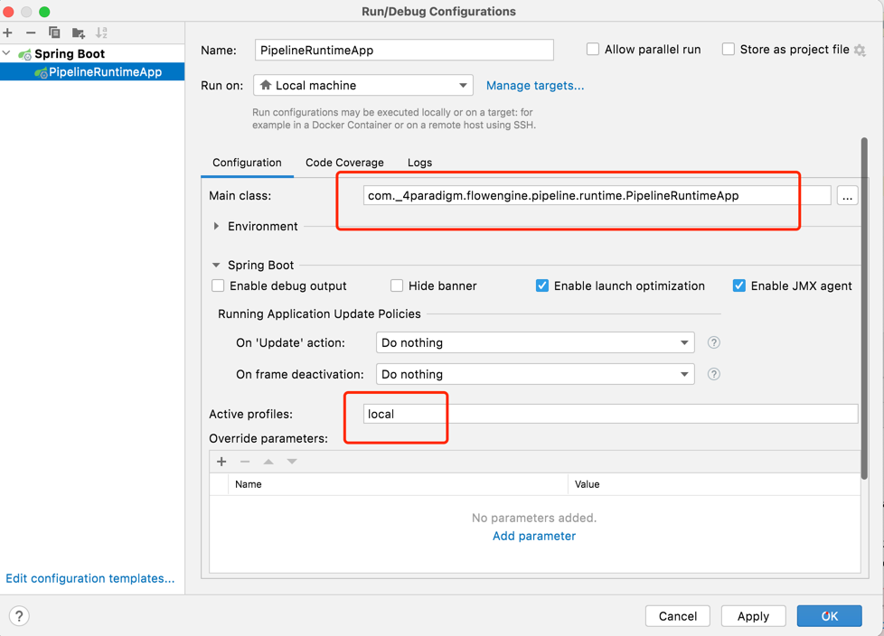
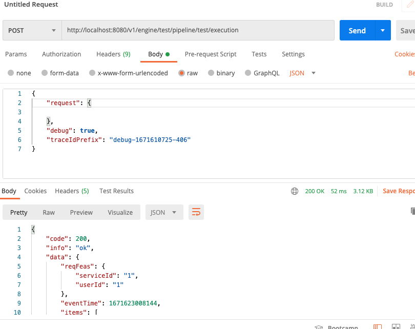
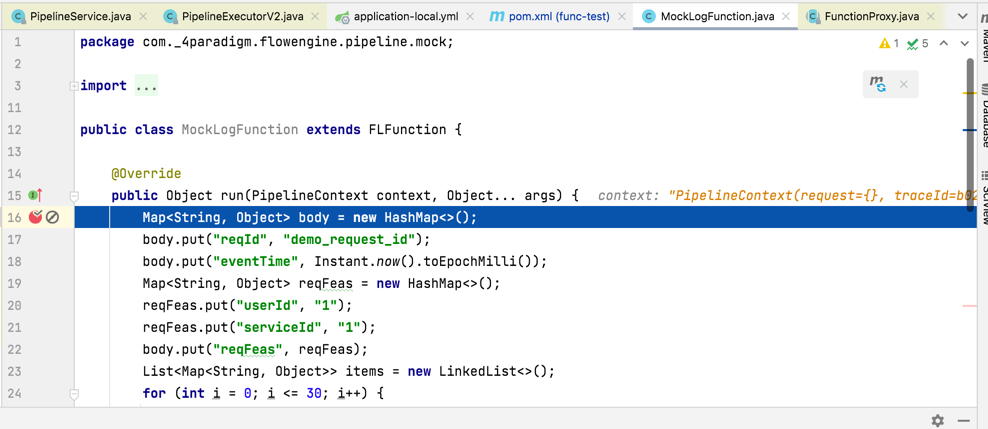

## 问题

如何在本地调试在线pipeline？

## 建议方案

下面我们以案例的形式，指导配置，也可以直接参考该工程获取样例(https://github.com/flow-engine/examples/tree/master/pipeline-local-test)。

示意图：

{:width="50%" }

1. 首先我们在云端创建一个测试用的引擎及pipeline,起名test，方便界面操作。

{:width="50%" }

并且，可以根据url可知其数据库为automl2。

2. 将既有的function开发工程，配置为springboot工程，以便调试使用。

   1) 在自己的func开发工程中添加runtime依赖。

   ```xml
   <dependency>
         <groupId>io.github.flow-engine</groupId>
         <artifactId>fl-func-pipeline-runtime</artifactId>
         <version>0.0.2.1</version>
       </dependency>
       <dependency>
         <groupId>org.springframework.boot</groupId>
         <artifactId>spring-boot-starter-webflux</artifactId>
         <version>2.2.12.RELEASE</version>
       </dependency>
       <dependency>
         <groupId>org.mybatis.spring.boot</groupId>
         <artifactId>mybatis-spring-boot-starter</artifactId>
         <version>2.1.2</version>
       </dependency>
       <dependency>
         <groupId>org.slf4j</groupId>
         <artifactId>slf4j-api</artifactId>
         <version>1.7.30</version>
       </dependency>
       <dependency>
         <groupId>org.projectlombok</groupId>
         <artifactId>lombok</artifactId>
         <scope>provided</scope>
         <version>1.18.20</version>
       </dependency>
   ```
   其中pipelineruntime版本会随升级变化，最低为0.0.2.1。

   2) 工程resouce目录增加springboot配置文件application-local.yml。

      ```yaml
      spring:
        datasource:
          url: jdbc:mysql://localhost:3306/automl2?connectionCollation=utf8mb4_unicode_ci&useSSL=false&sessionVariables=time_zone%3d'%2B08%3A00'
          username: root
          password:
      pipeline:
        flow-engine-key: test
        flow-engine-url: http://212.129.246.239:31101/template-market
        flow-engine-access-key: e5f1fc70-7d1d-4f60-9bd6-fd949078adad
        function-locations: /tmp/functions
        flow-engine-data-url: http://212.129.246.239:31101/sds-workbench
        localJarUrls: /Users/ully/githubprojects/examples/pipeline-local-test/target/pipeline-local-test-1.0-SNAPSHOT.jar
      ```
      其中：

      * datasource.url 为数据库地址，可以直接配置为云端刚才创建的引擎对应数据库，这里就是automl2。
      * datasource.username 为数据库账号
      * datasource.password 为数据库密码。
      * flow-engine-key: 引擎key
      * flow-engine-url： 云端flowengine hub的地址，默认为入口地址/template-market
      * flow-engine-data-url： 云端flowengine data的地址，默认为入口地址/sds-workbench
      * **localJarUrls: 该参数特为本地调试设置，为该function项目工程编译后jar输出全路径，多个jar用;分隔。**

   3) 编译该工程，注意工程jdk版本为11。

   ```shell
    mvn clean package
   ```
   根据地址，修改上面的localJarUrls（该地址随pom定义的变化变化）。

   如图：

   {:width="50%" }
3. 配置springboot工程启动,注意将启动的配置文件设置为local。

   {:width="50%" }
4. 启动该项目，pipelineruntime会自动从云端拉取pipeline定义，并加载本地工程的jar包工作。

   * 调试接口地址为：http://localhost:8080/v1/engine/{engineKey}/pipeline/{pipelineKey}/execution,
   * 请求参数为：

   ```json
   {
       "request": {

       },
       "debug": true,
       "traceIdPrefix": "debug-1671610725-406"
   }
   ```
   在需要调试的代码上打断点，然后利用postman即可调试开发。

   {:width="50%" }
   {:width="50%" }

   {:width="50%" }
