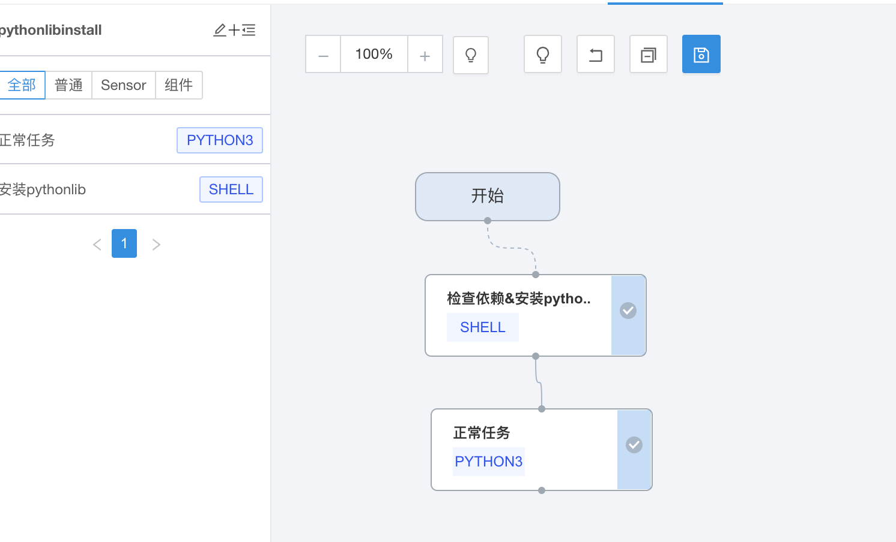
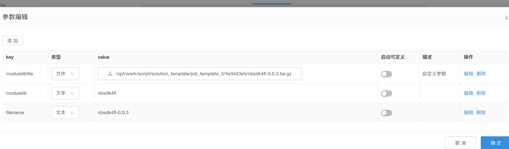

在不依赖于底层的运行环境的库可以通过以下方式安装：

1.准备好自己的pythonlib完整包（包含依赖），如xxx.tar.gz

2.在离线编排界面中，创建一个自定义任务。

{:width="50%" }

```
echo 'start job'
if [ python3 -c "import ${modulelib}" > /dev/null 2>&1 ];then
echo "has installed"
else
tar -xvf ${modulelibfile}
cd ${filename}
python3 ./setup.py install
echo "install ok"
fi
```


3.编排进需要运行的pipeline

{:width="50%" }

右侧可以修改默认参数。
{:width="50%" }
4.前置依赖， 可以下载相关rpm包，在安装pythonlib前安装

rpm -i ${pgxxx}
