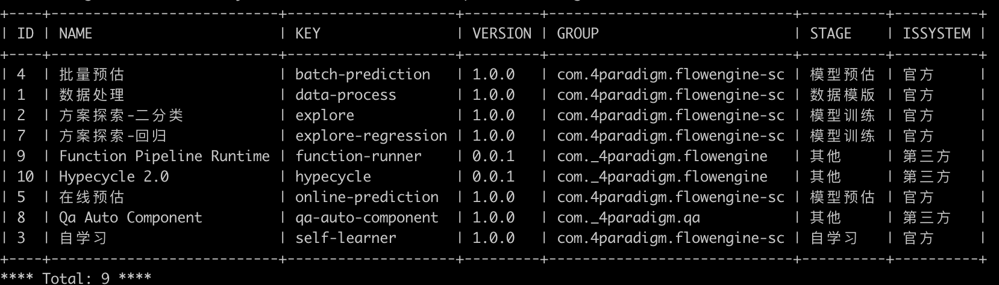

#FlowEngine CLI

## 安装更新
#### 安装
安装方式请参考 [SDK QuickStart](sdk_quickstart.md) 的`安装`部分。

#### 检查安装是否成功
~~~sh
# 查看 cli 安装是否成功
>> ml_cli
~~~
#### 版本查看
版本查看请参考 [SDK QuickStart](sdk_quickstart.md) 的`版本查看`部分。

## 简单使用
#### 配置
在 ~/.flowEngine/config.ini 配置如下信息：

~~~sh
[REMOTE]
access_key = <access_key>
cluster_url = <cluster_url>
~~~
如何获取以上参数请参考 [SDK QuickStart](sdk_quickstart.md) 的`配置`部分。

#### cli ：查看所有组件 sc
~~~sh
>> ml_cli list sc
~~~
结果为：


其他 list 命令，则可：

~~~sh
>>ml_cli list  -h
usage: ml_cli list [-h] {asol,engine,sc,sci,stage,user,workspace} ...

positional arguments:
  {asol,engine,sc,sci,stage,user,workspace}
                        subcommand, please add -h
    asol                list all asol
    engine              list all engines
    sc                  list all sc
    sci                 list all sci of the engine, sci stands for the Instance of Service Component
    stage               list all stages
    user                list all users of workspace_ID
    workspace           list all workspace

optional arguments:
  -h, --help            show this help message and exit
~~~

## cli 的主要命令
``` shell
>> ml_cli
usage: ml_cli {clone,create,define,delete,deploy,desc,disable,edit,enable,exec,export,generate,import,job,list,log,resume,run,start,stop,update,help}
              ...

. _____ _                               _
 |  ___| | _____      _____ _ __   __ _(_)_ __   ___
 | |_  | |/ _ \ \ /\ / / _ \ '_ \ / _` | | '_ \ / _ \
 |  _| | | (_) \ V  V /  __/ | | | (_| | | | | |  __/
 |_|   |_|\___/ \_/\_/ \___|_| |_|\__, |_|_| |_|\___|
                                  |___/

:: 4Paradigm ::           (v1.6.0)
-------------------------------------------------------------------------
Welcome to use the Command-line interface to the API server of FlowEngine.
    sc stands for Service Component.
    sci stands for the Instance of sc.

positional arguments:
  {clone,create,define,delete,deploy,desc,disable,edit,enable,exec,export,generate,import,job,list,log,resume,run,start,stop,update,help}
    log                 log stream of sci list
    help

See "ml_cli help COMMAND" for help
[FlowEngine]:
	clone asol 	create an asol by clone another
	create pipeline 	create new pipeline in engine.ml_cli create pipeline --file_path={file_path} --engine_key={engine_key}
	create project 	generate sc project repo on gitlab
	create sc 	Enable to create sc and upload image by command. Please run this command under the root directory of your project,
For more info, please view solution market's website and fi
	define sc 	define a sc
	delete engine 	delete an engine forever
	delete sc 	delete the sc by id
	deploy engine 	deploy an engine by the asol
	desc asol 	show details of the asol
	desc engine 	show details of the engine
	desc pipeline run 	describe the pipeline run in engine.ml_cli desc pipeline run {history_id} --engine_key={engine_key}
	desc sc 	show details of the sc
	disable pipeline 	disable pipeline cycle period settings.ml_cli disable pipeline {pipeline_id} --engine_key={engine_key}
	enable pipeline 	enable pipeline period settings，eg.trigger period.ml_cli enable pipeline {pipeline_id} --engine_key={engine_key}
	export asol 	import asol from remote FlowEngine
	generate sc 	generate sc yaml file, please run this command under the root directory of your project
	import asol 	import asol to remote FlowEngine
	job runner 	run job use python job runner.
	list asol 	list all asol
	list engine 	list all engines
	list pipeline 	show pipelines of the engine.ml_cli list pipeline --engine_key={engine_key}
	list pipeline history 	list pipeline history_list in engine.ml_cli list pipeline history {pipeline_id} --engine_key={engine_key}
	list sc 	list all sc
	list stage 	list all stages
	list user 	list all users of workspace_ID
	list workspace 	list all workspace
	log 	log stream of sci list
	resume pipeline run 	resume the pipeline run in engine.ml_cli resume pipeline run {history_id} --engine_key={engine_key}
	run pipeline 	run pipeline once，eg.trigger period.ml_cli run pipeline '{pipeline_id}' {job_params} --engine_key={engine_key}
	start engine 	start the engine
	stop engine 	stop the engine
	stop pipeline run 	stop the pipeline run in engine.ml_cli stop pipeline run {history_id} --engine_key={engine_key}
	update pipeline 	update the pipeline settings in engine.ml_cli update pipeline {pipeline_id} --engine_key={engine_key} --file_path={file_path}
	help
[ServiceComponent Instance]:
	desc sci 	show the details of the specific sci.
	edit sci 	reload the sci by editing the config
	exec sci 	remote shell to the pod, using exit to quit.
	list sci 	list all sci of the engine, sci stands for the Instance of Service Component
[Remote SCI]:
if get more help from remote sci, try `ml_cli --engine-id <engine_id>`.
```

#### FlowEngine
该部分命令主要是操作和查看 FlowEngine 的相关内容，包含 asol、sc、engine 等主要资源的操作以及其他辅助命令。

* asol ：方案模板，FlowEngine 的描述文件和 checkpoint 。
* sc ：service component，组件。
* engine ：FlowEngine 的实例。

#### SCI
sci ，表示 service component instance ，组件的实例。该部分命令主要是操作和查看 sci 。主要包含查看、动态修改配置、远程访问操作等。

#### Remote SCI
该部分命令主要是开发者自定义的命令。开发者可以为组件自定义开发不同的命令，并将脚本部署在组件实例内部，即可通过 Cli 远程调用。


## Welcome Issues
欢迎提供 issues，[FlowEngine-python-SDK](https://gitlab.4pd.io/meteor/mlplat/flowengine-python-sdk/issues)
