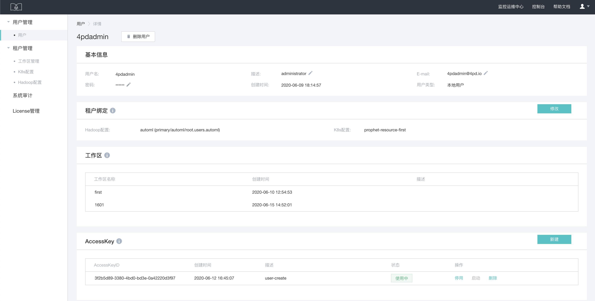

# FlowEngine SDK

## 环境
Python 3.x.
Linux


## 安装更新
#### 安装
~~~sh
pip3 install FlowEngineSDK --index-url=http://pypi.4paradigm.com/4paradigm/dev --trusted-host pypi.4paradigm.com
~~~
也可以从源码安装（但不建议）[FlowEngine-python-SDK](https://gitlab.4pd.io/meteor/mlplat/flowengine-python-sdk) 。    
变更记录 [CHANGELOG](https://gitlab.4pd.io/meteor/mlplat/flowengine-python-sdk/blob/develop/CHANGELOG.md) 。
#### 检查安装是否成功
~~~sh
# 查看 SDK 是否安装成功
>> import flowengine
~~~
#### 版本查看
~~~sh
pip show flowengineSDk
~~~

## 简单使用
#### 配置
##### FlowEngine 环境中
在 FlowEngine 环境中无需配置。    
作为 FlowEngine 的自定义任务脚本也无需配置。
##### 本地开发环境
在 ~/.flowEngine/config.ini 配置如下信息：

~~~sh
[REMOTE]
access_key = <access_key>
cluster_url = <cluster_url>
workspace_name = <workspace_name>
engine_key = <engine_key>
error_log_file=error.log
info_log_file=info.log
~~~

其中：

1. cluster\_url 表示 FlowEngine 服务的 url
2. access\_key 表示 FlowEngine 服务的访问口令
3. engine_key 是新建引擎时输入的 “AI引擎Key”
4. workspace_name 是工作区名称

##### 配置获取方法

工作区名称：查看 FlowEngine 主页左上角。


访问路径：进入 `控制台` -> `用户管理` -> `选择对应用户` 便可直接复制 `accessKey` 。



#### Demo ：查看所有自学习任务
``` shell
>> ipython3
>> from flowengine import SelfLearnService
>> self_learner = SelfLearnerService()
>> histories = self_learner.get_history()
```


## SDK 主要服务类

#### HyperCycleService
官方 HyperCycle 组件实例的服务类，主要包含数据导入、探索模型部署、开启批量预估等。
#### SelfLearnerService
官方自学习组件实例的服务类，主要包含自学习任务查看、开启、停止等。
#### BatchPredictorService
官方批量预估组件的服务类，主要包含批量预估任务的开启和查看等。
#### PdmsService
FlowEngine 底层依赖 pdms 服务的服务类，主要包含不同存储对象的增删查改等。
#### WorkFlowService
FlowEngine 底层依赖 pws 服务的服务类，主要包含 dag 提交、查看运行状态等。

## Welcome Issues
欢迎提供 issues，[FlowEngine-python-SDK](https://gitlab.4pd.io/meteor/mlplat/flowengine-python-sdk/issues)
