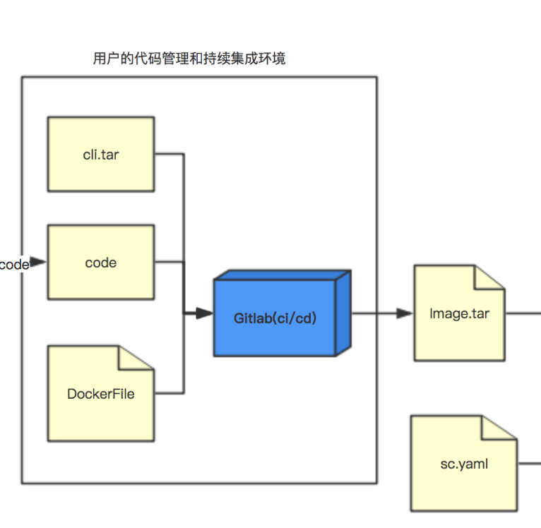
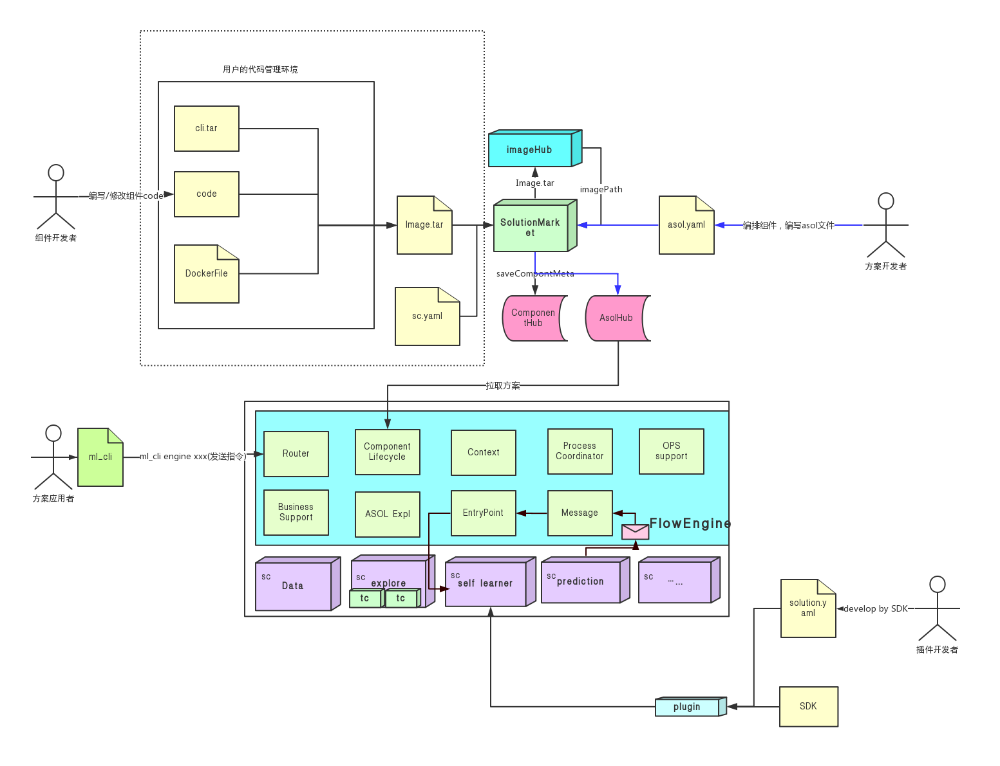

## 关于组件
### 组件概念
组件包括了一个服务镜像和一个描述文件`sc.yaml` ，镜像中包含了用户的服务包，CLI ，`sc.yaml` 主要描述了组件的基本信息，CLI 文件路径，静态画面的入口，服务日志路径，健康检查的 url ，声明的消息类型以及一些可能线上才能确定的环境变量。

### 组件架构
FlowEngine 每个系统组件统一编译发布的流程，包括了 CICD 脚本，服务组件源码，前端服务的静态文件，组件 CLI ，镜像编译文件 DockerFile。

如果你只是想扩展系统组件的能力，只需要修改组件源码，并按照 CICD 脚本执行,完成镜像打包，然后调用 FlowEngine 提供的 CLI 或者直接在组件市场页面上操作，将之前打好的镜像包和 `sc.yaml`上传至 SolutionMarket，SolutionMarket 将镜像上传至镜像仓库，并将镜像的地址回写到 `sc.yaml` 中，再将 `sc.yaml` 保存到 ComponentHub 里。

如果是更新同一个组件，建议你定义一个自己的版本，Solution-Market 会帮你管理该组件下的所有版本，以备方案开发者使用。

开发新的组件流程和这个大致类似，你可以沿用现有组件的 CICD 流程，直接替换系统组件服务包，更换 `sc.yaml` 里对应组件的类型和版本。


### 组件启动
Component Lifecycle Management 模块会根据用户选择的 asol 文件或者是用户直接上传的一个 asol 文件，manager 调用 ASOL expl 模块解析 asol 文件，拉取对应的镜像，并注入 FlowEngine 的上下文信息，最后启动服务。

manager 的 Compont Lifecycle Management 模块会根据组件定义的健康检查 url 实时同步服务的运行状态，方案应用者可以通过 CLI 来实时监控他们组件的运行状态。

### 组件流程

如果是在 FlowEngine 标准流程上的组件，组件之间的流程通信方式是记录在 StageInfo 上的，各个组件必须严格按照这套标准通信（如果你开发的是主流程上的组件），由 Process Coordinator 统一协调组件运作，如果你不是按照这个标准声明，那么抱歉，你的组件可能在该流程上会失败，导致后面的流程无法进行，当然 Process Coordinator 也会将这个消息实时反馈给用户。  

### 组件基本信息格式(样例)
``` yaml
version: senior/v2
kind: sc
metadata:
  name: 方案探索-二分类
  alias: 方案探索-二分类
  key: explore
  group: com.4paradigm.flowengine-sc
  creator: 4pdadmin
  label: 模型训练,二分类
  version: 1.0.0
  describe: 适用于二分类的模型训练任务
businessSetting:
  solutionSetting:
    solution: {}
    solutionUiPath: /explore/1.0.0/
opsSettings:
  basicSetting:
    loadMode:
      type: Normal
    livenessUrl: http://:8080/health
    externalService:
      enable: false
      mode: Enable-Shard
      dbMode: Engine-Shard
      serviceEndpoint: http://explore-57-hypc20test11.prophet-resource-first:8080
      portalListenPath: /automl-engine/explore/37/57
    uiConfig:
    - name: test
      endPoint: /#/
    resource: {}
    service: {}
  rawSetting:
    backend: pas
    template:
      config:
        options:
          requireHadoopConfig: true
          hadoopConfigPath: /usr/local/hadoop/etc/hadoop
        deployments:
          ${global.flowEngineId}-solution-explore:
            kind: Deployment
            metadata:
              labels:
                instanceId: ${global.flowEngineId}
            spec:
              replicas: 1
              strategy:
                rollingUpdate:
                  maxSurge: 1
                  maxUnavailable: 1
                type: RollingUpdate
              template:
                metadata:
                  labels:
                    instanceId: ${global.flowEngineId}
                spec:
                  containers:
                  - env:
                    - name: PYSPARK_SHARE_OPTS
                      value: ${global.PYSPARK_SHARE_OPTS}
                    - name: RUNNING_ENV
                      value: ${global.RUNNING_ENV}
                    - name: CLUSTER_SCIPY27_INSTALLED
                      value: 'false'
                    - name: TUNING_REMOTE_HOME
                      value: ${global.TUNING_REMOTE_HOME}
                    - name: STRATEGY_PYSPARK_DRIVER_MEM
                      value: ${global.STRATEGY_PYSPARK_DRIVER_MEM}
                    - name: STRATEGY_PYSPARK_DRIVER_CORES
                      value: ${global.STRATEGY_PYSPARK_DRIVER_CORES}
                    - name: STRATEGY_SCRIPT_RUNNING_ON_YARN
                      value: ${global.STRATEGY_SCRIPT_RUNNING_ON_YARN}
                    - name: FE_PYSPARK_OPTS
                      value: ${global.FE_PYSPARK_OPTS}
                    - name: ZK_ADDR
                      value: ${global.ZK_ADDR}
                    - name: DB_HOST
                      value: ${global.db.host}
                    - name: DB_PORT
                      value: ${global.db.port}
                    - name: DB_USER
                      value: ${global.db.user}
                    - name: DB_PWD
                      value: ${global.db.password}
                    - name: DB_NAME
                      value: explore__${global.flowEngineId}_${global.scTemplateId}
                    - name: ACCESS_KEY
                      value: ${global.accesskey}
                    - name: NAME
                      value: ${global.engineName}
                    - name: ENGINE_KEY
                      value: ${global.engineKey}
                    - name: INSTANCE_ID
                      value: ${global.flowEngineId}
                    - name: SC_KEY
                      value: explore
                    - name: SC_VERSION
                      value: 1.0.0
                    - name: FLOW_ENGINE_URL
                      value: http://automl-${global.flowEngineId}:8080
                    - name: TARGET_PORT
                      value: '8080'
                    image: ${global.registry}/config-center:sc-solution-explore
                    imagePullPolicy: Always
                    livenessProbe:
                      failureThreshold: 10
                      httpGet:
                        path: /health
                        port: 8080
                        scheme: HTTP
                      initialDelaySeconds: 30
                      periodSeconds: 20
                      successThreshold: 1
                    name: ${global.engineKey}
                    readinessProbe:
                      failureThreshold: 10
                      httpGet:
                        path: /health
                        port: 8080
                        scheme: HTTP
                      initialDelaySeconds: 30
                      periodSeconds: 20
                      successThreshold: 1
                    resources:
                      limits:
                        memory: 2048M
                        cpu: '1'
                    volumeMounts:
                    - mountPath: /opt/work/pico_deploy
                      name: pico-config-data
                  dnsPolicy: ClusterFirstWithHostNet
                  initContainers:
                  - command:
                    - sh
                    - -ex
                    - -c
                    - for i in `ls /opt/prophet/node-executor/base-operators/pico-dependency/031`; do cp -r /opt/prophet/node-executor/base-operators/pico-dependency/031/$i /data/ || exit $?; done; cd /data/pico/whl/; unzip pygdbt-*-py2-none-any.whl;
                    image: ${global.registry}/config-center:operator-repository
                    imagePullPolicy: IfNotPresent
                    name: pico-config
                    resources:
                      limits:
                        cpu: '1'
                        memory: 1024M
                      requests:
                        cpu: '0'
                        memory: '0'
                    volumeMounts:
                    - mountPath: /data
                      name: pico-config-data
                  nodeSelector:
                    prophet.4paradigm.com/offline: 'true'
                  restartPolicy: Always
                  schedulerName: default-scheduler
                  terminationGracePeriodSeconds: 30
                  volumes:
                  - name: pico-config-data
        services:
          ${global.flowEngineId}-solution-explore:
            kind: Service
            metadata:
              annotations:
                api-gw-conf: '{"gw-api-confs":[{"listen-paths":"/automl-engine/${global.engineKey}/${global.flowEngineId}/${global.scTemplateId}","enable-auth":false,"stripe-url":true}]}'
              labels:
                enable-on-api-gw: 'true'
              name: explore-${global.scTemplateId}-${global.engineKey}
            spec:
              ports:
              - port: 8080
                targetPort: 8080
              type: NodePort
      class: explore-${global.scTemplateId}-${global.engineKey}
configSetting: {}
componentRuntimeConfig: {}
```

字段详解

* version 描述解析 sc.yaml 的解析器的版本
* kind 描述资源类型，开发组件该字段必须填写 sc
* metadata 服务信息字段
* metadata.creator 服务创建者
* metadata.describe 服务描述信息
* metadata.group 服务所属组别名称
* metadata.name 服务名称
* metadata.version 服务镜像版本
* businessSettings 业务信息字段
* businessSettings.solutionSettings 方案信息字段
* businessSettings.solutionSettings.solutionLocationPath 方案 UI zip 包本地存放的绝对路径
* businessSettings.solutionSettings.solutionUiPath 方案 UI 在远端预期存放的路径 
* opsSettings 运维设置
* opsSettings.basicSetting.livenessUrl 健康检查
* opsSettings.basicSetting.replicas 服务需求副本数
* opsSettings.basicSetting.resource.cpu 服务资源 cpu 需求
* opsSettings.basicSetting.resource.memory 服务资源内存需求
* opsSettings.basicSetting.service.port 服务在clusterIP上暴露的端口配置
* opsSettings.basicSetting.service.targetPort 服务在容器中的端口配置
* opsSettings.scImage 服务镜像所在相对地址

组件开放的环境变量
作用：保证组件迁移，减少修改成本
替换时机：组件创建和修改
例子：

``` yaml
config:
  deployments:
    ${global.flowEngineId}-${global.scTemplateId}-data-process:
      kind: Deployment
      metadata:
        labels:
          instanceId: ${global.flowEngineId}
```

可使用的环境变量如下：

| key                 | describe                                                 | scope    |
|---------------------|----------------------------------------------------------|----------|
| global.engineKey    | 引擎key，全局唯一，同一引擎下的组件值相同                | 引擎     |
| global.engineName   | 引擎name， 同一引擎下的组件值相同                        | 引擎     |
| global.flowEngineId | 引擎id， 全局唯一，同一引擎下的组件值相同                | 引擎     |
| global.registry     | 当前环境下的镜像仓库地址                                 | 整个环境 |
| global.accesskey    | 执行创建引擎操作的用户accesskey                          | 引擎     |
| global.workspaceId  | 引擎所在的工作空间id                                     | 引擎     |
| global.scTemplateId | 当前组件模版id，同一引擎下一定唯一，不同引擎下可能不唯一 | 组件     |

----
### 接下来
* [快速开发组件](../component/sc_quickstart.md)
* [组件注册到上线](../component/sc_create.md)
* [组件更新再发布](../component/sc_redeploy.md)
* [自定义组件与Cli如何交互](../component/component-cli.md)