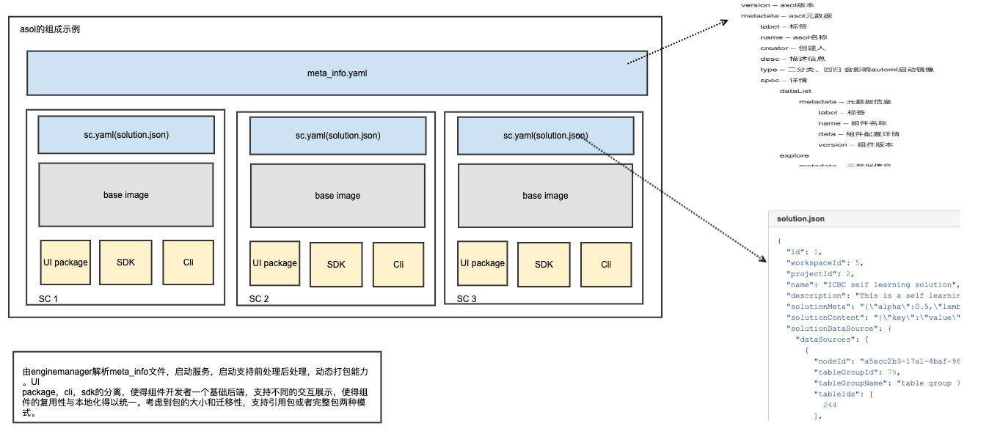

## 关于方案
### 方案概念
AI 方案在 FlowEngine 中称为 AI Solution ，以下简称 asol 。  

asol 是能够被 FlowEngine 解析执行的文件包格式，包含 AI 应用全过程的运行逻辑和规则，以及运行环境上下文的文件集合体。如果把 FlowEngine 比作一个运行时（runtime）的话，那么作为方案沉淀的核心结果物（asol）就是待运行的 app。

对于运行时来讲，它是无状态的，它如何工作，所有的行为都交给了 asol 的定义。这样做的好处就使得方案产品具有了很强的可迁移性，只要 FlowEngine 版本兼容，它就能够很好的重建整个过程。从思想上，可以类比于 docker image 的概念，由于镜像的出现，它使得运维的成本有了很大的下降。

同理，在 AI 应用开发过程中，核心结果物，比如建模过程的 dag ，用到的工具都被零散的放在 wiki 中，文件夹中等散落在各处， asol 的作用就是将其完整的，有序的集成在一起，使得因为运维或者环境原因导致的交付实施成本就可以很大程度降低。

asol 的核心作用就是能够完成方案场景定义，沉淀和迁移。
### 方案架构
&emsp; &emsp; asol包的具体格式及包含文件如图所示：
 
&ensp; &ensp; 其中 `meta_info.yaml` 为 asol 的基本信息，每一个 sc 文件夹中包含 `sc.yaml` (组件基本信息)， `sc Image`（组件镜像），`sc solution UI zip`（组件前端）。  
### 方案基本信息格式(样例)
``` yaml
id: 1
version: '1.0'
kind: asol
meta:
  name: test
  describe: example asol META_INFO
  label: 通用
opsSetting:
  template:
    class: automl-${moduleId}
    config:
      deployments:
        ${moduleId}-engine-kernel:
          kind: Deployment
          metadata:
            labels:
              instanceId: ${moduleId}
          spec:
            replicas: 1.0
            template:
              metadata:
                labels:
                  instanceId: ${moduleId}
              spec:
                containers:
                - name: ${engineKey}
                  image: ${registry}/config-center:engine-kernel
                  imagePullPolicy: IfNotPresent
                  env:
                  - name: DB_HOST
                    value: mysql.${namespace}
                  - name: DB_PORT
                    value: '3306'
                  - name: DB_USER
                    value: root
                  - name: DB_PWD
                    value: root
                  - name: DB_NAME
                    value: automl${moduleId}
                  - name: CLUSTER_URL
                    value: http://gateway.automl13.devops.4pd.io
                  - name: ACCESS_KEY
                    value: ${accessKey}
                  - name: NAME
                    value: ${engineName}
                  - name: ENGINE_KEY
                    value: ${engineKey}
                  - name: INSTANCE_ID
                    value: ${moduleId}
                  - name: SCRIPT_HOME
                    value: /opt/work/script
                  - name: TUNING_REMOTE_HOME
                    value: ${tuningRemoteHome}
                  - name: BATCH_PREDICTOR_URL
                    value: http://batch-predictor-${moduleId}:9600
                  - name: SELF_LEARNER_URL
                    value: http://self-learner-${moduleId}:9600
                  - name: PREDICTOR_IMAGE
                    value: env/release/3.1.0/prophet/app/predictor.tar:v3.1.0
                  - name: MEM_REQUEST
                    valueFrom:
                      resourceFieldRef:
                        containerName: ${engineKey}
                        divisor: '0'
                        resource: requests.memory
                  - name: MY_MEM_LIMIT
                    valueFrom:
                      resourceFieldRef:
                        containerName: ${engineKey}
                        divisor: '0'
                        resource: limits.memory
                  - name: Node_IP
                    valueFrom:
                      fieldRef:
                        fieldPath: status.hostIP
                  resources:
                    limits:
                      cpu: 2000m
                      memory: 6144M
                    requests:
                      cpu: 2000m
                      memory: 6144M
                  volumeMounts:
                  - name: pico-config-data
                    mountPath: /opt/work/pico_deploy
                initContainers:
                - command:
                  - sh
                  - -ex
                  - -c
                  - for i in `ls /opt/prophet/node-executor/base-operators/pico-dependency/031`; do cp -r /opt/prophet/node-executor/base-operators/pico-dependency/031/$i /data/ || exit $?; done
                  image: ${registry}/config-center:operator-repository
                  imagePullPolicy: IfNotPresent
                  name: pico-config
                  resources:
                    limits:
                      cpu: '1'
                      memory: 1024M
                    requests:
                      cpu: '0'
                      memory: '0'
                  volumeMounts:
                  - name: pico-config-data
                    mountPath: /data
                volumes:
                - name: pico-config-data
                  emptyDir: {}
      services:
        ${moduleId}-automl:
          kind: Service
          metadata:
            name: automl-${moduleId}
            labels:
              enable-on-api-gw: 'true'
            annotations:
              api-gw-conf: '{"gw-api-confs":[{"listen-paths":"/automl-engine/${moduleId}","enable-auth":false,"stripe-url":true}]}'
          spec:
            type: NodePort
            ports:
            - port: 8080
              targetPort: 8080
      options:
        requireHadoopConfig: true
        hadoopConfigPath: /usr/local/hadoop/etc/hadoop
  backend: pas
businessSetting:
  marketTemplateId: 17.0
  displayType: FlowEngine
  router:
    index_type: ''
    index_url: ''
    index_componet_key: ''
  scComponents:
  - scGroup: com.4paradigm.flowengine-sc
    scVersion: 1.0.0
    label: 数据
    scKey: data-process
    scName: 数据模版
    order: 1
  - scGroup: com.4paradigm.flowengine-sc
    scVersion: 1.0.0
    label: 训练,二分类,LR/GBDT/DSN
    scKey: explore
    scName: 模型训练-二分类
    order: 2
   diskLimit: false
  limitSize: 0.0
```
----
### 接下来
* [新建方案](../solution/solution_selfdefined.md)
