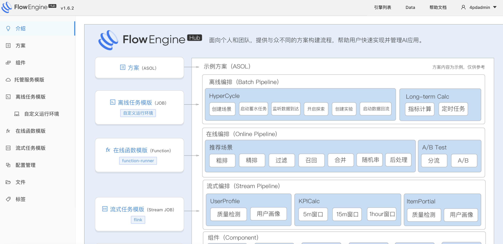
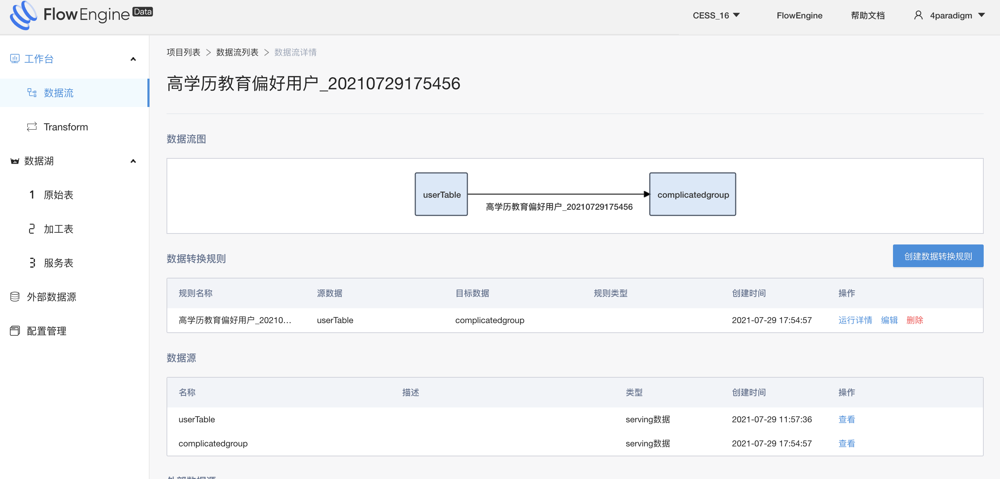
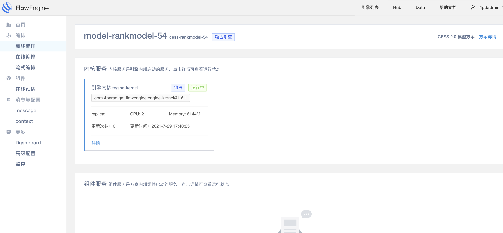

# 功能简介
flowengine从功能上分为以下子功能板块。
## Flowengien Hub 

管理Flowengine方案，组件，JOB，Function等资源的仓库，提供开发，部署，分发的功能。

  

更多......

## Flowengine Data 

数据及元数据管理服务，为Flowengine提供数据流能力。

  

更多...

## Flowengine App
 
* engineManager（引擎管理）能够启动和管理引擎。

  

其中，引擎设定可以设置引擎运行期的公共参数。注意，这里的参数和方案配置不同，一般这类配置与具体运行环境有关，如外部数据库地址等。
标签管理，可以允许你讲引擎进行分类，进一步有效管理引擎。

* 引擎服务

  

引擎是由引擎内核及若干组件服务构成，引擎内核可提供可视化的在线，离线，流式服务编排能力，可以通过这些功能轻松的完成决策类应用的开发和管理。

更多...
