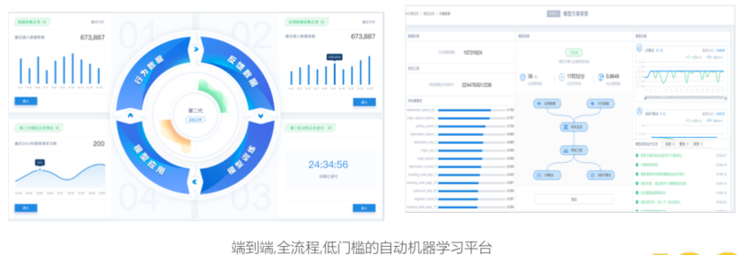
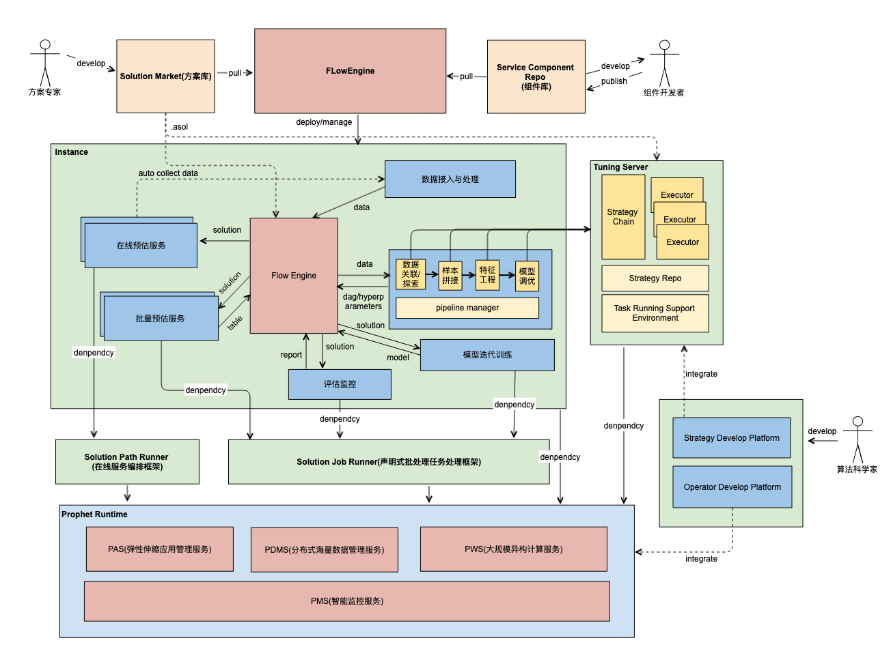
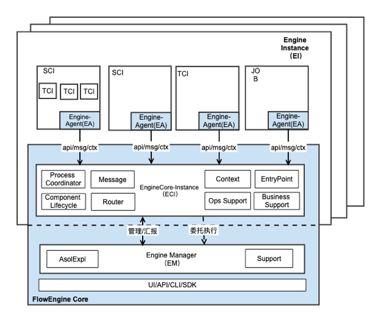
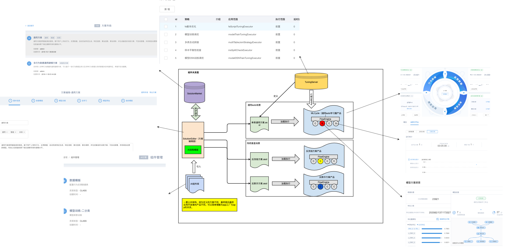

# 背景
Flowengine作为一个在AI应用开发和管理领域的服务框架，它是第四范式在多年AI场景实践的核心方法论沉淀，致力于为AI应用场景开发者提供一个开放的，组件化的，lowcode的框架，加速AI场景快速，正确，规模化落地。
## FlowEngine 设计初衷

* AI 能力输出是第四范式的现阶段价值所在
* AI 场景开发在第四范式乃至整个行业具备共性痛点，如成本高，落地周期长，效果难控制
* 领域问题缺乏标准模式，工具繁多，模式多样，学习成本高
* 产品交付难以规模化，领域内的工具和方法论难以有效沉淀
* 第四范式特有的一个产品对应多个客户，多个行业，产品需要具备灵活性，并能够逐层开放灵活性，能够达到标准和灵活的统一
* 该领域内早期缺乏一个专注这一领域层面的开源方案，且从平台战略角度上，需要有一个能够掌握在手中的框架和生态顺应战略并锁定客户
* 第四范式的客户和产品策略（五类用户，两类场景）

|                                                                   | 头部场景（推荐，营销等）                                                                     | 长尾场景                                   |
|-------------------------------------------------------------------|----------------------------------------------------------------------------------------------|--------------------------------------------|
| 头部行业大KA（eg.金融五大行） IT化水平高，大行业领军，预算充足        | 标准化产品，但要支持，强定制，要求灵活性，可开发，结合客户已有平台，输出核心技术 | 提供快速场景开发工具和平台                 |
| 腰部行业的大KA（eg.零售百胜/永辉） IT化水平一般，大行业领军，预算充足 | 标准化产品，提供标准方法论及产品，能够有限的二次开发，要具备一定领域概念，输出技术方法论     | 提供快速场景开发工具和平台（基本上用不上） |
| 各行业腰部客户（城商行/汉堡王） IT化水平差，追赶者，价格敏感    | 标准化产品，无需二次开发，输出产品运营理论                                                   |                                            |
| 头部/腰部行业的长尾客户 无IT能力，预算不足                            | 提供快速场景开发工具和平台，输出项目交付                                                     |                                            |
| 长尾行业长尾客户                                                  | 探索                                                                                         | 放弃                                       |

## FlowEngine 定位

Flowengine 是一个以范式“学习圈”方法论为基础的AI应用开发和管理平台框架集合生态。下图是一个“学习圈”的典型案例：

上图是模型方案探索的一个页面，这个页面展示了数据进来之后，能够自动进行数据处理，拼接和特征工程。做完特征工程后会有些模型算法的选择，参数的调整。通过这个平台这一切都可以由系统自动去完成。

#### FlowEngine 核心能力：
* AI 应用及组成单元的沉淀，迁移，快速构建（以 asol 为核心）
* AI 应用组成单元的管理，集成，迭代 （组件，任务等管理，监控）
* AI 应用流程的编排（离线编排，在线编排，流式编排）
* AI 相关的核心组件支撑80%以上场景，无需额外开发组件（低代码）

#### FlowEngine 位置：
技术组件（Rtidb，Pico，Tensorflow，Flink等）之上，业务中台（搜索，推荐等）之下，整合纷繁复杂的技术工具，给业务中台提供统一领域概念和方法论，低成本高效率的开发AI驱动的业务中台

#### FlowEngine 与先知的关系：

FlowEngine 是基于先知的中台系统，先知提供 FlowEngine 最基础的底层能力，而 FlowEngine 是构建于先知之上的自动机器学习平台。
FlowEngine 与先知 Runtime 存在依赖关系：

* FlowEngine的组件，任务等可能依赖先知的 DAG 计算服务
* FlowEngine 核心依赖先知的 PAS 管理组件服务，一种 backend 实现

FlowEngine 是广义上先知产品的一部分：

* 手工流程，交付利用先知提供的自学习预估等模块完成场景交付
* FlowEngine 支撑的全流程，标准化交付
* 先知 HyperCycle ML 1.0 版本产品

#### FlowEngine 与 HyperCycle 的关系：
* Flowengine 支撑 HyperCycleML 1.0，是该产品的支撑框架
* Flowengine 中的方案探索（AutoML），自学习，预估组件及其编排流程形成了闭环的 HyperCycle ML
* 新版 HyperCycle 将 AutoML，自学习，预估内聚成 AI Core，统一由平台作为黑盒产品提供
* 未来 HyperCycle 可以作为一个组件，就现状实现来看，相当于自学习组件和预估组件合一，远期三个组件合一

#### FlowEngine 与 SDS 的关系：
* FlowEngine 在设计上是一个无状态系统，组件需要有业务数据的存取能力支持
* 多个场景（引擎）可能共享数据
* 数据的接入，加工，处理的标准性
* SDS + FlowEngine 能够完整覆盖AI应用开发核心

## FlowEngine 架构图

这是开放架构的全景，从这个全景上面看，我们可以看到，它一个基于先知技术中间件的 AI 应用开发与管理的平台生态。它的很大特点就是:
  
1. 允许应用开发者，组件开发者，算法开发者，方案专家多角色协同、参与
2. 以应用，方案，算法，组件为产出，形成良性生态

从架构角度来看，使得其得以达到预期的关键是做好以下工作：  

1. Pipeline 组件集成及通信的标准化  
   * 服务化，组件化，容器化  
   * 组件自由编排  
   * 围绕FlowEngine，完成组件信息交换协调，支撑组件的插拔能力  
2. Pipeline 数据 & 产出有序化，标准化
3. 具备支撑各角色快速集成和使用的核心能力
4. 产出（服务镜像库，组件库，算法库等）可管理与集成

## 我们的核心特性
&emsp; &emsp; 作为一个好的产品，如何让用户能够快速的上手，并不感到害怕，缓和的学习曲线是必要的。另一方面，必要的分工也是工程化推广的关键，因此结合AI应用开发的特点，我们对整个架构面向的用户做了分层，使得用户在自己的层面只需要关注自己关注的，也正是因为分层，我们可以专门面向他们做符合他们口味的交互模式。  
 
&emsp; &emsp; 结合问题的复杂度，我们提供流程的自定义和编排，从另一个层面贴合具体的场景，而非一个模式通吃天下，这也避免了不合适强套的尴尬，一个好的架构应该是简化使用者的使用成本，而不是给他更多的约束。

##### 核心构成：
* AI HUB  用于存放和管理方案（ASOL），组件，资源（JOB，Func，脚手架，依赖）
* EngineManager 用于管理引擎实例
* EngineKernel 引擎核心实例，用于管理协调组件/服务运行调度

##### 配套：
* SDS
* 组件
* Dashboard 框架

 
## 基本工作模式与产品支撑

&emsp; &emsp; 从上图可以看到，一个方案从开发到部署整个过程。从支撑上来看，我们一套架构可以支持开发多款基于 FlowEngine 架构的产品，如 HyperCycle ML，反洗钱，反欺诈等，并且他们具有自己的行为和交互。  

##### FlowEngine + asol = 某一具体AI场景

* FlowEngine + 内置 HyperCycle 通用方案 = HyperCycle ML
* FlowEngine + 内置反洗钱方案 = 反洗钱平台
* FlowEngine + 内置 cess 方案（tradeup）+ 业务服务 + sds = CESS 1.0
* FlowEngine + 内置 cess 方案（在线编排）+ 业务服务 + sds = CESS 1.2
* ......
