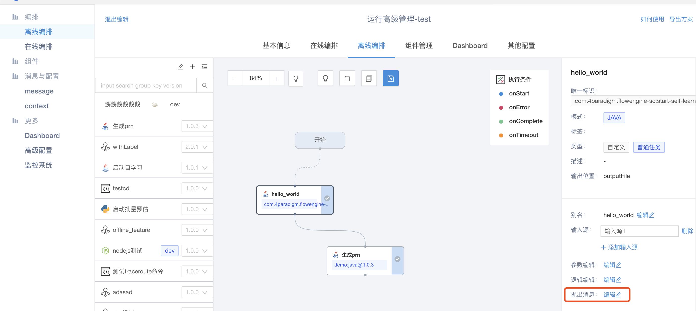
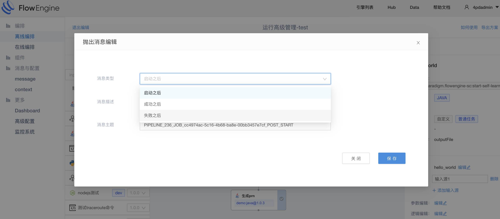

#消息
&emsp; &emsp;flowengine为离线任务配备了一个消息队列，可以通过这些消息来触发离线pipeline。消息除了包括系统消息外，用户还可以自定义消息.

##消息的配置
&emsp; &emsp; 每个离线任务有三个时间点可以暴露消息，分别是任务开始后，任务运行成功后，任务运行失败后，任务不会自动发出消息，需要用户显式的配置,通过一下配置建立起了一个消息管道，一旦任务触发了这个状态，便会像管道里发送一条消息，等待消费端消费

