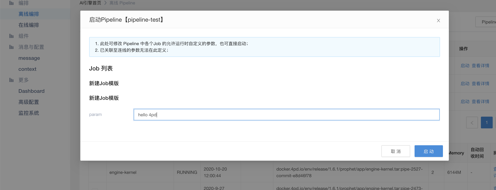

#启动方式
&emsp; &emsp;启动方式可以分为主动和被动两种方式，主动是预先给离线任务设置一个触发条件，当条件满足以后任务自动运行，被动则是需要用户显式的在页面或者调用api的方式启动离线任务。
##主动方式
###定时触发
&emsp; &emsp;crontab表达式，离线任务支持的crontab表达式的写法是Quartz写法
```
说明：
Java(Quartz)
*    *    *    *    *    *    *
-    -    -    -    -    -    -
|    |    |    |    |    |    |
|    |    |    |    |    |    + year [optional]
|    |    |    |    |    +----- day of week (1 - 7) sun,mon,tue,wed,thu,fri,sat
|    |    |    |    +---------- month (1 - 12) OR jan,feb,mar,apr ...
|    |    |    +--------------- day of month (1 - 31)
|    |    +-------------------- hour (0 - 23)
|    +------------------------- min (0 - 59)
+------------------------------ second (0 - 59)
```
&emsp; &emsp;如果不需要这么复杂的触发方式，也可以简单的设置一个运行周期

###消息触发
&emsp; &emsp;flowengine内部维护一个消息队列，pipeline可以设置消息来触发离线任务([如何设置消息](./job_msg.md))