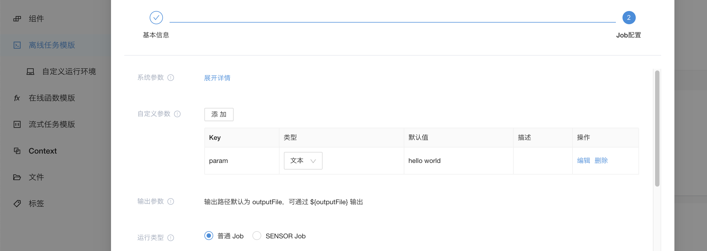
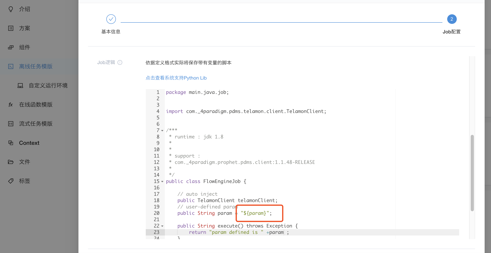
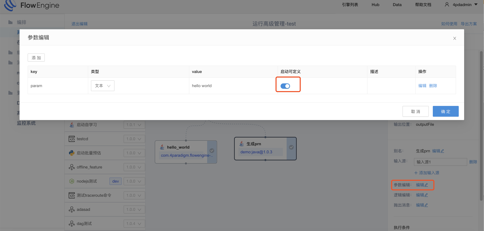
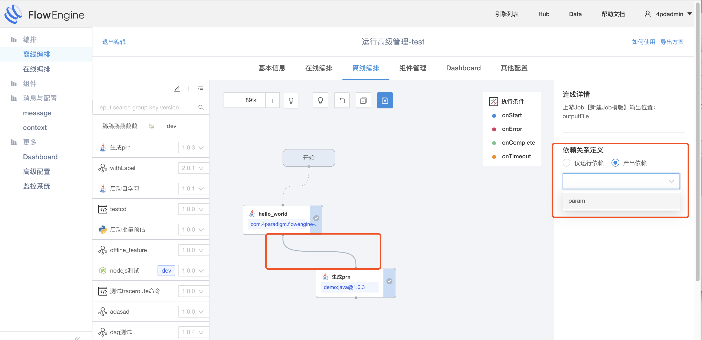

#自定义变量
&emsp; &emsp;自定义变量是job的输入，job可以通过自定义变量在运行时灵活调整自己的运行策略

##自定义变量的声明
&emsp; &emsp;自定义变量是由三部分构成：变量key，代表唯一的输入参数，job的运行逻辑代码里会用到，用占位符表示；类型，分为文本类型和文件类型，文本类型是一个字符串，文件类型需要用户上传一个文件，运行代码里会得到这个文件的实际地址；默认值，自定义变量的默认值，是输入参数的缺省值

##自定义变量的使用
&emsp; &emsp;任务自定以变量的作用域是当前的job，在代码逻辑里以占位符的方式来引用，使用方式与任务类型无关，占位用${xxx}来表示，xxx为变量key

##启动时传入
&emsp; &emsp;job是要添加到pipeline中运行，用户可以自己选择哪些自定义参数可以启动时传入

##输出赋值
&emsp; &emsp;自定义参数不止可以由启动时传入，也可以来自上游任务的输出([输出的定义](./job_output.md))，用户可以通过定义任务连线来实现

