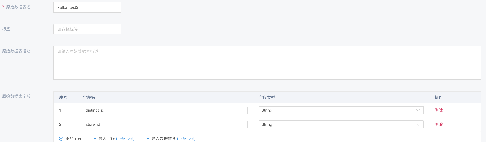
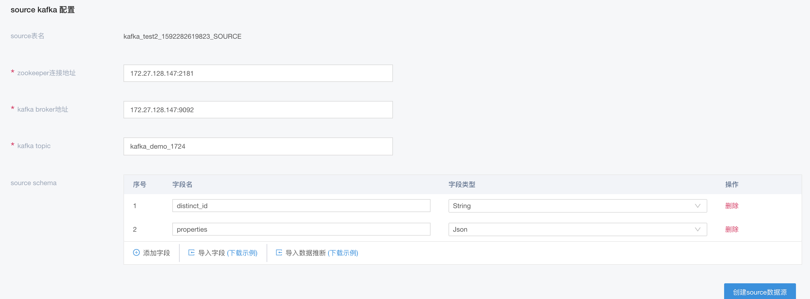
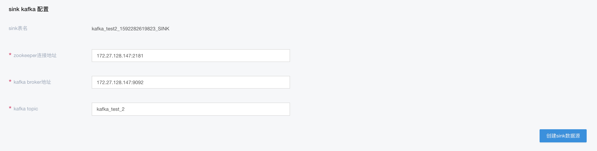
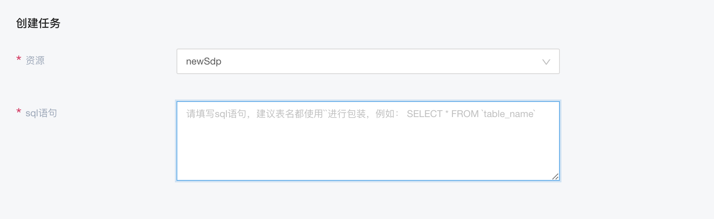
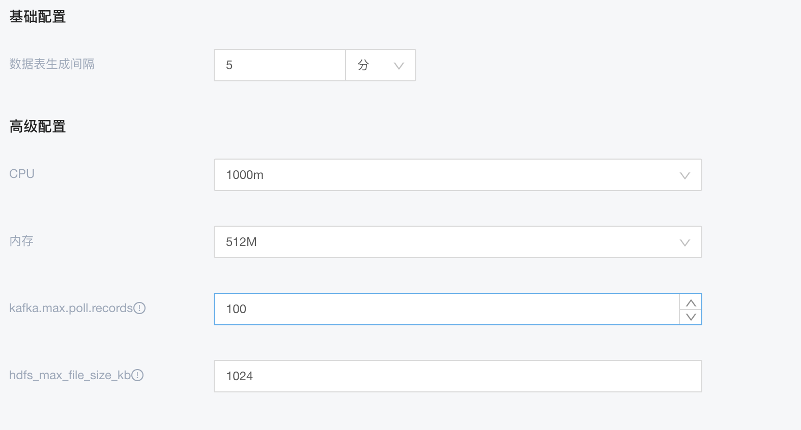

# SDP-Kafka引入

## 背景
在实际 kafka 引入的过程中，由于数据部分存在 json/object 等多种形式，需要对相关数据进行处理后，才能引入落盘

## 前提

以数据中存在 json 为例，需[https://gitlab.4pd.io/PHT3/sage-builtin-operators/sdp-flink-operator/tree/feat/sds](https://gitlab.4pd.io/PHT3/sage-builtin-operators/sdp-flink-operator/tree/feat/sds) 打出相应的 sdp-flink-operator.jar 包


## 步骤

### 创建数据接入



### 创建 source 数据源



注意

* 这里的 properties 为 json 数据，所以这里的字段类型选为 json 

### 创建 sink 数据源



注意

* 这里无需设置 schema，是因为 sink 的 schema 跟当前的数据接入的 schema 一致

### 设置引入SQL



* 选择资源，就是上面提到的 sdp-flink-operator上传后的资源对应
* SQL 代表即从 source 如何转化，并引入到 sink 中

```sql
insert into kafka_test2_1592282619823_SINK select distinct_id, json_path(properties, '$.store_id') as `store_id` from kafka_test2_1592282619823_SOURCE
```
* 这里的`kafka_test2_1592282619823_SINK`和`kafka_test2_1592282619823_SOURCE`即为之前创建的source表和sink表
* 这里使用到`json_path`即为解析某个 json 字段为 string，解析规则见标准的[JsonPath](https://github.com/json-path/JsonPath)

### 设置落盘的参数



* 这里设置了5分钟落盘的时间间隔


至此，即完成相应的 sdp-kafka 的引入。