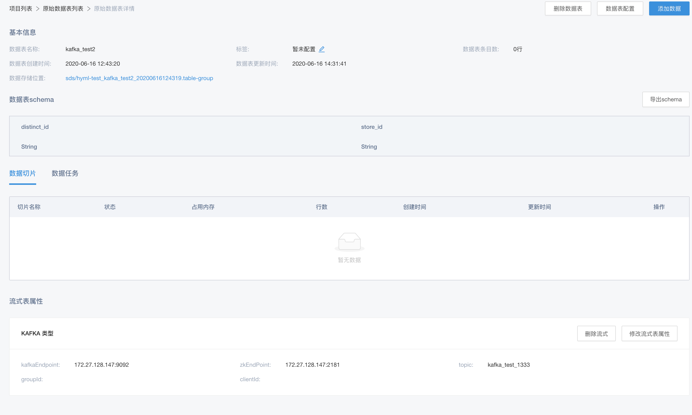
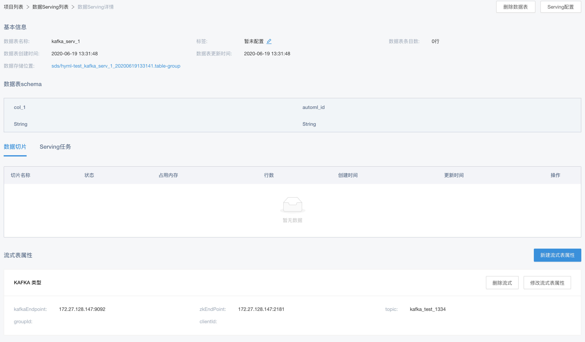
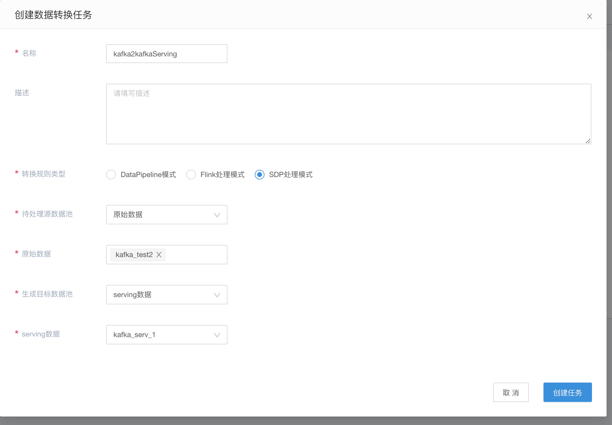
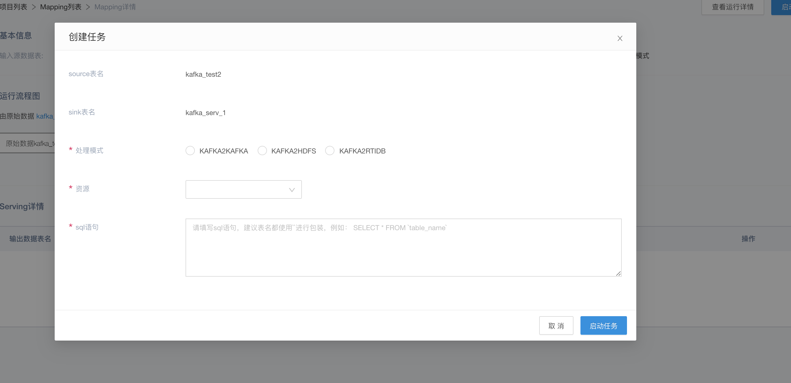
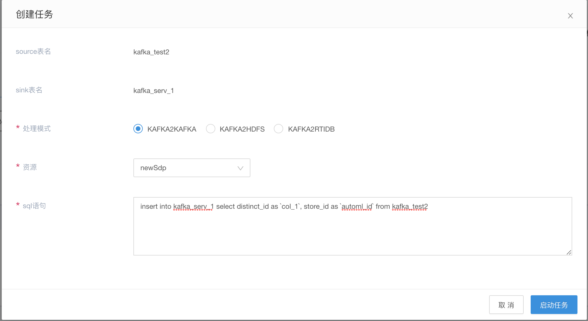

# SDP处理模式

## 背景
该模式主要是用于流式任务处理部分，当前的处理能力包括 kafka2kafka，kafka2hdfs，kafka2rtidb 模式

## 前提
* 同 sdp-kafka 引入类似，需[https://gitlab.4pd.io/PHT3/sage-builtin-operators/sdp-flink-operator/tree/feat/sds](https://gitlab.4pd.io/PHT3/sage-builtin-operators/sdp-flink-operator/tree/feat/sds) 打出相应的 sdp-flink-operator.jar 包

* 相关数据表创建了流式表属性

这里以 kafka 转发作为例子，进行说明

## 步骤

### 数据表分别设置相应的流式表属性






注：

* 由于 SDP 处理模式，需要指明相应的 schema，所以相关数据表需要设置相应的 schema


### 创建数据转换规则



选择之前设置好了流式表属性的数据表后，建立 SDP 处理模式

### 启动处理规则

在确定好 mapping 规则，进入规则详情，启动任务，就可以指定相关的处理细则



选择流式处理的资源后，填写相应的 dml ，即可启动相关任务



```sql
insert into `kafka_serv_1` select distinct_id as `col_1`, store_id as `automl_id` from `kafka_test2`;
```

注意: 此地方表名最好都加上``

至此，就完成了 kafka 转发的 SDP 处理规则的设置