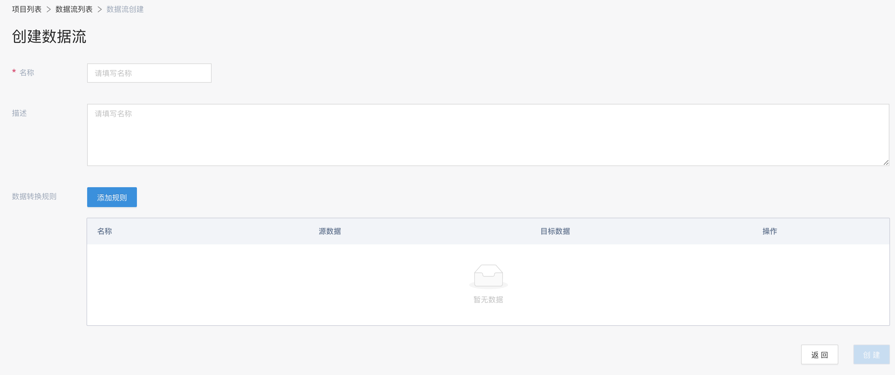
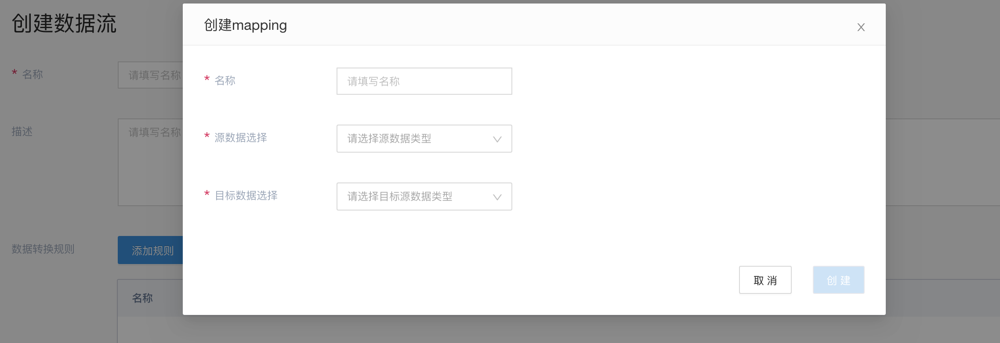
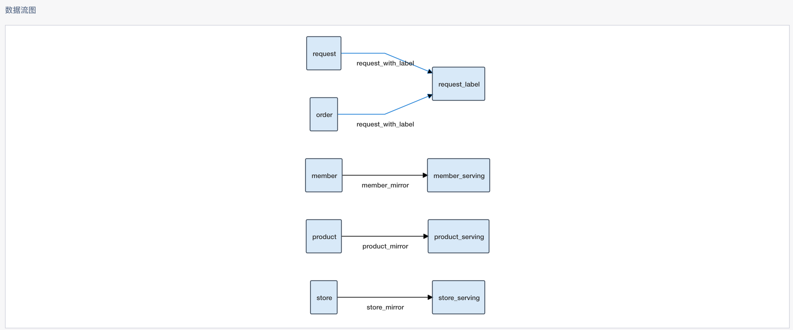
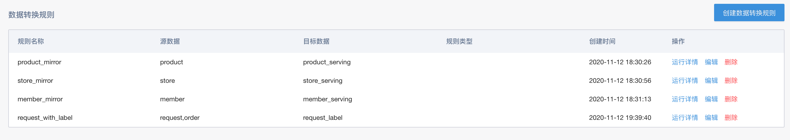
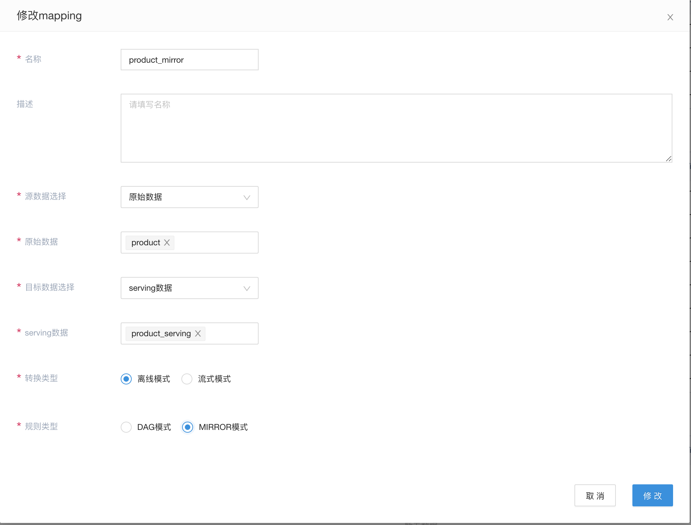
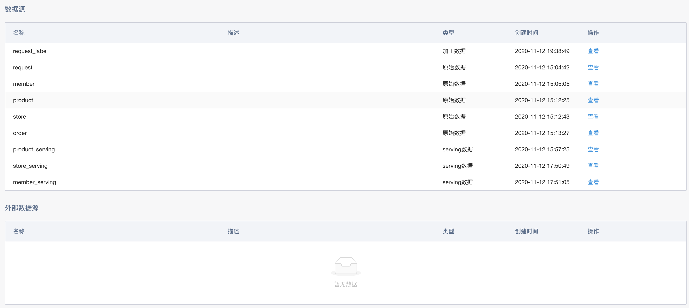

# 数据流管理

在构建业务数据流的场景下，需要多种层次数据表以及之间的转换规则。

## 新建数据流

### 添加规则

这里可以选择需要处理的相关数据表

## 数据流展现

当数据流创建完成后，可以在数据流的详情页面看到相应的信息

这里详情页，分为三个部分：

### 数据流图

这里是通过定义的数据规则，以及相应的数据表，自动生成的数据转换流图，显示相关数据从接入到加工，最后到serving的全过程。

### 数据规则列表

这里列出数据流中所有使用的数据转换规则。同时，也提供相应创建/修改操作，方便对相应的数据流进行修改。

#### 离线模式

离线模式，包含DAG模式，mirror模式。

* DAG模式，通过flowengine离线pipeline完成相关的数据处理
  
* MIRROR模式，无需处理，镜像相关数据schema和批量表部分，一般利用此能力mirror到serving表，从而可以serving到其他的存储介质中

#### 流式模式

* STREAM模式，通过flowengine的流式编排的能力进行相关的数据处理

### 数据表列表

这里列出数据流中使用到的所有相关数据