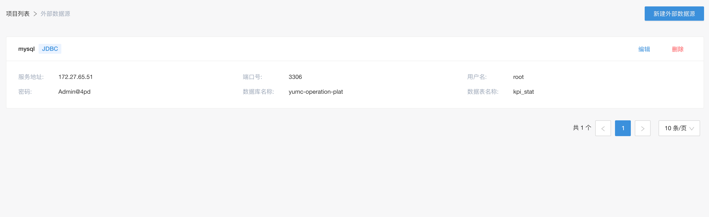
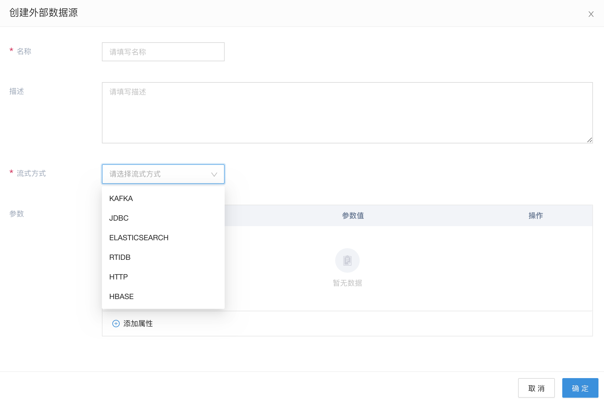
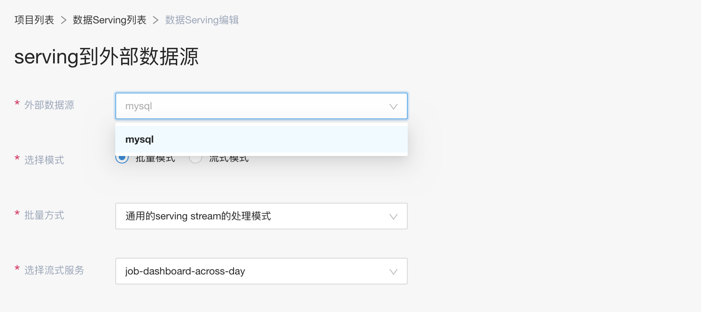
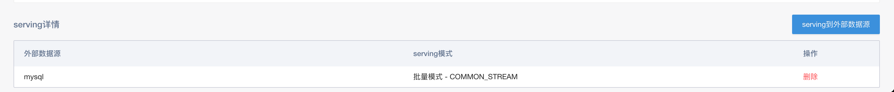

# 外部数据管理

外部数据管理，是以配置托管的形式，管理相关的外部数据源。这样，用户可以在Flowengine-Data平台上完成对所有数据(包含内部和外部)的管理

## 多种数据类型的支持

外部数据源现在支持多种类型

## 使用

当定义好外部数据之后，我们就可以使用它了。我们一般在数据serving到外部数据源的时候，会使用此数据源

如图所示，在选择外部数据源的时候，可以选择到刚才创建的mysql数据源。

当建立好serving规则之后，就可以在serving详情看到相应的serving的外部数据源和相关的规则

