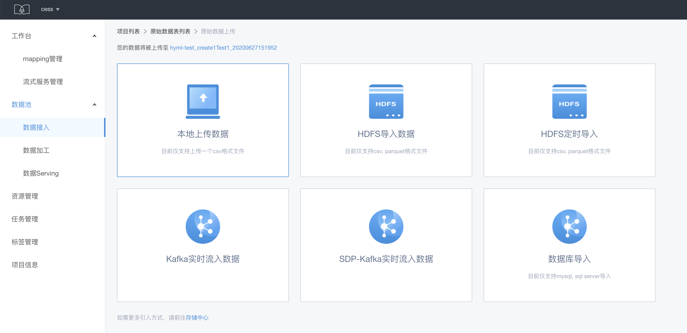
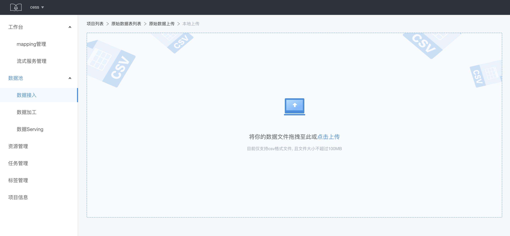
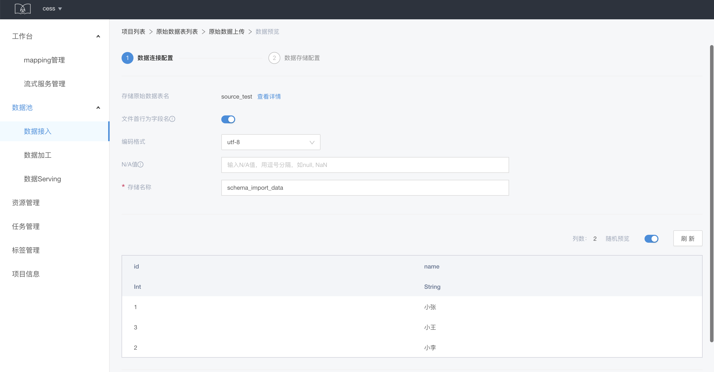
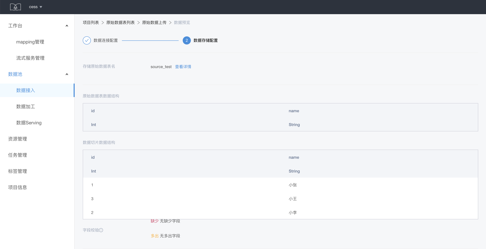
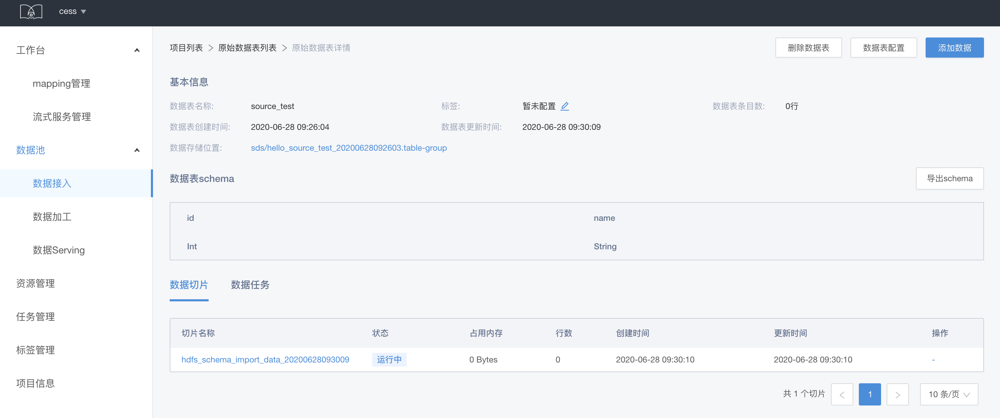
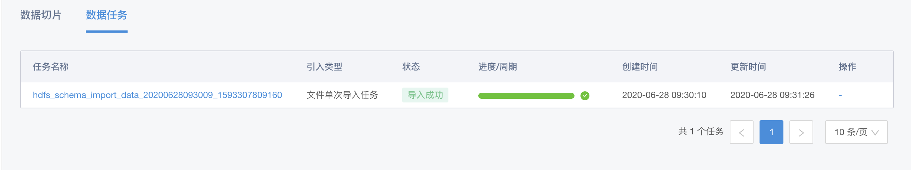

# PDMS引入

依托于pdms的能力，提供多种数据导入方式：本地导入、HDFS 导入、HDFS 定时导入、Kafka 实时流入数据、数据库导入、Hive导入。

在数据列表页选择数据表卡片右上角的导入数据按钮，或者在数据表详情页点击添加数据

提供多种数据导入方式：本地导入、HDFS 导入、HDFS 定时导入、Kafka 实时流入数据、数据库导入、Hive导入。选择具体的导入方式，填写相关参数，进行数据导入。

这里以本地导入为例，简单数据的导入

1. 选择进入本地导入，点击上传数据，本地导入支持成 csv 格式，且不能超过 100 MB

2. 设置存储名称、编码格式、N/A 值等信息，这里支持对数据的随机预览，确认无误点击下一步

3. 配置数据存储，这里可以查看数据切片结构，会进行字段校验，还支持对异常行做处理和资源配置，点击数据引入，即可完成数据导入。

导入数据后，可以在数据详情页查看所导入的数据的详细信息，数据切片显示当前数据表包含的数据切片

数据任务可以查看数据导入的进度
