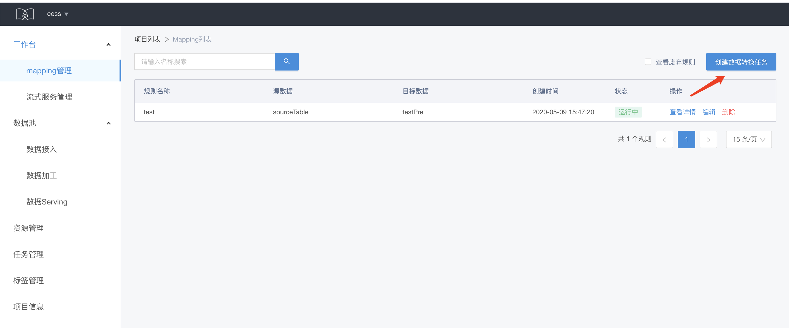
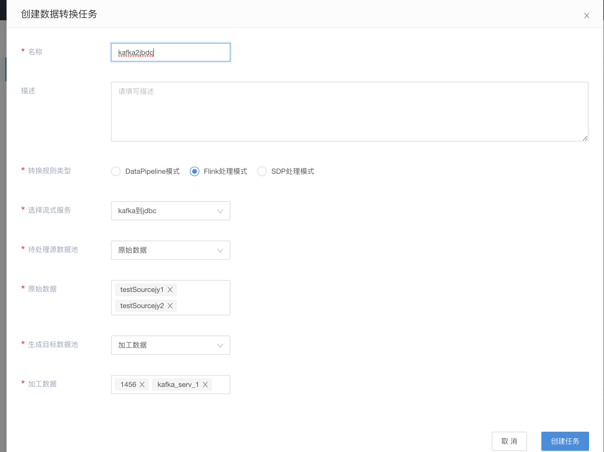
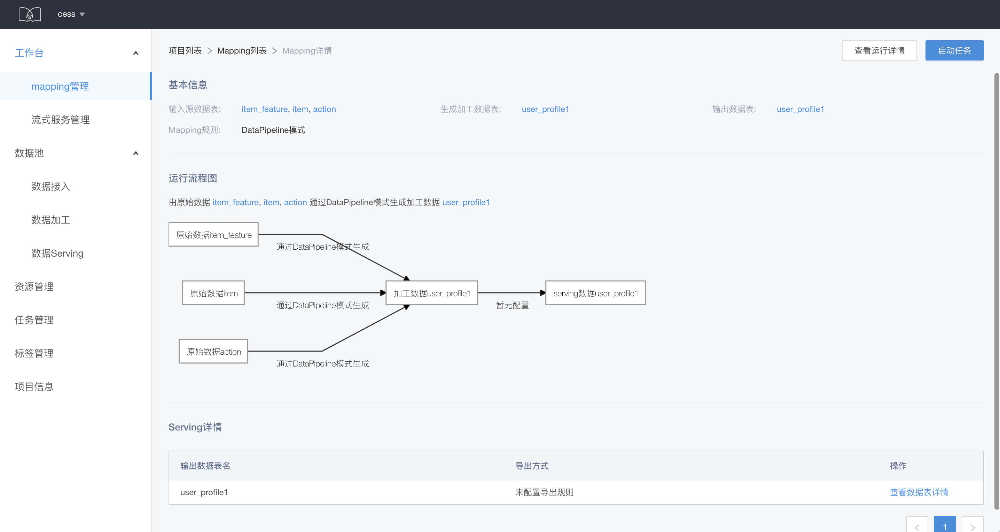
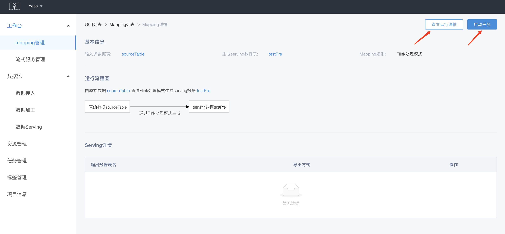

# Mapping 管理

&emsp; &emsp; Mapping 管理即规则管理，提供批量数据/流式数据的处理能力，分为两个方面：

* 批量数据，指的是通过 dag 或者脚本的方式，对单表/多表进行 join 等更多高级操作的规则，这里利用自定义任务的方式进行处理
* 流式数据，指的是依托于flink之上的流式服务模板/sdp sql等方式对流式数据进行处理

&emsp; &emsp; Mapping 提供三种数据处理模式：DataPipeline 模式、Flink 处理模式、SDP 处理模式。

* DataPipeline 模式：利用 flowengine 离线 pipeline 的能力，对数据进行处理。
* Flink 处理模式：使用流式服务模版，对数据进行处理。
* SDP 处理模式：SDP 提供基于 kafka2kafka, kafka2rtidb, kafka2hdfs 这样的方式，对流式数据进行处理。

## Mapping 创建

规则是对数据表进行处理，所以在创建规则之前，我们需要先在根据业务需要，在数据池创建相关对数据表，如原始数据表、加工数据表、serving 数据表。

在mapping列表页，选择创建流式数据转换任务，选择并配置处理模式，选择待处理数据表和生成数据表，点击创建。

不同的处理模式需要填写参数和启动方式不同：

* DataPipeline 模式需要先在 flowengine 创建离线 pipeline，选择 DataPipeline 模式，需要填写创建好的 pipeline 的 id。（这块可以参考flowengine的[离线编排](/offline-pipeline/intro.md)）
* Flink 处理模式需要先在流式服务管理创建好流式服务，选择 Flink 处理模式后需要选择流式服务。流式服务创建流程请查看[流式服务管理](/sds/sds-stream-service.md)相关内容介绍。
* SDP 处理模式具体介绍请查看[SDP 处理模式](/sds/sdp-process.md)

不同的处理模式下，待处理数据表和生成数据表选取的类型和数量也有一定的限定规则：

* 三种模式下，待处理数据表既可以从原始数据表或加工数据表中选取。生成数据表在 DataPipeline 模式模式下生成数据表只能选择加工数据表，其他模式可以从加工数据表或 serving 数据表中选取。
* 待处理数据表在三种模式下都可以选多张表，生成数据表在SDP处理模式下只能选择1张表，其他模式可选多张表。

## Mapping 详情

在 Mapping 详情页可以查看基本信息和数据的运行流程图，如果生成的数据表是 serving 数据表，还可以查看serving 数据表的 serving 方式等信息。

## Mapping 启动

在流式处理模式下，在 Mapping 详情页选择启动服务，即可以启动规则。点击查看运行详情即可查看所启动的任务的运行状况。

