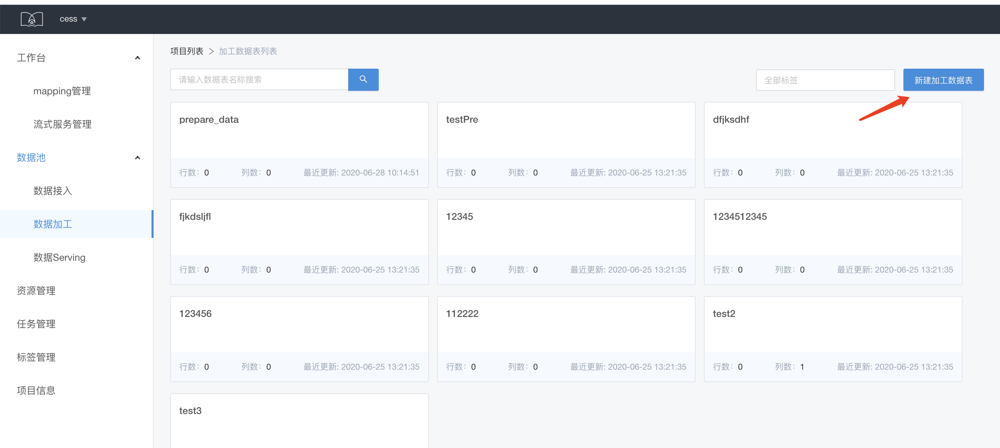
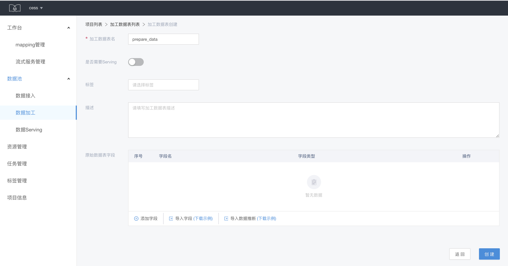
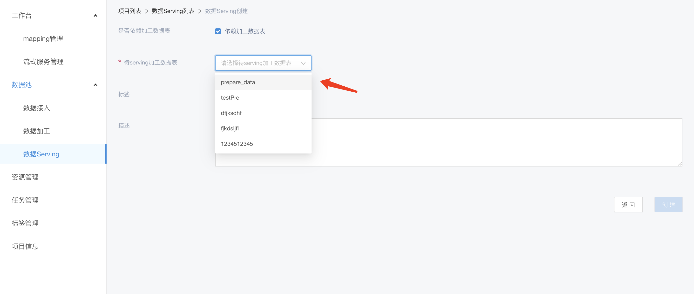
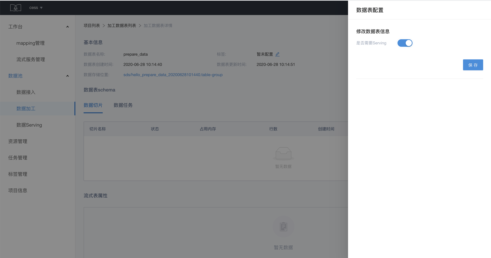
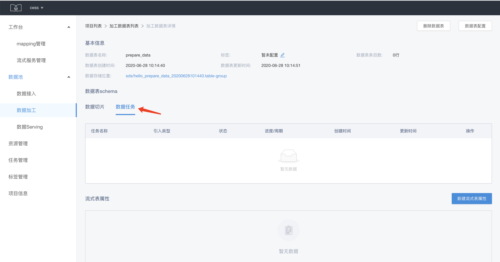

# 数据加工

提供对所有加工处理数据的管理。加工表的输入，可以是原始表，也可以是加工表，即进行一次加工或多次加工。

## 加工数据表创建

点击数据列表页的新建加工数据表， 填写名称等信息。

注：
> 这里 schame 一般无需填写，根据只有一种情况下需要填写：在创建 mapping 规则的时候选择了 SDP 处理模式，并在启动任务的时候选择了 kafka2hdfs 这个模式，这时候的加工数据需要有 schema

其中，是否需要 serving 选项是配置该加工数据表是否需要输出数据，如果选择了 需要 serving，则可以用于创建 serving 数据表，serving 数据表创建成功后即可 serving 数据到指定的地方。

加工数据表也可以在创建后再开启 serving 选项，在加工数据表的详情页，点击数据表配置，开启 serving 选项

## 加工数据表的数据和任务信息查看

加工数据表的详情页可以查看与数据表有关的任务和生成的数据切片

## 加工数据表的流式表属性

同原始数据的流式表属性