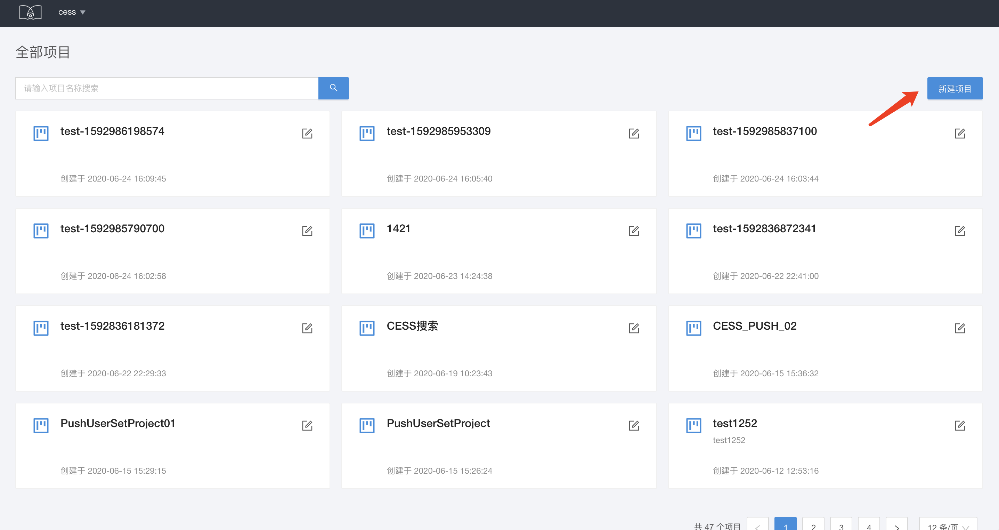
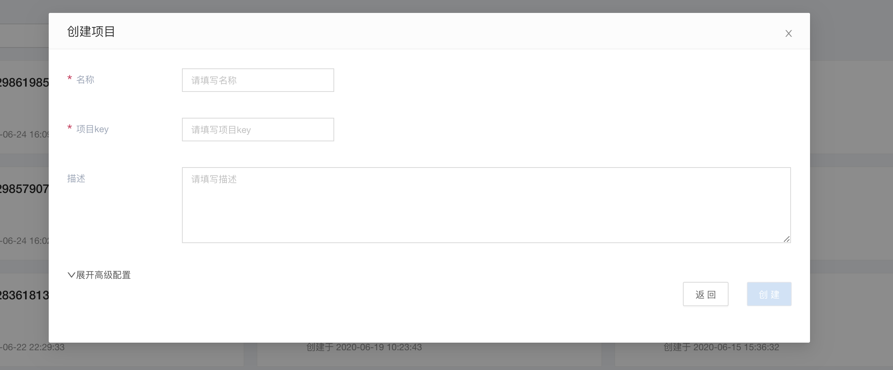
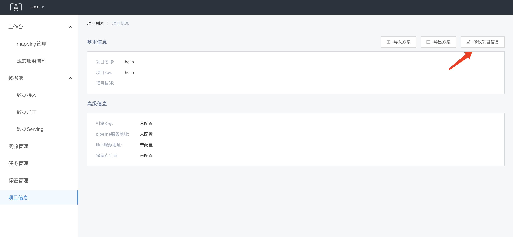
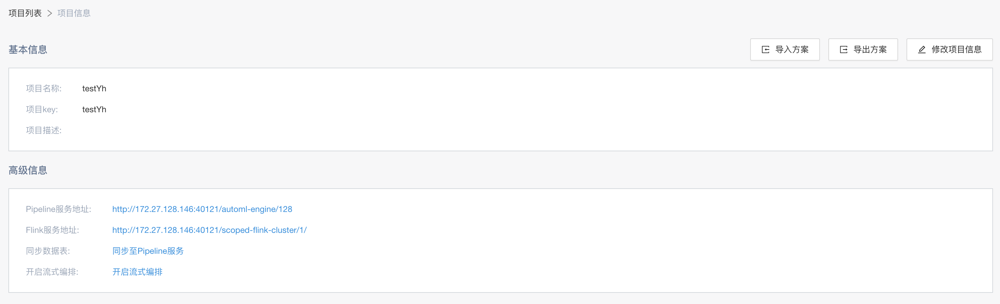
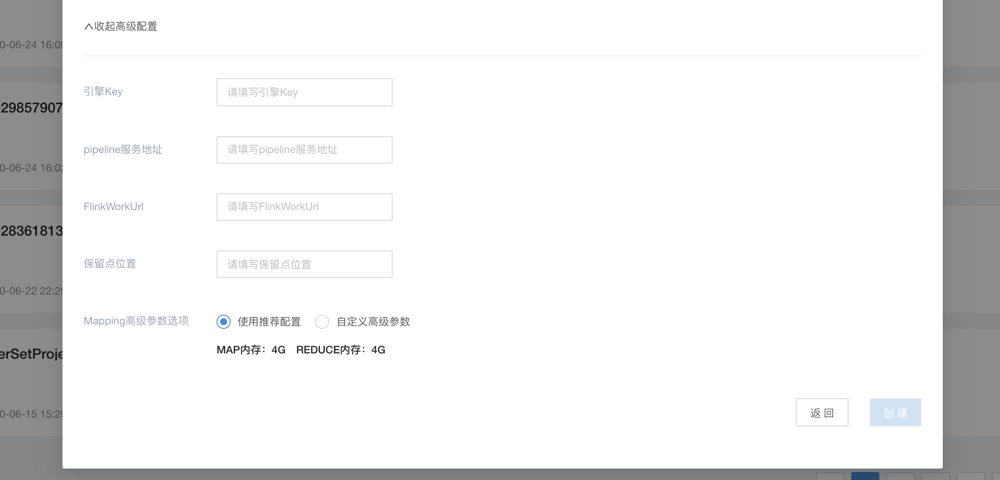
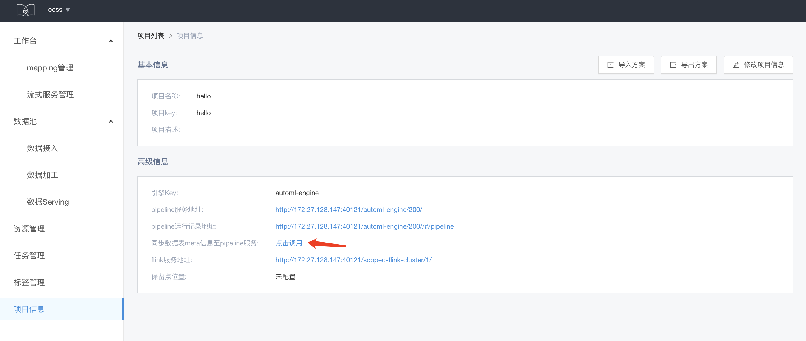

# 项目管理

&emsp; &emsp; Flowengine Data 通过创建项目，把数据和数据的处理进行统一管理。

## 项目创建
&emsp; &emsp; 在项目列表页点击新建项目，填写项目名称和项目key、描述等信息，点击创建即可创建一个空白的项目。

## 项目信息查看和修改

&emsp; &emsp; 项目创建成功后，点击进入项目，选择侧导航的项目信息选项，即可查看和修改当前项目的项目信息。这里还提供项目方案的导入导出功能，可以导入或导出项目的数据加工/数据serving表。

&emsp; &emsp; 新建项目后，Flowenginge Data默认会新建一个与之对应的引擎，用于进行离线数据的处理：

* Pipeline 服务地址： 新建引擎成功后，会自动注入相应的引擎pipeline地址，可以利用flowengine的离线pipeline功能处理相关数据

* Flink服务地址: 用于绑定Flink的服务地址。Flowengine Data使用flink作为流式服务的依赖。同时，Flowengine可以依托于Flink开启相应的流式编排的功能

* 开启流式编排: 当填写完Flink服务地址后，便会提示是否需要在相应的引擎里开启流式服务，也就是流式编排的能力

* Mapping 高级参数选项：作为数据引入的默认选项，如果需要进行较大的离线数据引入时，可修改此选项来调整相关任务的参数

&emsp; &emsp; 同步数据表，同步数据的相应的元数据至对应的建立的引擎中，供离线编排和流式编排来使用˙

