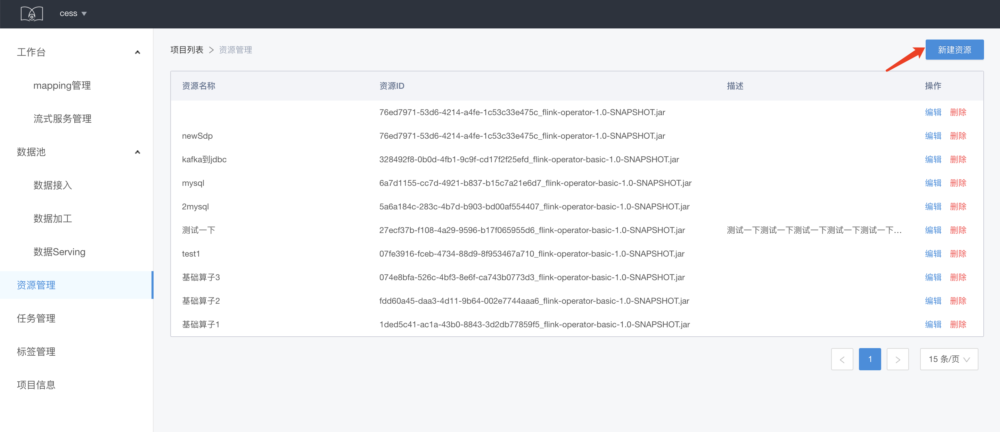
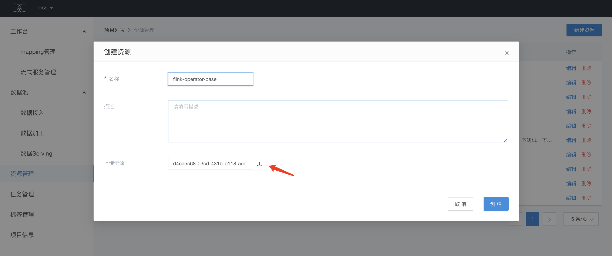
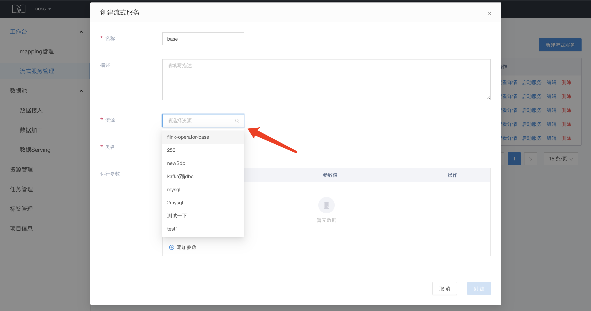
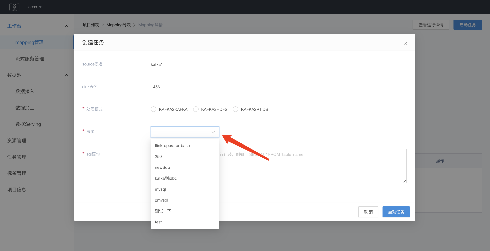

# 资源的管理和使用

SDS 资源管理，即对用户上传对 Flink job 的 jar 包对管理。SDS 以 jar 包的方式定义流式任务模板，来支持流式服务的运行。

## 资源创建

进入资源管理页面，点击新建资源，进入资源的创建页面。

填写资源名称和描述，并点击上传 jar 包，上传成功后，会在上传资源一栏显示资源的 id。

## 资源使用

Jar 包资源可以用于定义流式任务模板，在创建流式服务的时候，选择 jar 包资源：

同时，jar 包资源还可以 sdp 处理模式下的流式任务创建：

