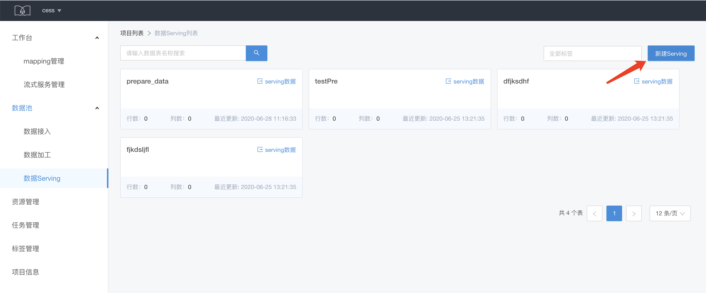
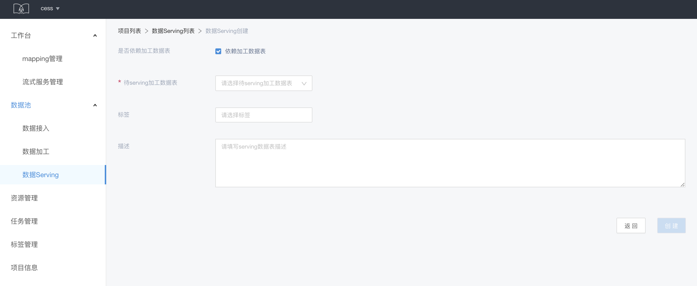
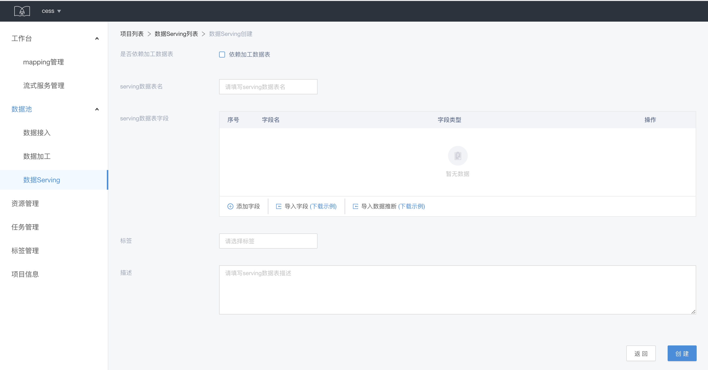
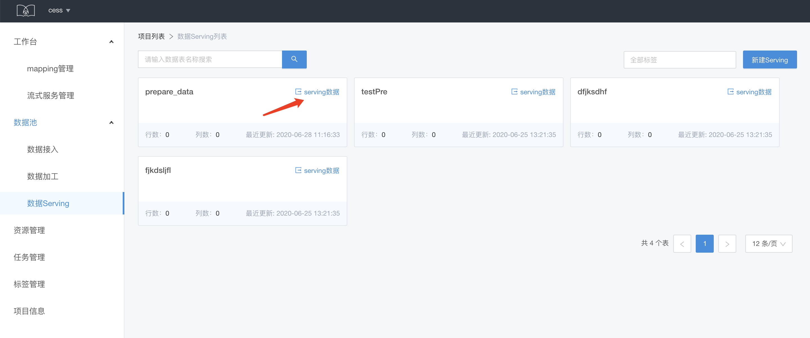
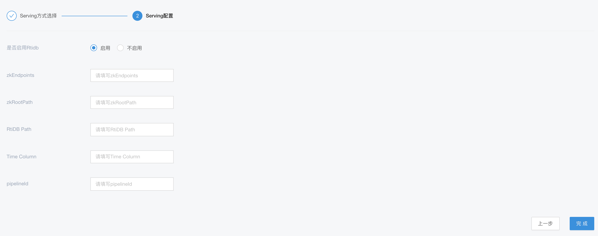
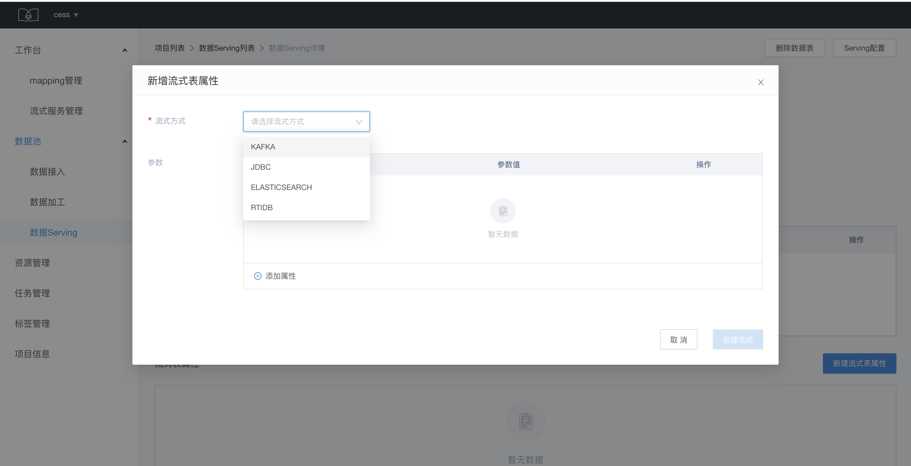

# 数据 Serving

对 serving 数据表进行管理，支持 serving 到 RTIDB 等

## serving 数据表创建

点击数据列表页的新建 serving 数据表。

如果依赖加工数据表，则选择对应的加工数据表，serving 数据表的表名与加工数据表一致

如果不依赖加工数据表，则需要填写表名和 schema 等信息。

## serving 数据表导出

只有依赖加工数据表生成的 serving 数据表可以导出数据到别的地方，比如 RTIDB，在数据表列表页点击数据表卡片的 serving 数据按钮，或者在数据表详情页点击数据配置

选择导出至RTIDB，启用RTIDB，并填写相关的配置，点击完成即可

注：

* 相关参数说明：
  
  * zkEndpoints: rtidb 的 zk 地址，必填
  * zkRootPath: rtidb 的 path，必填
  * RtiDB Path：rtidb 的表名，必填
  * Time Column: rtidb 表的时间列，选填，若无，则以当前时间作为 ts 插入到 rtidb 中
  * pipelineId: 在导入到 rtidb 后，提供 pipeline 进行后续的 trigger 操作

* 启用rtidb serving后，每当加工表中新增数据切片后，serving数据便会自动同步该切片，同时将数据从Hdfs导入到rtidb中

## serving 数据表的流式表属性

serving 数据表的流式表属性支持多种类型：KAFKA、RTIDB、ELASTICSEARCH、JDBC，其中 KAFKA 类型与原始数据表一样。

