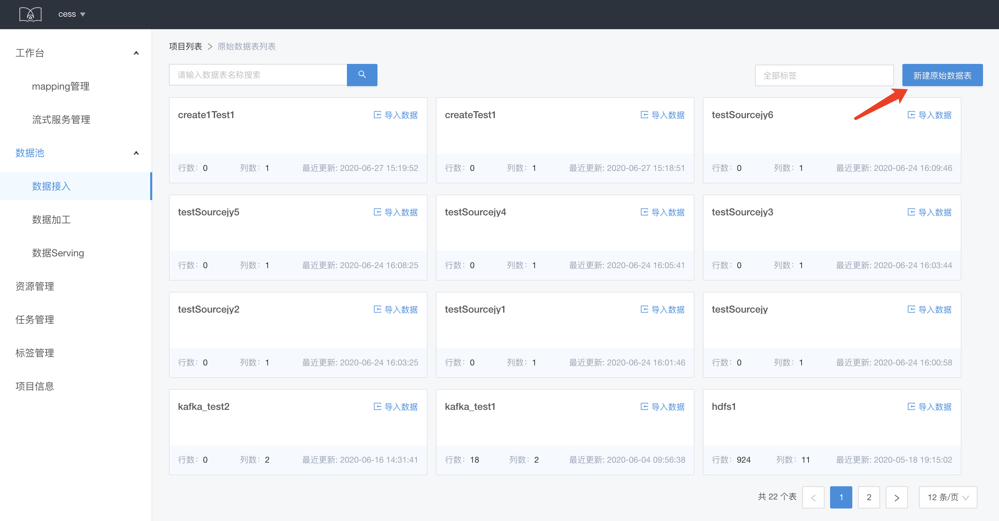
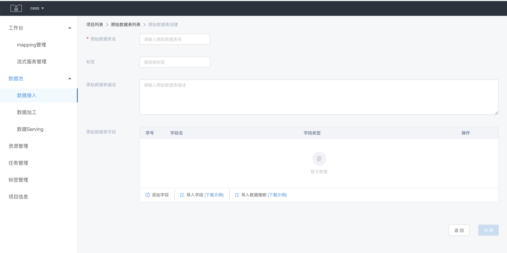
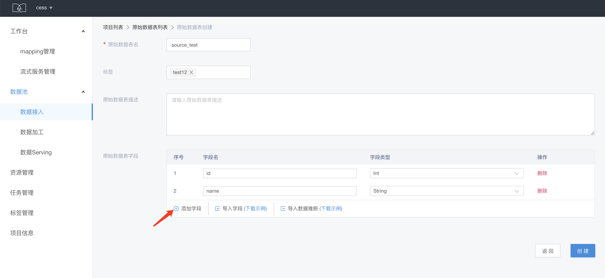
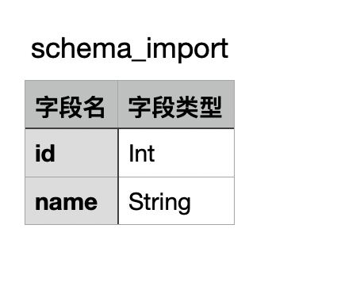
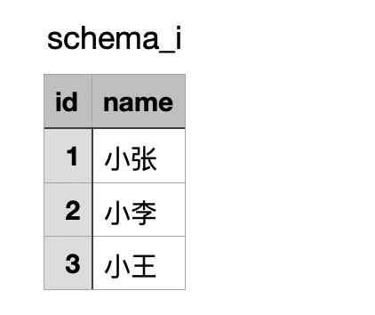
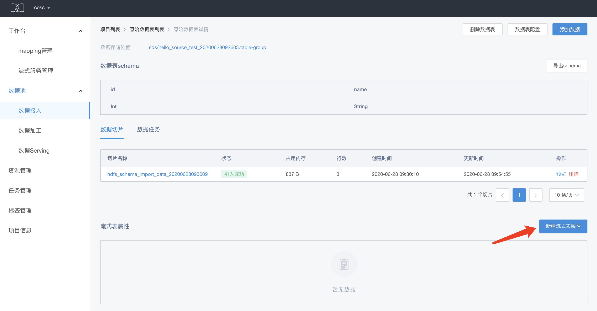
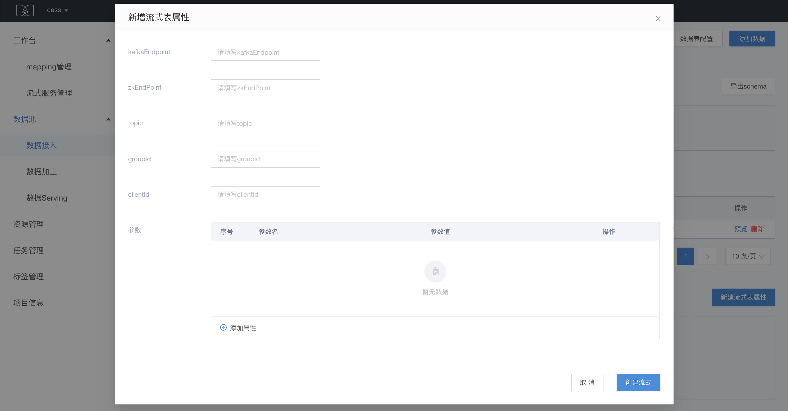

# 数据接入

原始数据的导入和管理

## 原始数据表创建

点击数据列表页的新建原始数据表

填写数据表信息，设置数据表的 schema，schema 需要与之后需要导入的数据的 schema 保持一致。schema 的创建支持三种方式：添加字段、导入字段、导入数据推断。

* 添加字段：点添加字段，填写字段名称和类型

* 导入字段：按照所给出的示例导入字段，示例如下

* 导入数据推断：按照所给出的示例导入数据，示实例如下

## 原始数据导入

这里面的数据导入，主要是基于批量数据表来进行操作。见[数据引入](./sds-data-import.md)

## 原始数据的流式表属性

在数据表详情页点击创建流式表属性，填写相关信息：

## 原始数据的流式表属性使用

请参考[SDP 处理模式](/sds/sdp-process.md)