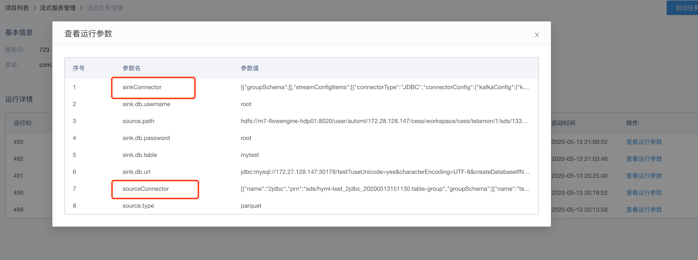
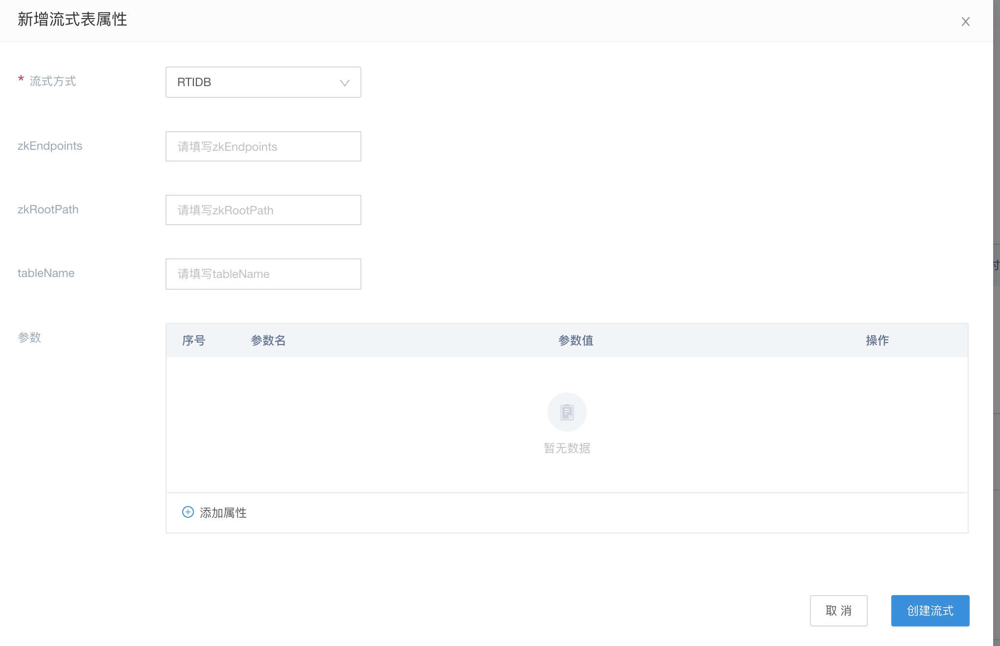

# 流式表属性

由于 SDS 中引入了流式处理的方式，其处理的都是流式数据。如[流式服务](sds/../sds-stream-service.md)中提到的，建立一套流式服务模板的方式来提供流式服务。

但实际过程中，我们希望将流式处理的参数以一种数据源的方式来沉淀下来，这样子，我们在建立流式服务模板中，无需定义非常多的参数，以一种数据源串联的方式来启动相应的流式服务。

在 mapping 上，定义相关数据的流式处理规则后，点击启动任务后，则会自动拉取相关数据定义的流式表属性，填充到固定的参数，供 flink job 来使用

如图所示，相关的流式表属性，以 sourceConnector 和 sinkConnector 传入到 flink job 中

而在定义的时候，只需要在相关的数据里定义流式表属性即可。

如上图所示，即定义流式的 rtidb 表属性。

后续在使用的时候，该 rtidb 属性以 sinkConnector 的形式传入到 flink job 中