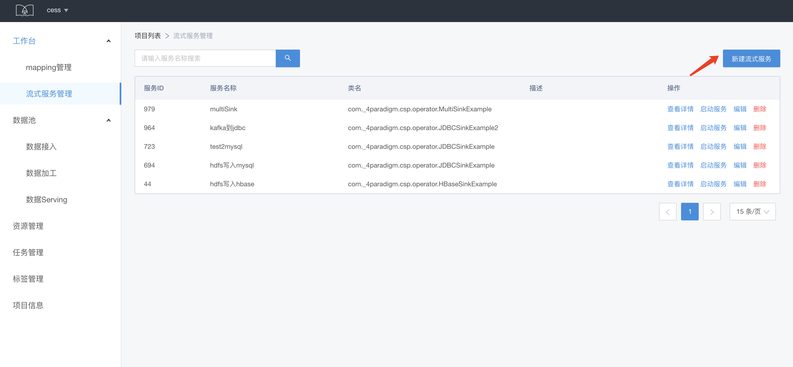
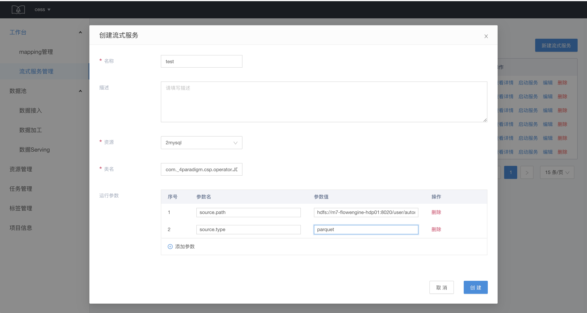
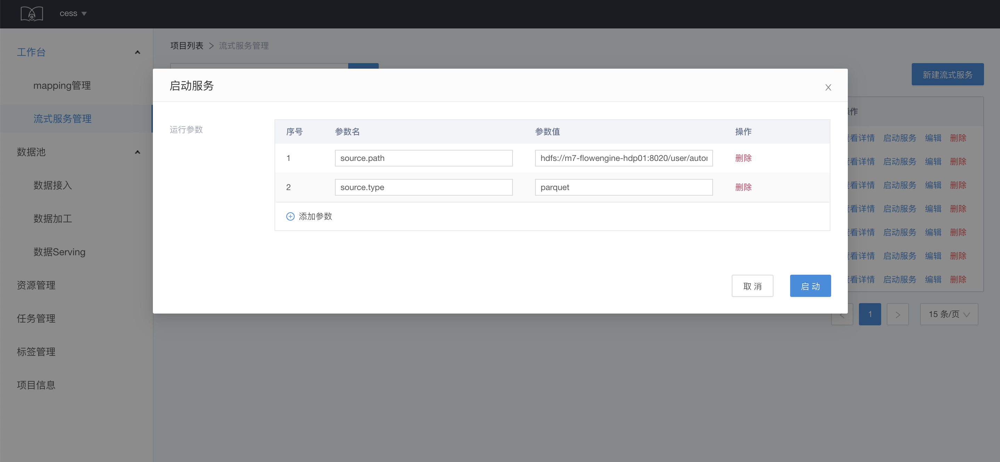
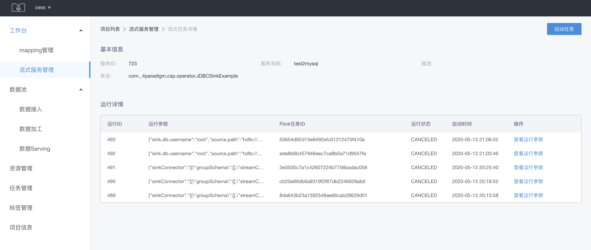
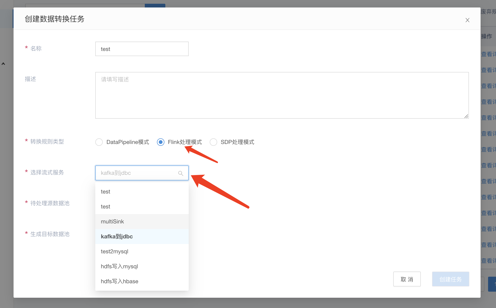

# 流式服务管理

提供数据的实时处理能力，通过流式任务模板的方式启动流式任务。Flink 任务发起的流程，主要是基于 Flink 提供的 rest api 能力。

## 流式服务创建

在流式服务管理页面选择新建流式服务

填写名称和描述。其中

* 资源：即在资源管理创建的 Flink job 的 jar 包资源
* 类名：对应着 Flink job 的 entryClass
* 参数：即为传入 Flink job 的参数

## 流式服务使用

流式服务列表页点击启动服务按钮可以启动服务，在这里，仍然可以配置参数

服务启动后，可以点击查看详情，查看服务运行状况：

也可以在创建 mapping 规则的时候，选择 Flink 处理模式，选择流式服务，然后在 mapping 详情页选择启动服务

