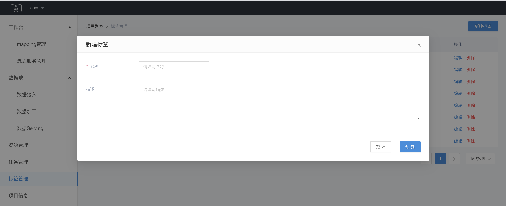
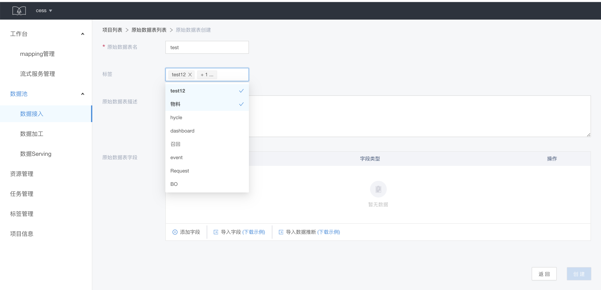
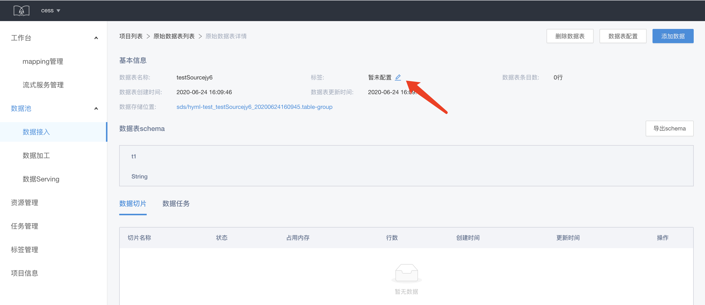
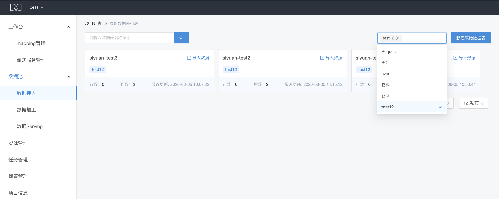

# 标签的管理和使用

SDS 的标签机制支持对数据表进行打标，方便数据表的分类检索和标记数据的业务属性。目前暂时仅支持一个层级的tag管理

## 标签的创建

在标签管理页面，点击新建标签，填写标签的名称和描述信息，点击创建

## 标签的使用

* 对数据表进行打标可以在创建数据表的时候选择标签。

* 在已创建的数据表中，可以对标签进行新增和修改。

* 在数据列表页使用标签对数据进行快速检索

上述操作，在三个层级的数据表均适用