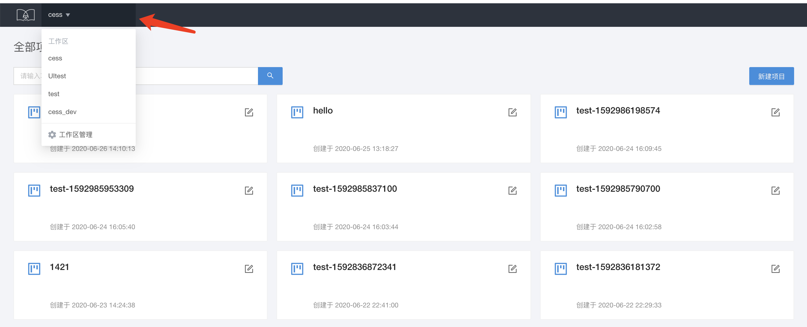
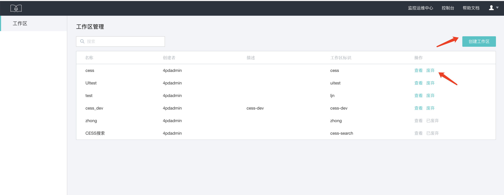
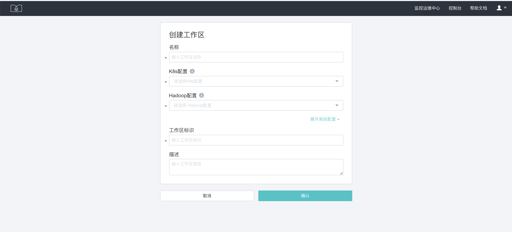
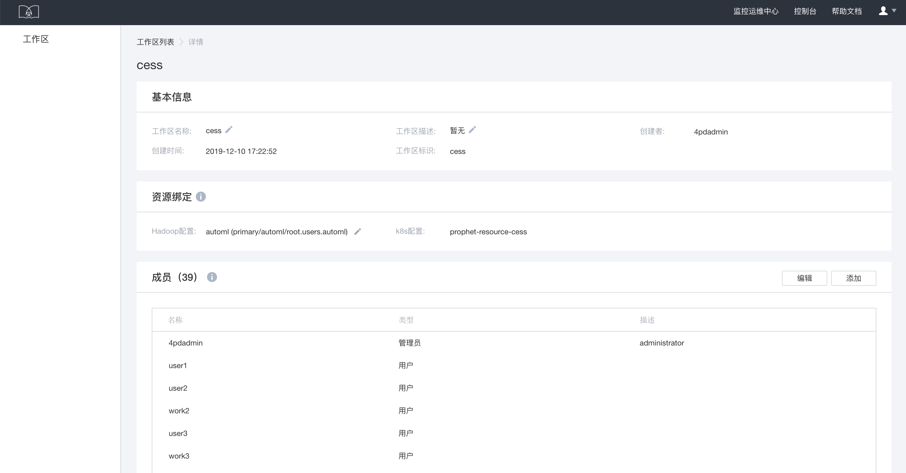

# 工作区管理

Flowengine Data 依托于先知，以工作区的方式对用户和数据进行划分，方便进行数据的共享和私密性的管理。一个工作区下，可以按照不同的数据业务维度，建立多个项目。

## 工作区创建和废弃

以管理员身份登录，点击工作区列表中的工作区管理按钮，进入工作区管理的页面，可以创建工作区、查看工作区详情、废弃工作区。

创建工作区，配置工作区名称和资源：

## 工作区详情

点击查看，进入详情页，可以查看工作区详细信息：

