# 自定义方案

&emsp; &emsp; FlowEngine 通过方案市场对方案进行管理，包括方案创建修改、导入导出等功能。

&emsp; &emsp; FlowEngine 官方提供功能强大的组件，通过对组件的选取和配置，既可以产出固定的、标准化的解决方案，通过官方提供的组件和pipeline功能完成一个标准的场景流程

&emsp; &emsp; 自定义方案是高级功能，下面将通过具体的案例来讲解，我们采用官方自带的组件创建一个自定义的hypercycle方案的。

## QuickStart：hypercycle方案

## 准备工作：

&emsp; &emsp; 需要可以产出模型的dag（如果是测试，不需要很复杂，简单的拼接加fe就可以，最后接个pico算子）
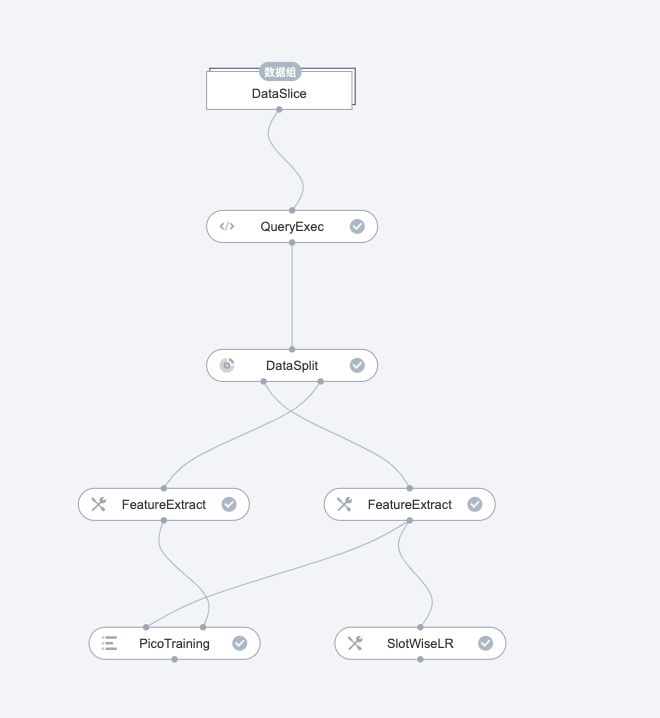

## 创建方案

&emsp; &emsp; 准备工作就绪后，我们在hub创建方案

1. 使用【管理员账号】登录先知平台，并进入 FlowEngine 主界面。
2. 点击方案市场，进入方案市场页面。
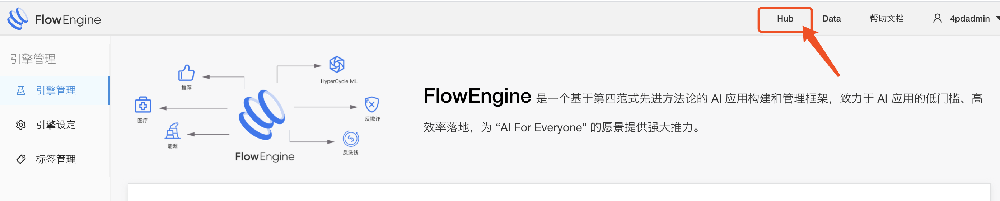

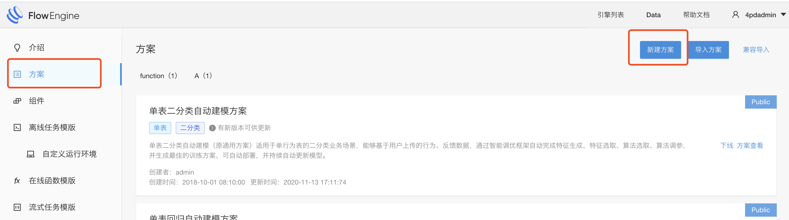

3. 点击新建按钮，创建一个方案。此处需要填写方案的基本信息,配置完成后点击保存即成功创建了一个新的方案。
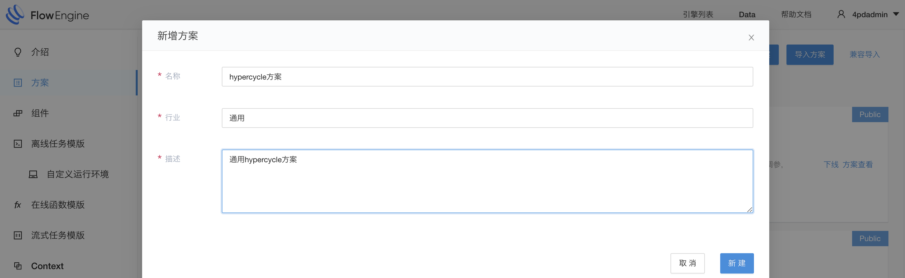

## 方案编辑

&emsp; &emsp; 方案创建完成后，在方案列表页找到该方案，点击方案编辑。一个方案的编辑主要可分为几大块：基本信息、在线编排、离线编排、组件管理、dashboard 及其他配置。
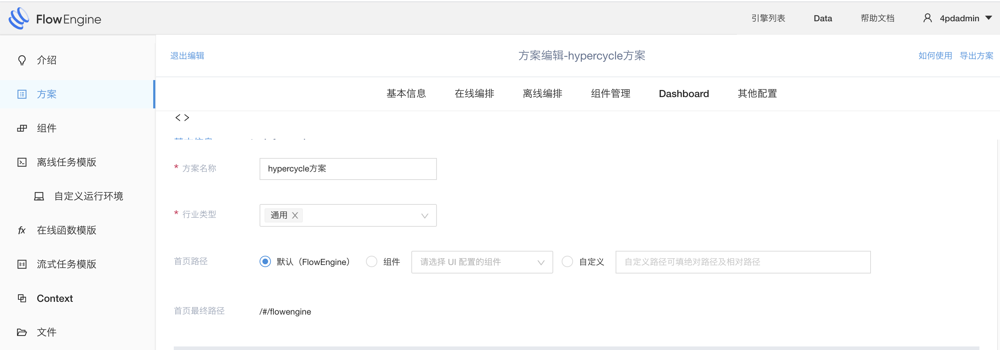

## 编辑组件

&emsp; &emsp;添加hypercycle需要的两个组件：自学习组件和在线预估组件
1. 点击组件编辑图标，弹出组件选择页面，选中两个需要添加的组件后，点击保存
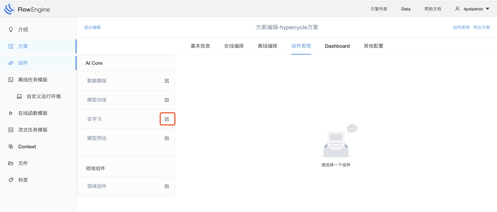
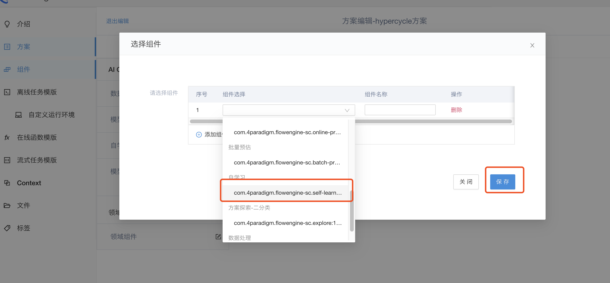
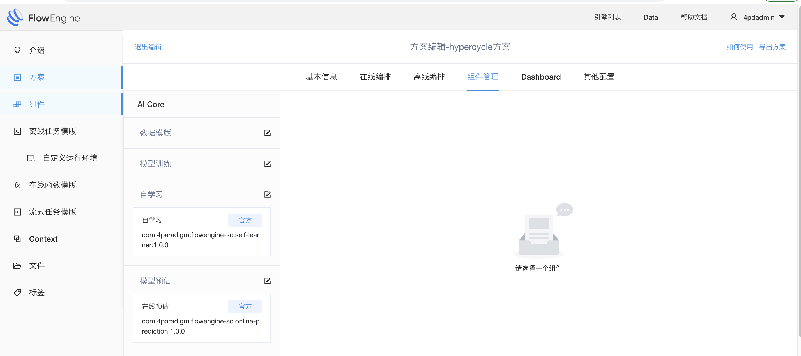
2. 选中自学习组件，打开自学习编辑画面，将之前准备好的dag复制到组件中
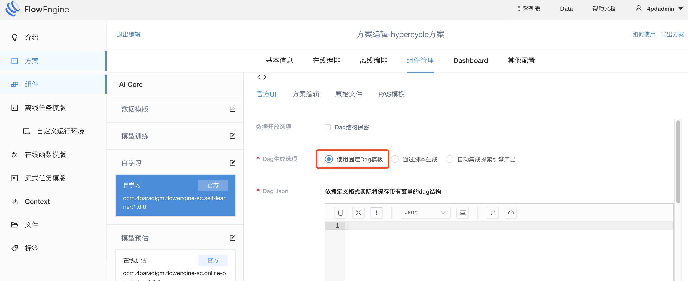
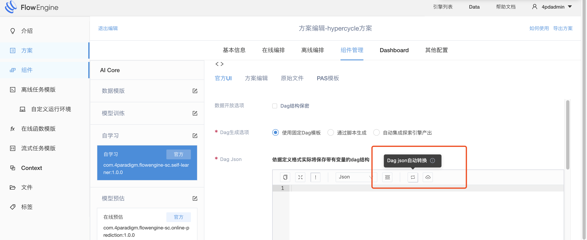
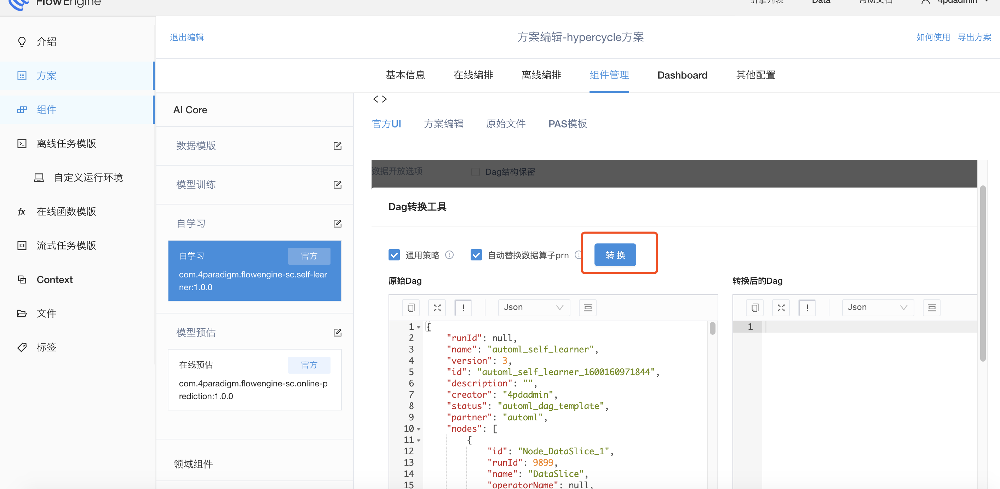
3. 编辑dag的数据算子，将数据地址用占位符来替换，因为这个数据地址后面需要运行时指定
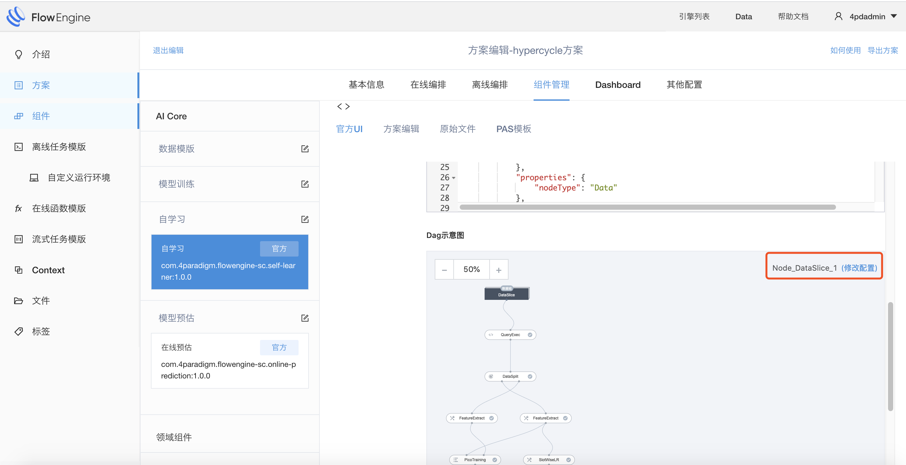
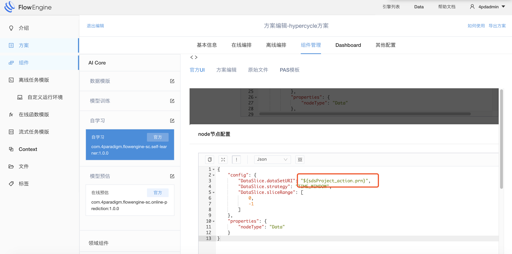

## 编辑离线任务

&emsp; &emsp;离线任务在这个场景中主要有两个作用，第一个是接受外部变量，并将变量替换自学习中的占位符，第二个作用是周期运行自学习，并根据一定的规则将自学习的产出的模型部署到在线预估中 （[如何快速开发一个pipeline?](../quickStart/offline_pipeline.md)）
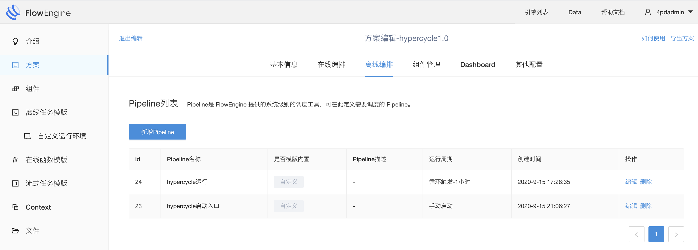

## 发布方案

&emsp; &emsp;只有发布出去的方案才会被使用，创建场景是无法选中未发布的方案
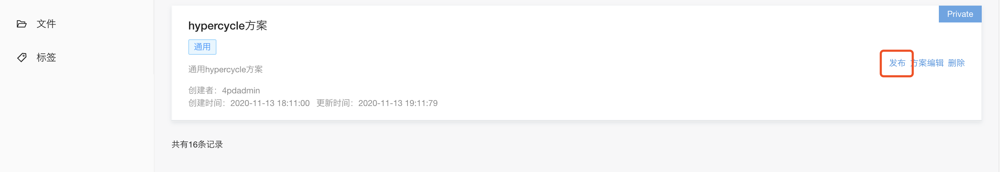

# 方案修改
&emsp; &emsp; 方案发布后，如果需要修改，可以在方案市场的方案列表页找到该方案，点击下线，然后点击方案编辑进入修改，修改完成后再点击发布即可。 
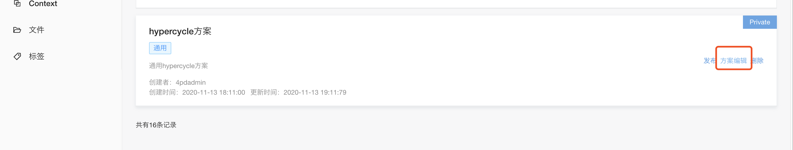

接下来[如何导入导出一个方案](solution-export.md)