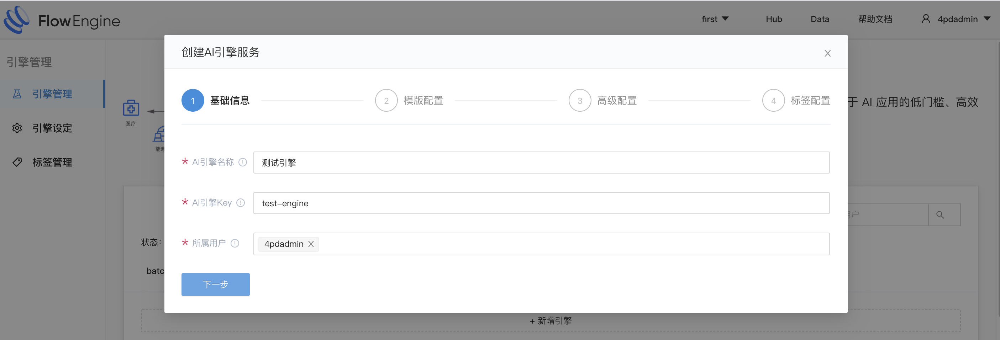
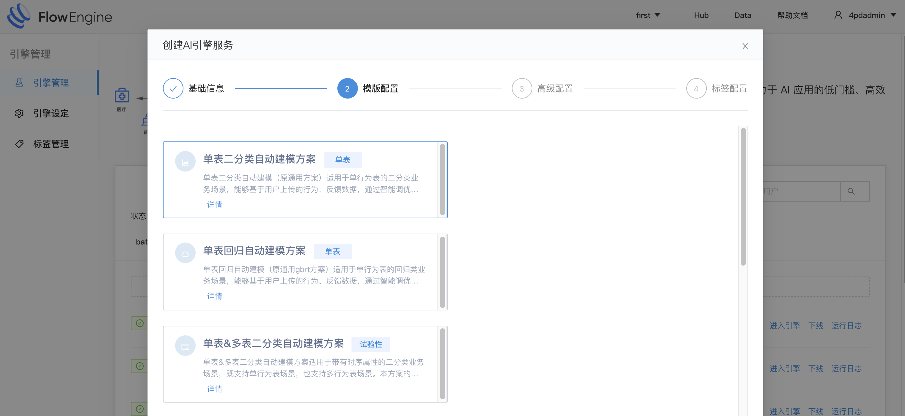
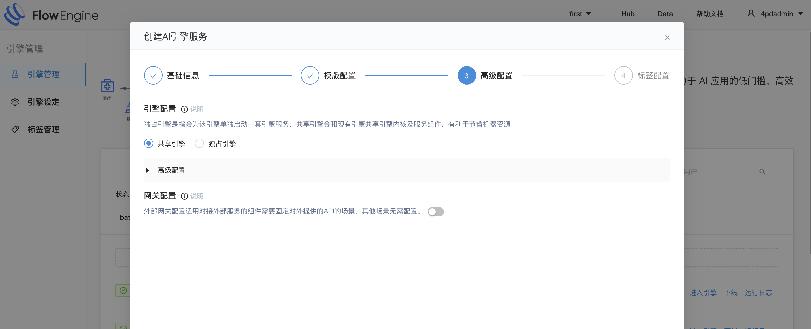
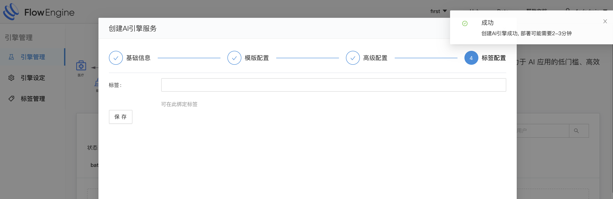
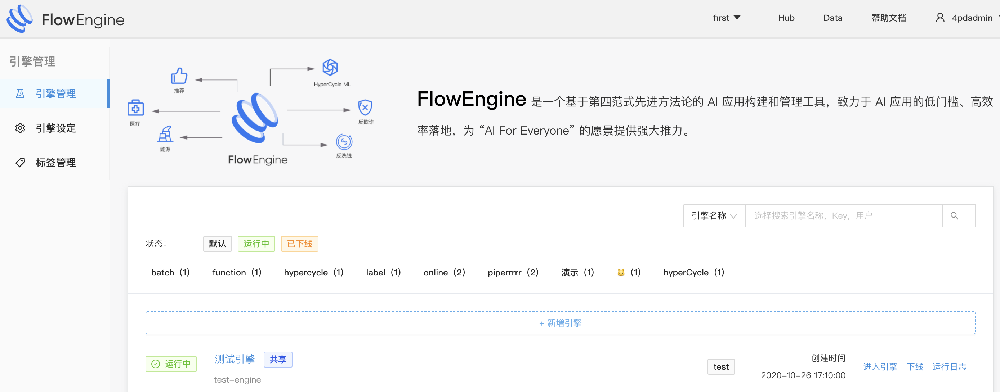
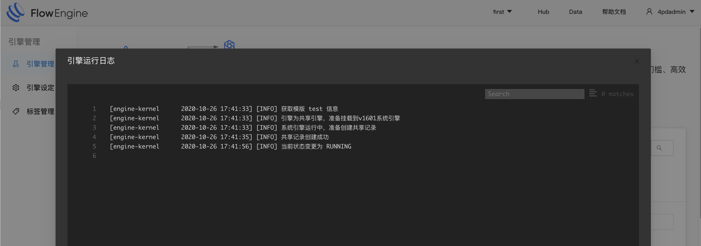

## 引擎

### 创建
* 基础信息
    1. 输入引擎名称
    2. 输入引擎Key
    3. 选择所属用户
    {:width="50%" }
* 模版配置
    1. 选择指定模版([什么是方案](/solution/intro.md))
    {:width="50%" }
* 高级配置
    1. 选择引擎类型([什么是引擎类型](/engine/engine_type.md))
    {:width="50%" }
* 标签配置
    1. 标签选填
    {:width="50%" }

### 查看
* 引擎列表([引擎异常要如何定位](/engine/engine_debug.md))
{:width="50%" }
* 引擎日志
{:width="50%" }

