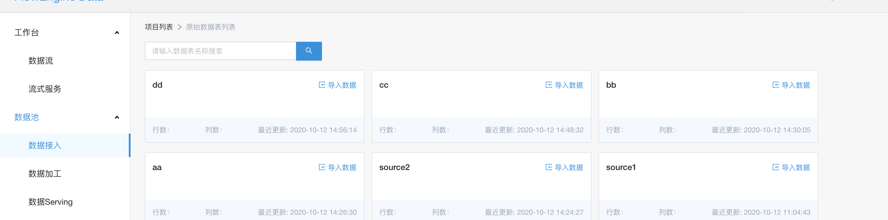
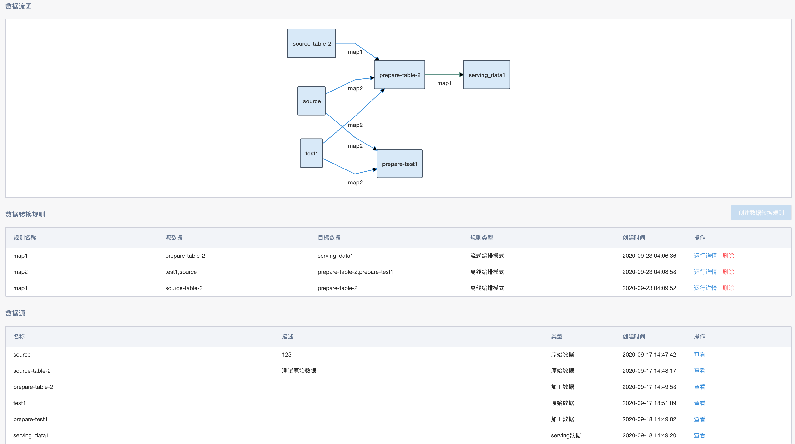
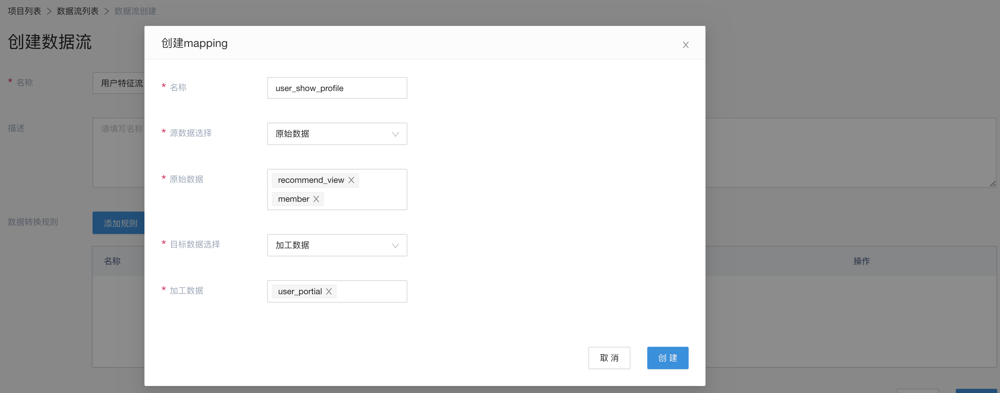
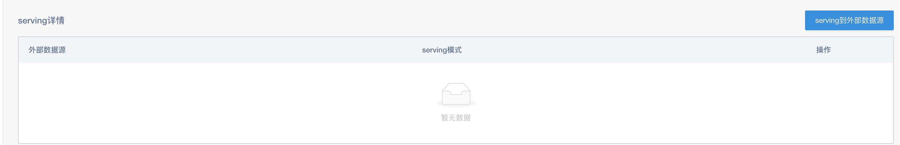
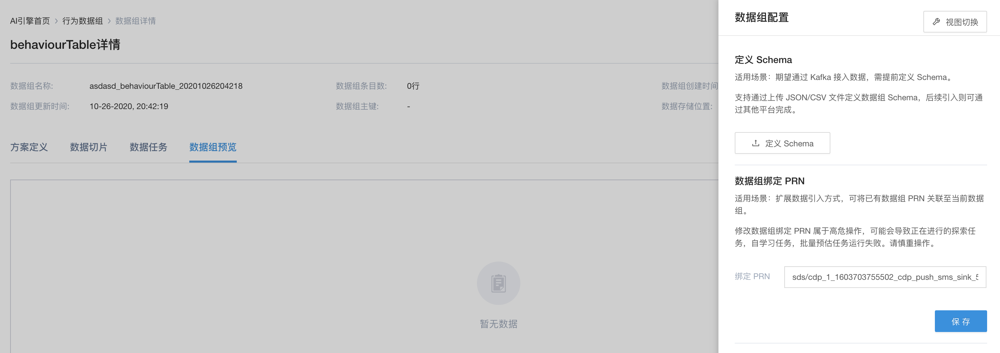

# Flowengine Data

## 简介

Flowengine Data作为flowengine的Data Lake，为AI应用、BI应用等提供各种数据以及数据服务

## 问题

用户需要对用户数据/行为数据进行处理，形成用户特征数据，同时供线上预估应用来使用

## 解法

* 通过数据引入将数据从外部系统/埋点等引入

* 建立特征数据流，通过批量模式的离线编排策略进行数据处理，形成用户特征数据

* 处理后得到的数据，选择serving到外部数据源的rtidb中，从而供线上预估应用使用

### 数据引入

Flowengine Data中的数据以项目的形式集成在一起

{:width="50%" }

sds以数据的生命周期，定义不同的数据，形成了数据接入/数据加工/数据serving，三种不同类型的数据

这里面，我们把数据分为3个层次的数据：

1. 一级表：用于数据的引入，定义数据的来源；
2. 二级表：提供对数据的处理，可以增加简单的数据处理逻辑，得到中间结果表；
3. 三级表：供引擎内的数据使用，同时也提供serving能力，即这些数据导出到Mysql可用于报表展示或者导出到Rtidb用于在线服务。

{:width="50%" }

在一级表里，我们使用本次csv引入recommend_view和user数据，这里我们以引入user数据作为例子

{:width="50%" }

{:width="50%" }

{:width="50%" }

### 数据流

数据之间的关系以及流转，通过数据流来体现。

{:width="50%" }

{:width="50%" }

这里，我们建立用户特征数据流，选择上面已经引入的一级表，并选择对应处理表，并选批量类型的DAG模式来进行相关数据处理

{:width="50%" }

{:width="50%" }

通过运行规则的运行详情，就可以看到实际的数据处理流程

{:width="50%" }

### 外部数据源

除了Data Lake中的数据管理外，平台提供外部数据源的管理，用于Data Lake中的数据serving使用

### serving服务

在serving数据中，可以新建serving服务

{:width="50%" }

可以选择批量模式，自动从hdfs导入到rtidb中，供线上应用来使用

{:width="50%" }

## 数据使用举例

### AI应用

数据经过引入/加工处理之后，成为三级表之后，就可以供AI应用来使用

{:width="50%" }

引擎内，通过绑定数据组的方式，即可使用到此数据，从而使得引擎内的数据，仅需进行FEQL来处理，保证了数据的线上/线下一致性。

{:width="50%" }
