## 开发或者修改一个离线pipeline
&emsp; &emsp;用离线pipeline实现一套从获取数据到执行自学习到部署自学习模型的流程

* 进入开发者模式，进入引擎->高级配置->系统命令，密码与当前日期相关

  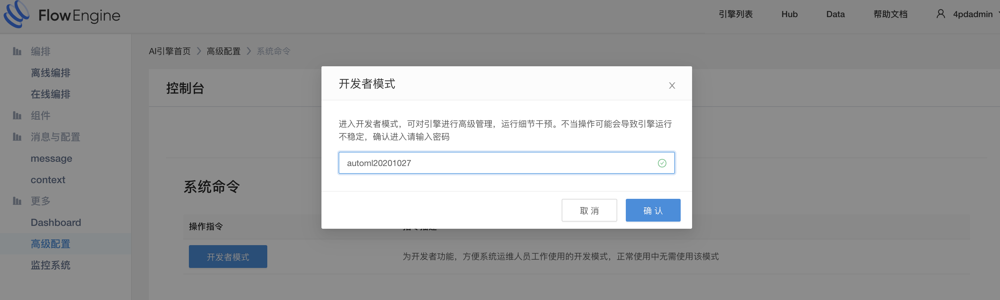

* 进入pipeline编辑，离线编排->Pipeline编辑

  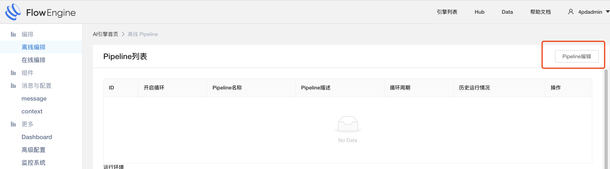

* 新增pipeline

  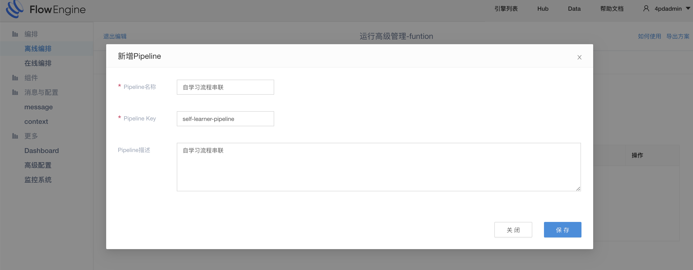

* 编辑pipeline，然后将所需要的job拖入pipeline画布中，并定义job的启动顺序

  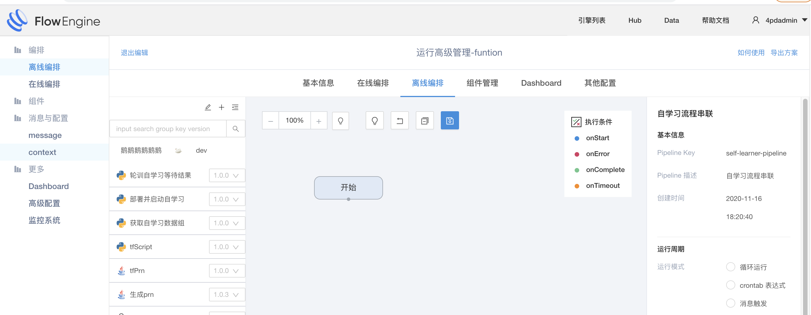

  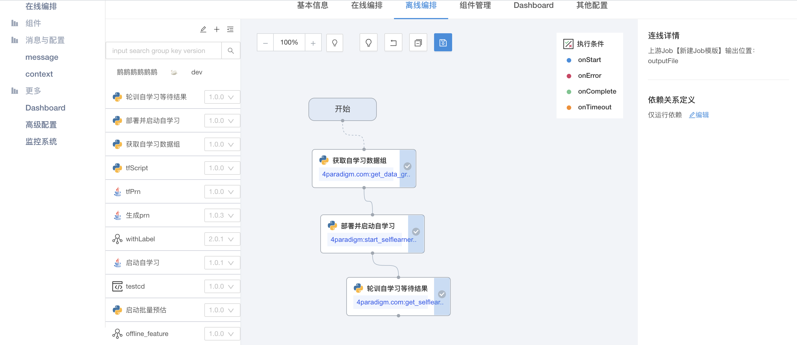

* 我们发现这个pipeline离我们最终的流程目标还差最后一个部署模型到在线预估的环节,缺少的job我们通过自定义job来完成
* 打开离线任务模版页面,点击创建job,完成基本信息录入后，点击保存

  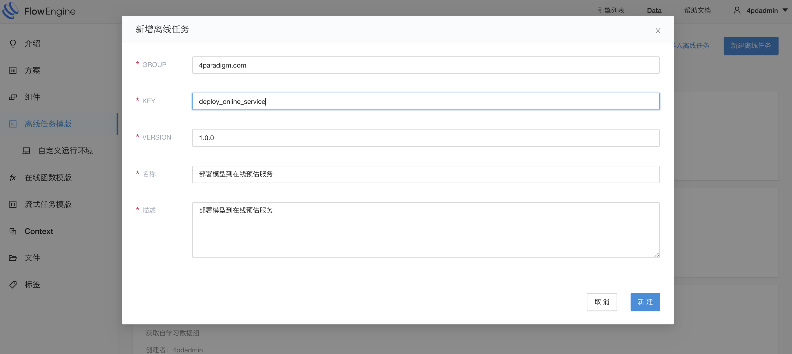

* 进入job详情，编写具体代码逻辑 ([支持的job类型](../offline-pipeline/user_defined_param.md))

  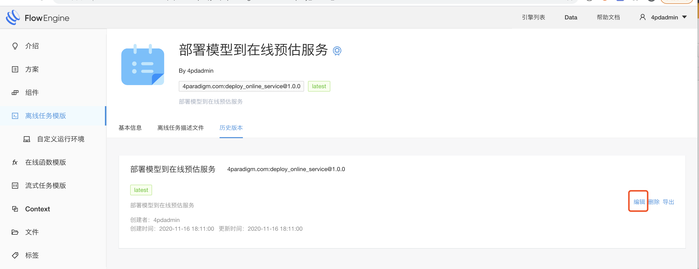

  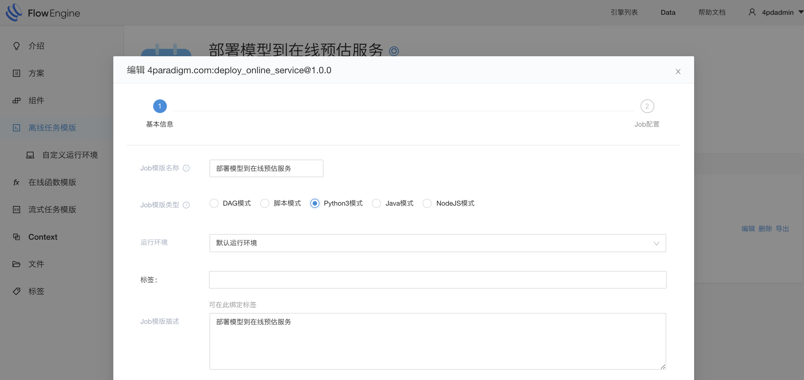

  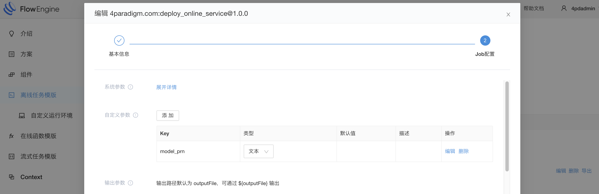

  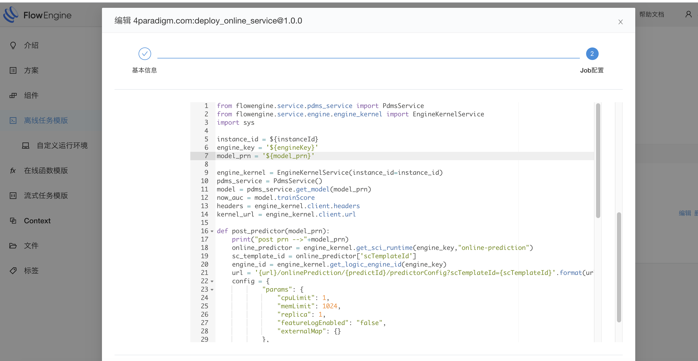

* 返回刚才的pipeline，将刚才创建好的job拖入到pipeline中，并链接好线保存

  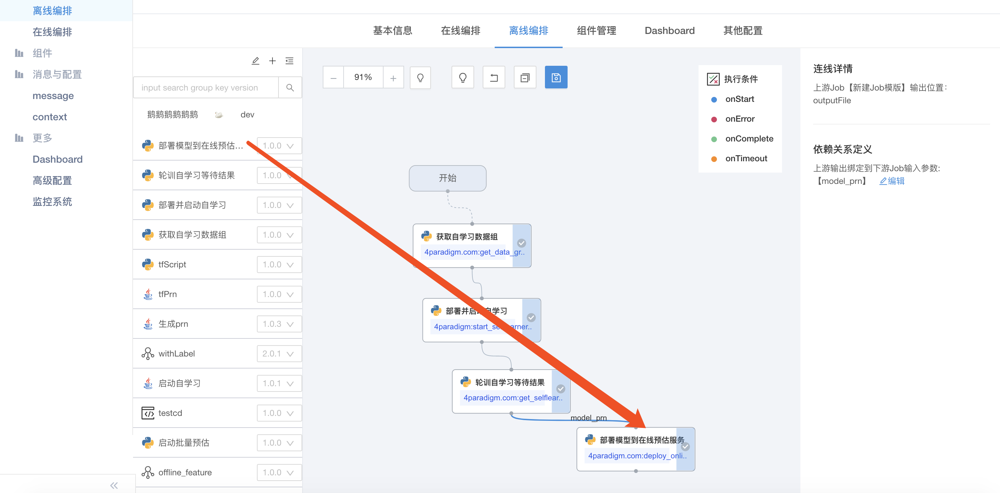

* 点击运行pipeline

  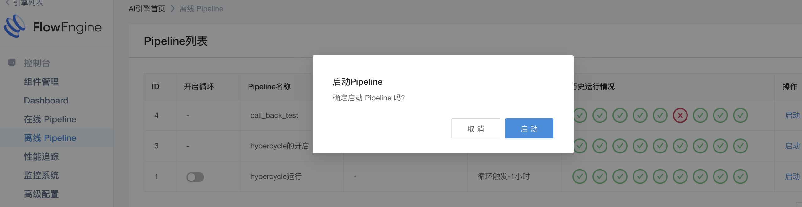

* 等待成功后，查看运行结果

  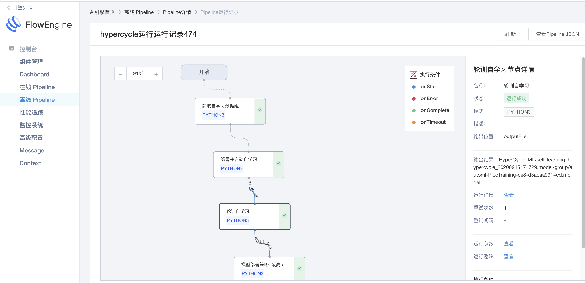

    
           