以开发一个某零售行业的营销场景为例，需要开发针对此场景的AI应用

# 背景

已有用户数据，物料数据等等，以及用户行为数据等，如何构建一个基于用户行为的推荐应用

# 方案

* 构建数据流
* 构建AI模型引擎
* 构建场景引擎

# 构建步骤

## 构建数据流

这部分，主要是构建场景所需要的相关数据，以数据流为核心，供后面模型/业务引擎来使用

### 新建Flowengine Data项目

<div align="left">
  
</div>

### 引入数据

这里涉及的表，主要是member(用户), product(产品), store(店铺), request(请求)，order(订单), recommend_view（曝光） 6张表。如下图所示，新建原始数据表，并以本地csv的方式引入到系统中

<div align="left">
  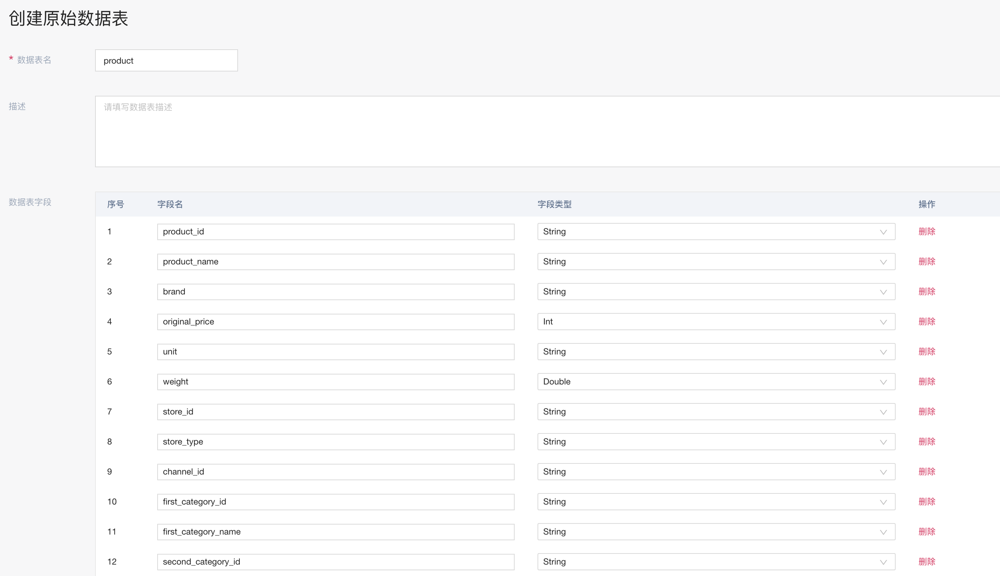
</div>

<div align="left">
  
</div>

<div align="left">
  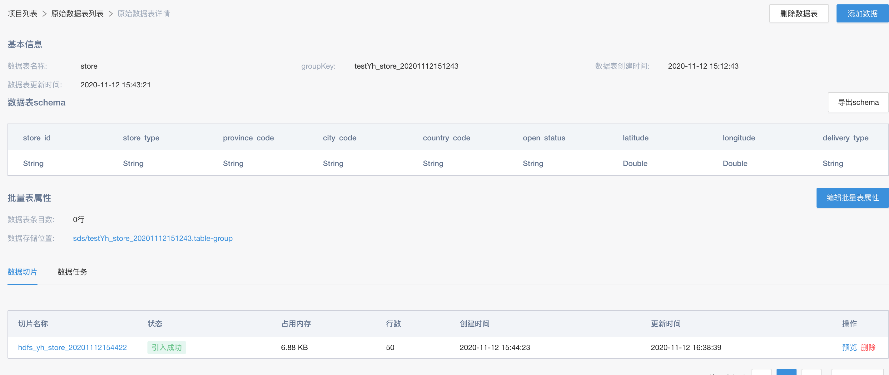
</div>

<div align="left">
  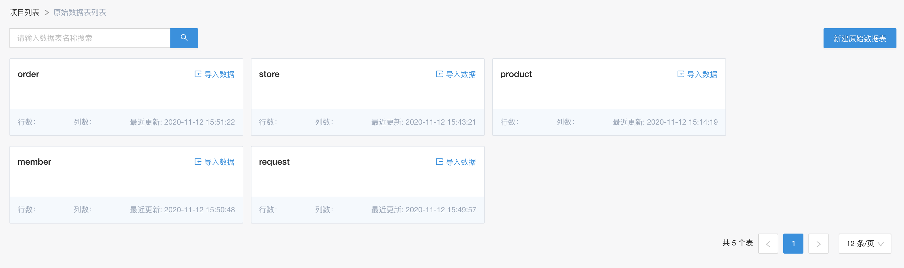
</div>


### 定义数据流

当得到相关的原始数据之后，就可以对相应的数据进行加工处理。

<div align="left">
  
</div>

以处理离线的店铺画像/用户画像/产品画像为例，

<div align="left">
  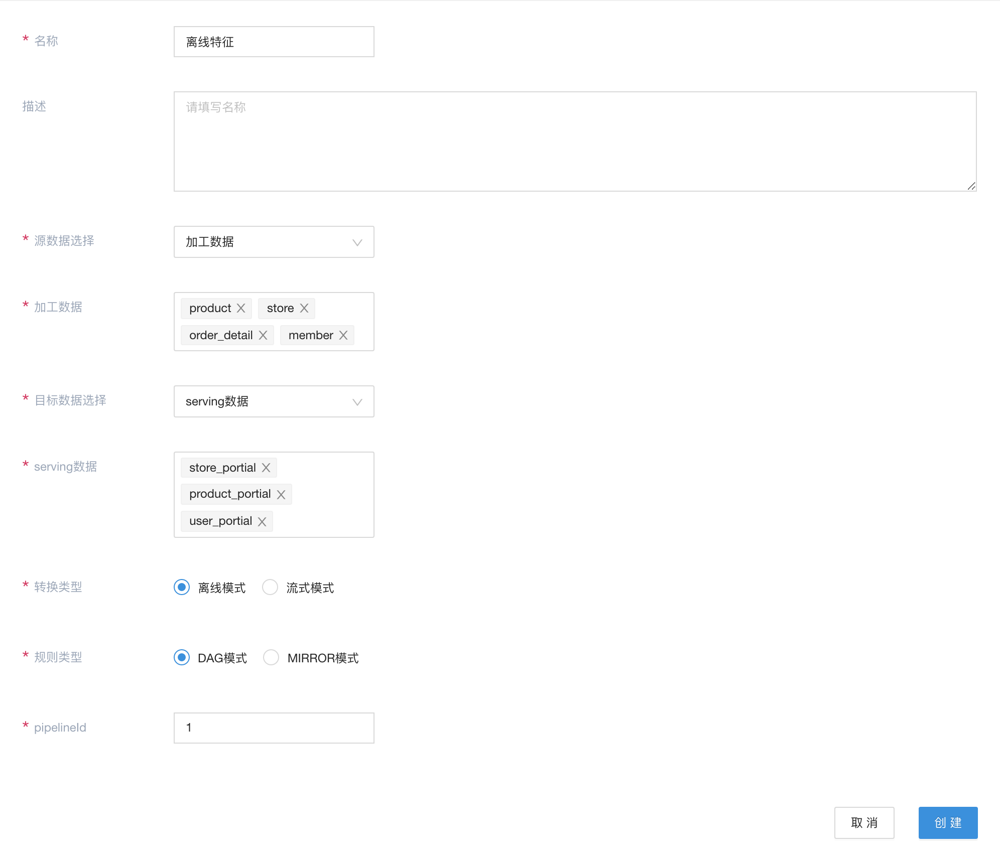
</div>

<div align="left">
  
</div>

此数据流定义相关特征的处理过程。这里采用离线编排的方式来完成离线特征的处理。


以准备在线模型的数据为例，

<div align="left">
  
</div>

此数据流定义相关的数据简单的处理以及映射，主要是通过raw规则来完成相应的数据映射，方便在后续通过Flowengine-Data的serving能力完成自动serving到其他存储介质，如rtidb中。

### 启动数据流

在绑定的数据引擎里，启动相对应的离线编排。

<div align="left">
  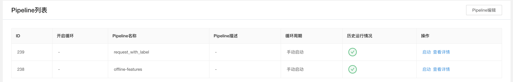
</div>


### 查看数据

离线数据：

<div align="left">
  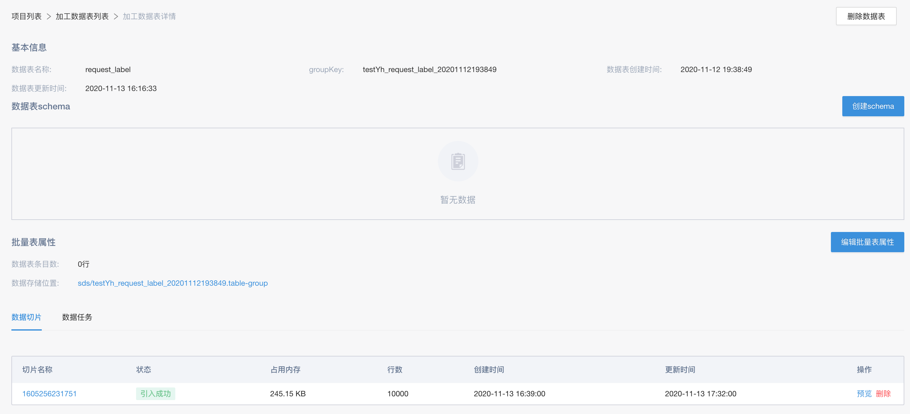
</div>


rtidb数据：

<div align="left">
  
</div>


## 构建AI模型引擎

当数据构建完成之后，可以开始构建所需要的AI模型引擎。该引擎以自学习为核心来串联整个流程，以最终的预估接口作为服务，对外提供服务。

### 建立模型引擎

通过一个示例方案，建立模型引擎

<div align="left">
  
</div>

这里的tradeup_v2方案是一个示例方案，里面包含了数据组件/自学习/批量预估/在线预估组件。用户也可以根据自己的实际需要去调整

### 绑定数据

直接使用Flowengine Data已经处理好的数据，引擎内如果需要相关的数据的话，仅需绑定相应的数据组即可。

<div align="left">
  
</div>

进行绑定数据组操作

<div align="left">
  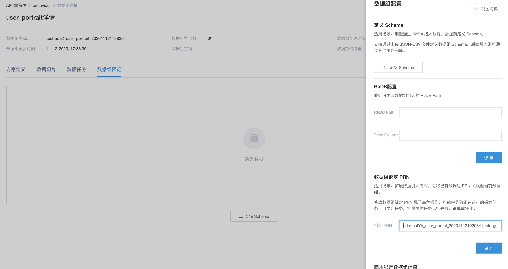
</div>


绑定完成后，

<div align="left">
  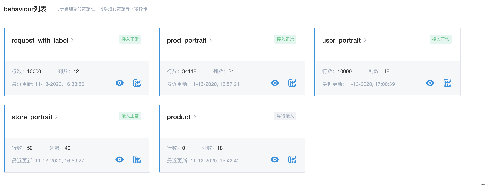
</div>


这里，采用绑定的方式来引入数据，主要是基于两点考虑：

* 相关数据已经由之前的数据流构建完成了，无须再进行处理一遍。这也体现了Flowengine Data一次构建，多次使用的思路，用于不同引擎/业务项目之间的数据共享


* 数据流部分在Flowengine Data中已经完成了相应的离线处理，使得应用内的数据，仅需要通过FEQL来进行数据的流转和处理，利用FEQL机制，可以保证离线/在线数据的一致性，从而也保证了数据的线上/线下一致性


### 自学习

当数据准备好之后，便可以通过相应的数据进行自学习

<div align="left">
  
</div>


确定相关自学习配置

<div align="left">
  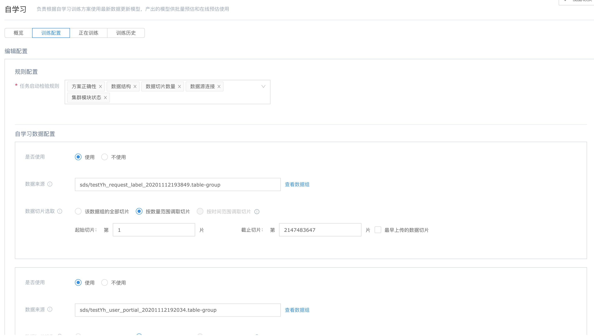
</div>


进行自学习，得到相关模型

<div align="left">
  
</div>

### 在线预估

得到模型之后，就可以选择它来进行在线预估

<div align="left">
  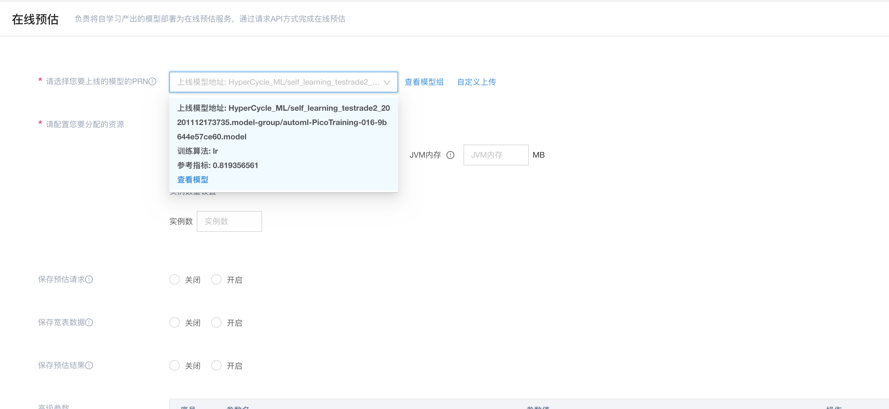
</div>

<div align="left">
  
</div>

<div align="left">
  
</div>


## 构建场景引擎

在构建完成模型引擎，得到相应的预估url之后，就可以跟业务部分进行对接。这里，我们可以通过构建场景引擎的方式，来完成最终跟业务部分的对接。

在实际的业务对接过城中，推荐不仅仅是做预估，还有例如召回，粗排，黑名单之类的规则逻辑。可以以在线编排的方式，来对外构建这些规则，从而整合推荐引擎，形成完整的场景引擎，对外提供服务。

这里以构建一个简单的调用预估作为例子进行说明。
### 基本的引擎和function的创建
基本的操作，见[在线编排](./online_pipeline.md)

### 流程的定义

定义一个在线pipeline流程，包含召回，模型，规则等

<div align="left">
  
</div>

### 模型精排

这里以实现一个简单的精排为例。构建精排func，

```java
public class DemoModelSortFunction extends FLFunction {

    private static final Logger LOG = LoggerFactory.getLogger(DemoModelSortFunction.class);

    private static RestTemplate restTemplate;

    private static String predictorUrl;

    public static final ObjectMapper jsonMapper = new ObjectMapper()
            .configure(DeserializationFeature.FAIL_ON_UNKNOWN_PROPERTIES, false)
            .configure(JsonParser.Feature.ALLOW_COMMENTS, true)
            .configure(JsonParser.Feature.ALLOW_UNQUOTED_FIELD_NAMES, true)
            .setTimeZone(TimeZone.getTimeZone("GMT+8"));

    @Override
    public void onInit(Map<String, Object> initConfig) {
        int timeOut = Integer.valueOf(String.valueOf(initConfig.getOrDefault("http.timeout", 500)));
        restTemplate = new RestTemplate(HttpUtils.httpRequestFactoryTimeOut(timeOut));
        predictorUrl = (String) initConfig.getOrDefault("predictUrl", "");
    }

    public Object run(PipelineContext pipelineContext, Object... objects) {
        Map<String, Object> limits = (Map<String, Object>) objects[0];
        List<HashMap<String, Object>> candidates = (List<HashMap<String, Object>>) limits.get("list");
        if (StringUtils.isNotEmpty(predictorUrl) && candidates.size() > 0) {
            try {
                LOG.info("start predict, {}", candidates.size());
                Map<String, Object>  predictRequest = new HashMap<>();
                predictRequest.put("accessToken", "mib");
                predictRequest.put("requestId", UUID.randomUUID().toString());
                predictRequest.put("requestTime", 0);
                predictRequest.put("isDebug", false);
                predictRequest.put("isWarmupRequest", false);
                predictRequest.put("resultLimit", candidates.size());
                List<Map<String, Object>> rawInstances = new ArrayList<>();
                for (int i = 0; i < candidates.size(); i++) {
                    Map<String, Object> item = candidates.get(i);
                    Map<String, Object> instance = new HashMap<>();
                    instance.put("id", item.get("id"));
                    Map<String, Object> rawFeatures = new HashMap<>();
                    instance.put("rawFeatures", rawFeatures);
                    rawFeatures.put("cart_original_price", 8250);
                    rawFeatures.put("cart_present_price", 7550);
                    rawFeatures.put("cart_product_list", "101,102,104,205");
                    rawFeatures.put("cart_product_quantity", 4);
                    rawFeatures.put("cart_quantity", 7);
                    rawFeatures.put("currentTime", 1576644307000L);
                    rawFeatures.put("instance_id", "I500000000003890");
                    rawFeatures.put("member_id", "M500000000009753");
                    rawFeatures.put("product_id",(String) item.getOrDefault("product_id", ""));
                    rawFeatures.put("store_id","S50000000000025");
                    rawFeatures.put("trace_id","T5000000000028003");
                    rawInstances.add(instance);
                }
                predictRequest.put("rawInstances", rawInstances);
                LOG.info("predict request, {}", jsonMapper.writeValueAsString(predictRequest));

                HttpHeaders httpHeaders = new HttpHeaders();
                httpHeaders.add("Content-Type", "application/json; charset=UTF-8");
                HttpEntity<String> requestEntity = new HttpEntity<String>(jsonMapper.writeValueAsString(predictRequest), httpHeaders);
                ResponseEntity<String> response;
                try {
                    response = restTemplate
                            .exchange(predictorUrl, HttpMethod.POST, requestEntity, String.class);
                    if (!response.getStatusCode().is2xxSuccessful()) {
                        return candidates;
                    }
                } catch (Exception e) {
                    return candidates;
                }
                JsonNode resp = jsonMapper.readTree(response.getBody());
                if (!resp.get("status").asText().equalsIgnoreCase("ok")) {
                    return candidates;
                }

                LOG.info("predict response, {}", jsonMapper.writeValueAsString(resp));
                JsonNode array = resp.get("instances");
                if (array.isArray()) {
                    for (int i = 0; i < array.size(); i++) {
                        JsonNode resItem = array.get(i);
                        int index = resItem.get("id").asInt()-1;
                        Map<String, Object> item = candidates.get(index);
                        item.put("predictScore", resItem.get("scores").get(0).asDouble());
                    }
                }

                candidates.sort(new Comparator<Map<String, Object>>() {
                    @Override
                    public int compare(Map<String, Object> o1, Map<String, Object> o2) {
                        if (o1 == null && o2 == null) {
                            return 0;
                        }
                        if (o1 == null) {
                            return 1;
                        }
                        if (o2 == null) {
                            return -1;
                        }
                        double click1 = (double) o1.getOrDefault("predictScore", 0.0d);
                        double click2 = (double) o2.getOrDefault("predictScore", 0.0d);

                        if (click1 > click2) {
                            return -1;
                        } else if (click1 < click2) {
                            return 1;
                        } else {
                            return 0;
                        }
                    }
                });
            } catch (Exception e) {
                return candidates;
            }
        }

        return candidates;
    }
}
```

代码部分说明：

* init部分主要是初始化RestTemplate以及httpTimeout时间
* run部分代码，实际是调用predict进行打分，然后进行排序

### 创建场景pipeline以及运行时配置

在场景引擎里，构建仅包含精排流程的在线pipeline。

<div align="left">
  
</div>


在精排的function运行的时候，需要注入相应的predictUrl。需要在pipeline的job部分，进行初始化的配置

<div align="left">
  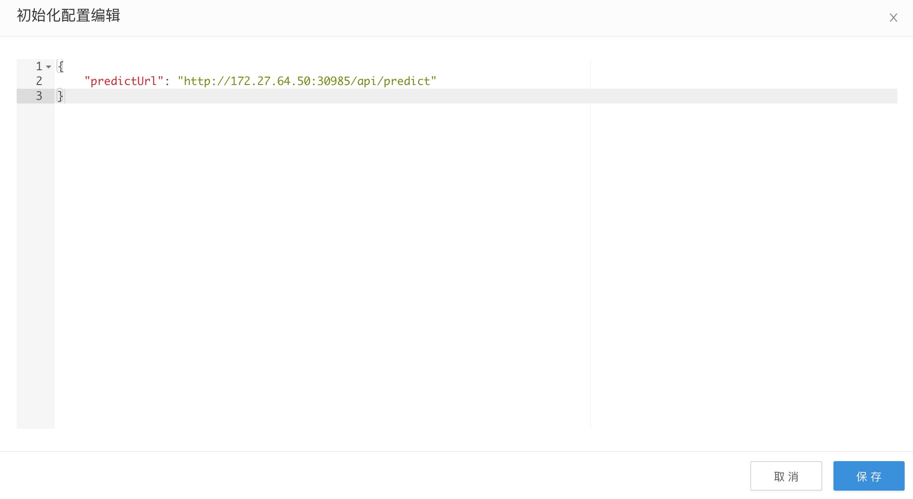
</div>

其中predictUrl填入上面推荐引擎的预估url

### 发布pipeline以及调试

当完成相应的配置之后，我们就可以重新发布pipeline，对外进行调试以及提供服务

<div align="left">
  
</div>

<div align="left">
  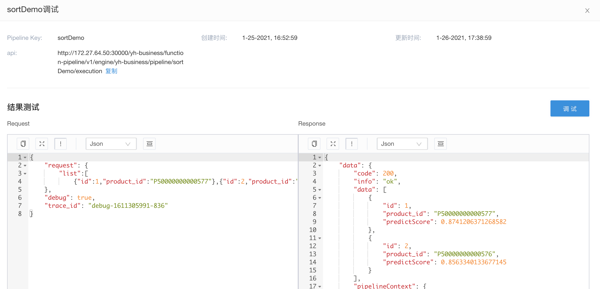
</div>

### 业务方使用

业务方在业务程序里，使用上面调试时使用的url，即可完成包含简单精排的推荐功能

## 附加

无


