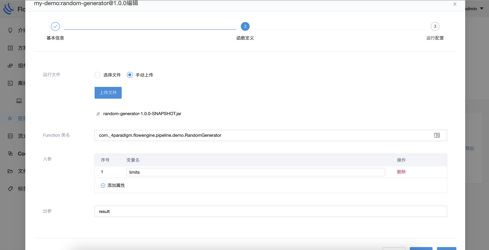
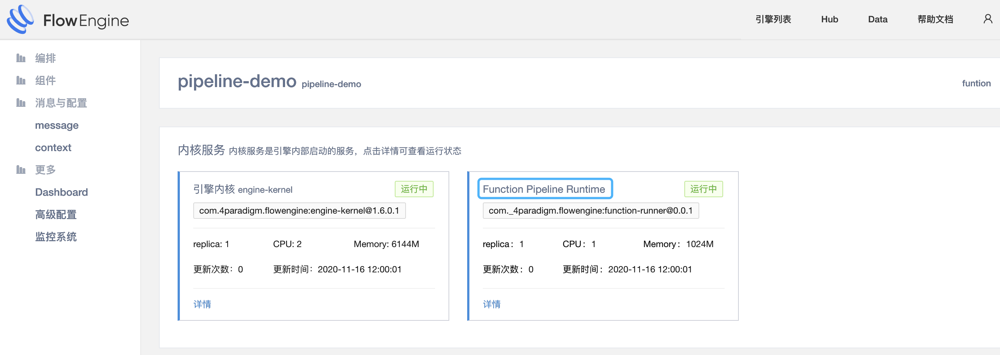
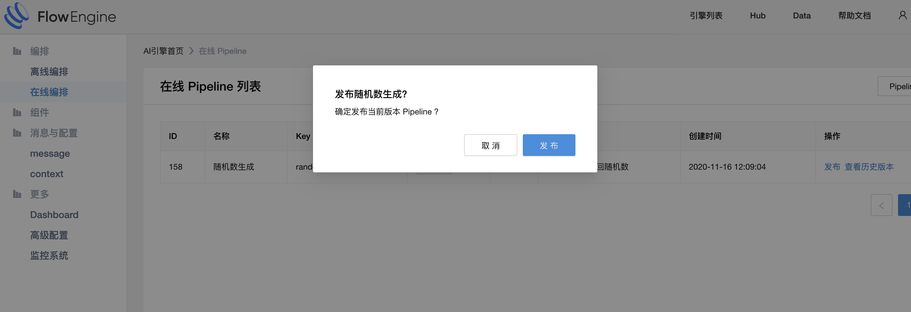

# 基本概念

## 概念介绍

### Pipeline

在线编排的执行单元，由若干个 Function 组成，描述 Function 之间的拓扑关系和配置。
部署后可通过 http 请求调用。

### Function

在线编排的最小粒度元素，基于 FlowEngine 提供的库、工具包，可以开发 function 的代码逻辑。
目前支持使用 JAVA 开发。

### Function Template（在线函数模板）

对 Function 的进一步描述（如 key、group、version，以及类名、参数、配置等）和定义，沉淀在 Flowengine Hub 中供所有用户使用。

### Function Pipeline Runtime

在线编排的运行时服务，pipeline 在发布后，会被 runtime 服务实例化，对外提供 http 服务。

## 添加组件以开启在线编排功能

FlowEngine 默认带有在线编排功能，能够上传 function、管理 pipeline。不过现阶段在线编排的运行时（function pipeline runtime）基于 FlowEngine 的 sc 组件机制实现，如果需要运行对应的 pipeline，需要手动在 asol 方案中添加 function pipeline runtime 组件。

## 创建 function template

在方案市场的『方案编辑』（方案范围）或引擎的『运行高级管理』（引擎范围）中，均可选择『在线编排』进行 function 或 pipeline 的操作。

点击『新增Function Template』即可创建 function template：

创建完成后，点击『编辑』，填写必要的信息。

标签：key、value 格式的标签，用于标记管理；
描述信息：必要的描述信息，帮助使用者了解 function 功能；

文件类型：目前只可选择 jar，更多模式陆续开放中；
运行文件：function 执行的 jar 文件，可从已上传文件中选择，或手动上传新文件；
Function 类名：Function 完整的类名
入参：Function 期望的输入参数（有序）变量名
出参：Function 返回值变量名

默认初始化配置：json 格式，默认的初始化配置
默认运行时配置：json 格式，默认的运行时配置

## 创建 pipeline

点击『新增Pipeline』来创建 pipeline，必填全局唯一的『Pipeline Key』：

创建完成后，点击『编辑』进入编辑页面，修改 pipeline 拓扑结构与相关配置。

## 发布 pipeline

发布操作只能在引擎中进行，请确保引擎添加并启动了相关组件：

选择左侧控制台中的『在线 Pipeline』，即可发布对应的 pipeline。

发布完成后，可以点击『调试』进行调用测试：

通过『查看历史版本』可以查看 pipeline 的历史版本，并进行下线或发布操作：

