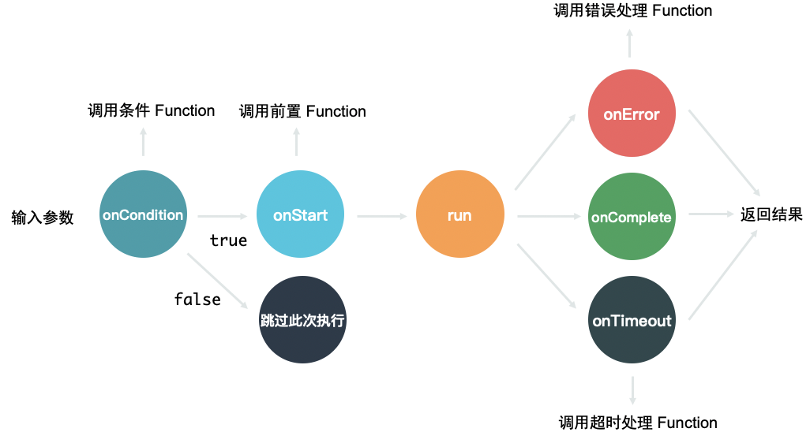
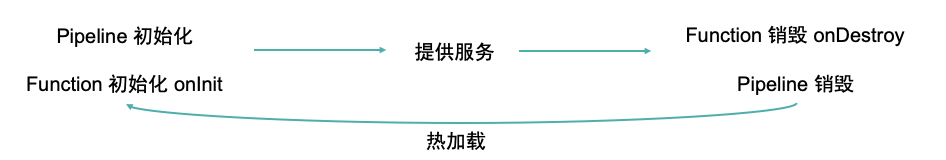

# 常见问题

> 请先阅读[基本流程](./basic-operation.md)部分。

## 运行机制

### Pipeline 中的 function 执行顺序是什么？

从 request 节点执行到 response 节点，连接在一起的上下游顺序执行，并列的节点并行执行。

### function 中的生命周期执行顺序是什么？

### 配置如何加载？如何更新？

initConfig 在初始化时加载，runtimeConfig 在运行时可变更。
修改 pipeline 配置并保存后，重新发布即可，加载过程框架会自动进行热加载。

## 问题排查

### Pipeline 加载失败了，是什么原因？

### 调用接口返回 xxx 是因为什么？

