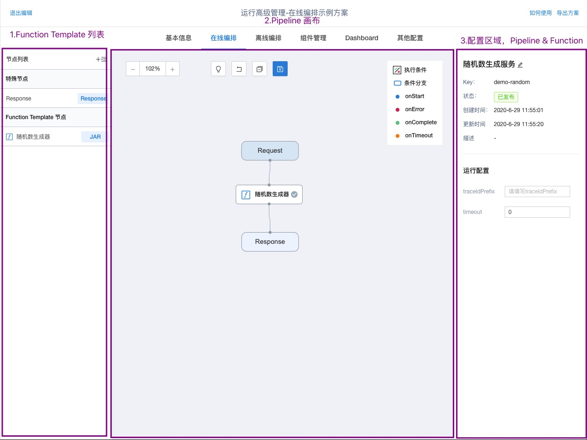
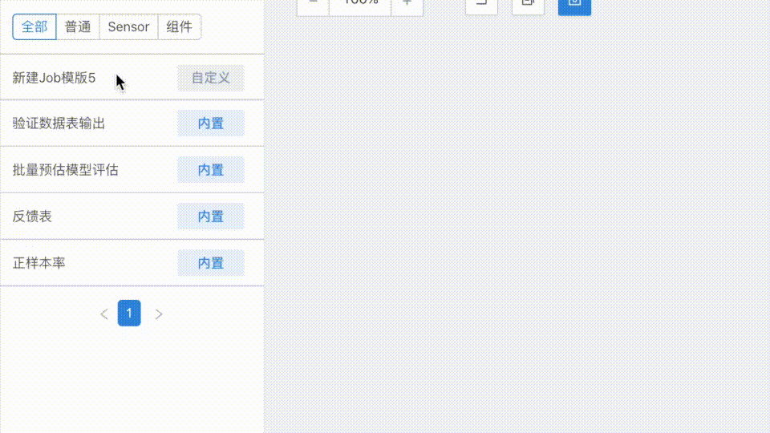
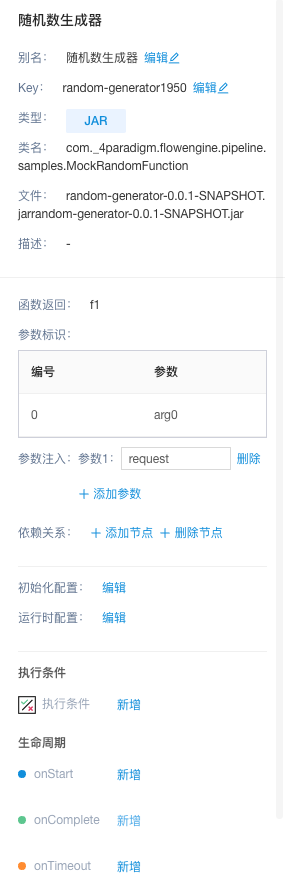
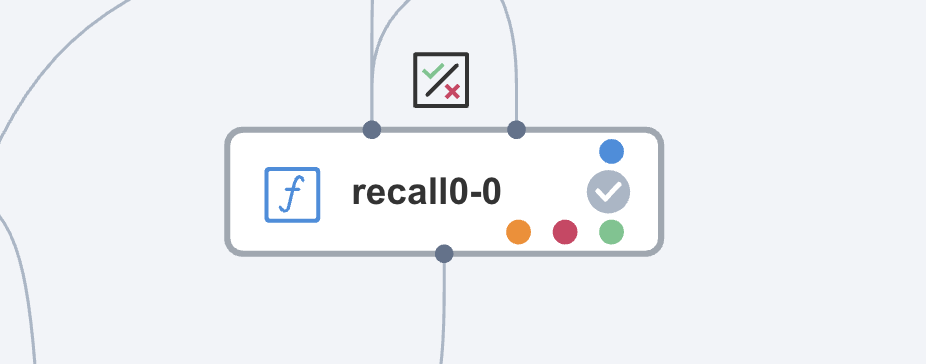

# 构造在线 Pipeline

> 请先阅读[基本流程](./basic-operation.md)部分

目前提供两种构建 Pipeline 的方式：

## 界面操作

下面介绍通过界面如何构建一个 Function Pipeline:

Pipeline 编辑视图如下：

1. **Pipeline Template 列表**：此处会展示已经定义完成的 Function Template，可将已定义完成的 Function Template 拖入画布。
2. **Pipeline 画布**：可在此处通过画布拖拽的方式定义 Pipeline 的编排关系。
3. **Pipeline 配置区域**：默认展示 Pipeline 基本信息及运行配置信息。如选中 Function 节点，则展示 Function 配置。

### 流程串联

1. 确定构建 Pipeline 所需 Function Template 已定义完成。
2. 将所需的 Function Template 拖入画布，可在右侧配置面板调整 Function 输入源个数。

    

3. 将画布中的节点按照依赖关系进行连接，如上图所示。
4. 可在右侧配置面板配置 Function，

    

参数配置可参考：

| key | 标题 | 描述 |
|-----|-------|----------|
| key   | Key     | **必填**，现有版本会继承 Function Template 已定义的 key，也可基于 Template 的 Key 进行修改       |
| title    | 别名      | 选填，可定义 Function 节点展示名字         |
| outputTag    | 函数返回      | 系统会在 Function 拖入画布时自动生成，在未连接下游 Function 时，可按需进行修改         |
| Function Template inputArgs    | 参数标识      | 展示 Function Template 配置的参数，可作为配置连接的参考，无需修改        |
| argsInjections    | 参数注入      | 系统会在 Function 连接时默认添加，也可按需添加         |
| inputSlots    | 依赖关系      | 可增删输入节点        |
| initConfig    | 初始化配置      | Function 初始化时需要的配置        |
| runtimeConfig    | 运行时配置      | 选Function 运行时需要的配置        |

### 执行条件

可为 Function 定义执行条件（Condition），条件满足后执行当前 Function。

Condition Function 需要返回 `Boolean` 类型。

### 生命周期

可为 Function 定义生命周期（LifeCycle）。

当前支持的 LifeCycle 有：

| 函数 | 函数类型 | 描述 |
|-----|-------|----------|
| onStart   | 运行触发函数     | 当函数开始运行时，会触发 onStart 函数 |
| onComplete    | 完成运行触发函数      | 当函数运行完成时，会触发 onComplete 函数        |
| onTimeout    | 超时触发函数      | 当函数运行超时，会触发 onTimeout 函数，可配置超时时间及是否返回兜底    |
| onError    | 错误运行触发函数      | 当函数运行错误，会触发 onError 函数，可配置是否返回兜底        |

配置生命周期完成的 Function 如下图所示：

## 通过 API

下面介绍如何通过 API 构建 Function Pipeline。
